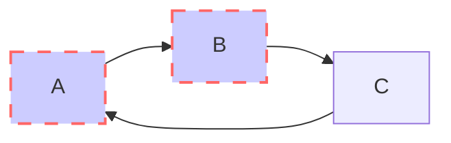

-------

## 1 前言

&#160; &#160; &#160; &#160; ASIC设计中需要用到脚本语言（Perl、Python、Shell等），有C语言基础的话Python好上手一些。

----

## 2 基础语法

### 2.1 编码

&#160; &#160; &#160; &#160; 默认情况下Python3源码文件以UTF-8编码，所有字符串都是unicode字符串。

### 2.2 标识符

&#160; &#160; &#160; &#160; 标识符由字母、数字、下划线组成，区分大小写，**但不能以数字开头**。可以使用中文作为变量名。

&#160; &#160; &#160; &#160; 以下划线开头的标识符是有特殊含义的：
* 以单下划线开头的代表不能直接访问的类属性，须通过类提供的接口访问；
* 以双下划线开头的代表雷的私有成员；
* 以双下划线开头和结尾的代表Python里特殊方法专用的标识。

### 2.3 保留字符

&#160; &#160; &#160; &#160; 就是关键字，只包含小写字母:

![img1][img1]

### 2.4 行和缩进

&#160; &#160; &#160; &#160; Python代码块不能用“{}”来控制类、函数以及其他逻辑判断，而是用缩进来写模块。缩进的空白数量是可变的，但所有代码块语句必须包含相同的缩进空白数量，必须严格执行，“Tab”和空格键不能混用。

&#160; &#160; &#160; &#160; Python语句中一般以新一行作为语句的结束符，但可以用多行连接符“\”将一行的语句分为多行“

```python
    a = b + \
        c + d \
        - 30
```

&#160; &#160; &#160; &#160; 语句中包含“[]”、"{}"、“()”就不需要使用多行连接符。

&#160; &#160; &#160; &#160; Python也可以同一行显示多条语句，语句之间用“;”分开：

```python
print("硬件不行了！"); print("辣当蓝啦");
```

### 2.5 引号

&#160; &#160; &#160; &#160; Python可以使用引号（'）、双引号（"）、三引号（'''或"""）来表示字符串。引号的开始和解书必须是相同类型的。其中三引号用于多行字符标注：

```python
name            = '岑小康'
age             = “18”
characteristic  = '''爱穿
                    横条纹'''
```

### 2.6 注释

&#160; &#160; &#160; &#160; 单行注释用“#”，多行注释首尾用三引号。


----

## 3 变量与数据类型

&#160; &#160; &#160; &#160; Python有五个标准的数据类型：
* Number（数字）：
    * int（有符号长整型）；
    * bool（布尔型）；
    * float（浮点型）；
    * complex（复数）;
* String（字符串）；
* List（列表）；
* Tuple（元组）；
* Set（集合）；
* Dictionary（字典）。

&#160; &#160; &#160; &#160; 其中:

* 不可变数据类型：
  * Number；
  * String；
  * Tuple；
* 可变数据类型：
  * List；
  * Dictionary；
  * Set。

&#160; &#160; &#160; &#160; 内置的“type()”函数可以用来查询变量所指的对象类型：

```python
a = 111
type(a)
```

&#160; &#160; &#160; &#160; 返回：

```python
<class 'int'>
```
&#160; &#160; &#160; &#160; 此外还可以用“isinstance()”来判断：

```python
a = 111
isinstance(a，int)
```

&#160; &#160; &#160; &#160; 返回：

```python
True
```

### 3.1 变量赋值

&#160; &#160; &#160; &#160; Python中的变量赋值不需要类型声明，会根据变量自动匹配类型。每个变量在内存中创建，在使用前必须被赋值，变量赋值以后该变量才会被创建。


&#160; &#160; &#160; &#160; 用等号“=”给变量赋值，左边是变量名，右边是存储在变量中的值：

```python
name    = 'Hamilton'
pi      = 3.14
cont    = 60
```

&#160; &#160; &#160; &#160; 其中“name”文字符串变量，“pi”为浮点型变量，“cont”为整型变量。

&#160; &#160; &#160; &#160; Python也允许同时为多个变量赋值：

```python
a=b=c=1
d,e,f=1,2,'Hamilton'
```

&#160; &#160; &#160; &#160; 其中“a”、“b”、“c”、“d”、“e”为整型变量，“f”为字符串变量。


### 3.2 Number

&#160; &#160; &#160; &#160; 数字数据类型用于存储数值，数据类型不允许改变。对变量赋值时对象直接被创建：

```python
var1 = 1
var2 = 2
str  = f"one {var1}"
a,b,c = 0,1,2
```

&#160; &#160; &#160; &#160; 也可以使用“del”语句删除对象：

```python
del var
del var1,var2
```


&#160; &#160; &#160; &#160; 数值类型举例：

| int | long | float | complex |
| --- | --- | --- | --- |
| 10 | 3426576L | 0.0 | 4.14j |
| 200 | -0x13152L | 15.66 | 45.j |
| -570 | 0xDEFABCEAL | -213.8 | 9.322e-36j |
| -0o422 | -840932750L | 32.3e+18 | .876j |
| -0x443 | 347653L | -90 | 4.7e-7j |
| 0x19 | 0281L | 70.2e-12 | -.65+0j |


&#160; &#160; &#160; &#160; 其中，复数由实部和虚部组成，可以用“a+bj”或“complex(a,b)”表示，复数的实部和虚部都是浮点型。

&#160; &#160; &#160; &#160; 数字类型转换：

```python
int(x)          #将x转换为整数；
float(x)        #将x转换为一个浮点数；
complex(x)      #将x转换到一个复数，实数部分为x，虚数部分为0；
complex(x,y)    #将x和y转换到一个复数，实数部分为x，虚数部分为y，x和y是数字表达式。
```

&#160; &#160; &#160; &#160; 数学函数：

| 函数 | 描述 |
| --- | --- |
| abs(x) | 返回数字的绝对值，如abs(-10)返回10 |
| ceil(x) | 返回数字的上入整数，例如ceil(4.1)返回5 |
| exp(x) | 返回e的x次幂 |
| fabs(x) | 返回数字的绝对值，如abs(-10)返回10.0 |
| floor(x) | 返回数字的下舍取整，如floor(4.9)返回4 |
| log(x[,y]) | 返回对数，如log(e)返回1.0，log(100,10)返回2.0 |
| log10(x) | 返回以10为底x的对数 |
| max(x1,x2,...) | 返回给定参数的最大值 |
| min(x1,x2,...) | 返回给定参数的最小值 |
| modf(x) | 返回x的整数部分与小数部分，两部分的数值符号与x相同，整数部分以浮点型表示 |
| pow(x,y) | x**y运算后的值 |
| round(x[,n]) | 返回浮点数x的四舍五入值，如给出n值，则代表舍入到小数点后的位数 |
| sqrt(x) | 返回x的平方根 |

&#160; &#160; &#160; &#160; 随机函数：

| 函数 | 描述 |
| --- | --- |
| choice(seq) | 从序列的元素中随机挑选一个元素，比如range(10)，从0-9中随机挑选一个种子 |
| randrange([start,]stop[,step]) | 从指定范围内，按指定基数递增的集合中获取一个随机数，基数默认值为1 |
| random() | 随机生成一个实数，范围在[0,1)范围内 |
| seed([x]) | 改变随机数生成器种子seed |
| shuffle(lst) | 将序列的所有元素随机排列 |
| uniform(x,y) | 随机生成下一个实数，它在[x,y]范围内 |

&#160; &#160; &#160; &#160; 三角函数：

| 函数 | 描述 |
| --- | --- |
| acos(x) | 返回x的反余弦弧度值 |
| asin(x) | 返回x的反正弦弧度值 |
| atan(x) | 返回x的反正切弧度值 |
| atan2(y,x) | 返回给定的x及y坐标值得反正切值 |
| cos(x) | 返回x的弧度的余弦值 |
| hypot(x,y) | 返回欧几里得范数sqrt(x*x+y*y) |
| sin(x) | 返回x弧度的正弦值 |
| tan(x) | 返回x弧度的正切值 |
| degrees(x) | 将弧度转换为角度 |
| radians(x) | 将角度转换为弧度 |

&#160; &#160; &#160; &#160; 随机函数：

| 函数 | 描述 |
| --- | --- |
| pi | π |
| e | e |


### 3.3 String

&#160; &#160; &#160; &#160; 字符串由数组、字母和下划线组成。

&#160; &#160; &#160; &#160; 与C语言不同的是，**Python字符串是不能被更改的**。

&#160; &#160; &#160; &#160; 可以使用反斜杠转义特殊字符，如果不想让反斜杠发生转义，可以在字符串前面添加一个“r”：

```python
print('Mac\nBook')
print(r'Mac\nBook')
```

&#160; &#160; &#160; &#160; 结果为：

```python
Mac
Book
Mac\nBook
```

| 转义字符 | 描述 |
| --- | --- |
| \（出现在行尾） | 续行符 |
| \\\\ | 反斜杠符号 |
| \\' | 单引号 |
| \\" | 双引号 |
| \a | 响铃 |
| \b | Backspace |
| \000 | 空 |
| \n | 换行 |
| \v | 纵向制表符 |
| \t | 横向制表符 |
| \r | 回车 |
| \f | 换页 |
| \oxxx | 八进制数 |
| \xyyy | 十六进制 |
| \other | 其他的字符以普通格式输出 |


&#160; &#160; &#160; &#160; 字符串列表有两种取值顺序：
* 从左至右索引，默认0开始，最大范围是字符串长度-1；
* 从右至左索引，默认-1开始，最大范围是字符串开头。

| N | F | A | U | D | I | O |
| --- | --- | --- | --- | --- | --- | --- |
| 0 |  1 | 2 | 3 | 4 | 5 | 6 |
| -7 | -6 | -5 | -4 | -3 | -2 | -1 |

&#160; &#160; &#160; &#160; 若要从字符串中获取一段子字符串的话，可以使用“[头下标:尾下标]”来截取相应的字符串，**获取的字符串包含头下标的字符，不包含尾下标的字符**。下标可以为空，表示从头取到位。

&#160; &#160; &#160; &#160; 另外，“+”是字符串连接符，“*”是重复操作，也可以在截取时加入第三个参数，说明截取的步长：

```python
str = 'Hello World!'
print str
print str[0]
print str[2:5]
print str[2:]
print str[6:10:2]
print str*3
print str+'wanglaowu'
```

&#160; &#160; &#160; &#160; 结果如下：

```python
Hello World!
H
llo
llo World!
Wr
Hello World!Hello World!Hello World!
Hello World!wanglaowu
```

&#160; &#160; &#160; &#160; Python支持格式化字符串的输出，与C语言语法一样：

| 符号 | 描述 |
| --- | --- |
| %c | 格式化字符及其ASCII代码 |
| %s | 格式化字符串 |
| %d | 格式化整数 |
| %u | 格式化无符号整型 |
| %o | 格式化无符号八进制数 |
| %x | 格式化无符号十六进制数 |
| %X | 格式化无符号十六进制数（大写） |
| %f | 格式化浮点数字，可指定小数点后的精度 |
| %e | 用科学计数法 |
| %E | 同%e |
| %g | %f和%e的简写 |
| %G | %f和%E的简写 |
| %p | 用十六进制数格式化变量的地址 |

&#160; &#160; &#160; &#160; 格式化操作符辅助指令：

| 符号 | 功能 |
| --- | --- |
| * | 定义宽度或小数点精度 |
| - | 用做左对齐 |
| + | 在正数前面显示“+”号 |
| \<sp> | 在正数前面显示空格 |
| # | 在八进制数前面显示“0”，在十六进制前面显示“0x”或“0X” |
| 0 | 显示的数字前面填充“0”而不是默认的空格 |
| % | “%%”输出为“%” |
| (var) | 映射变量（字典参数） |
| m.n. | m是显示的最小总宽度，n是小数点后的位数（如果可用） |

### 3.4 List

&#160; &#160; &#160; &#160; 列表是由一系列**按特定顺序排列**的元素组成，可以完成大多数集合类的数据结构实现，它支持字符、数字、字符串甚至可以包含列表（嵌套）。

#### 3.4.1 创建list

&#160; &#160; &#160; &#160; 列表用“[]”标识，列表的截取和字符串的截取类似：

```python
list = ['iPhone',768,2.23,'perl',88.1]  #['iPhone',768,2.23,'perl',88.1]
tinylist = ['Touch',990]                #['Touch',990]

print (list)                            #['iPhone',768,2.23,'perl',88.1]
print (list[0])                         #iPhone
print (list[-1])                        #88.1
print (list[1:3])                       #[768,2.23]
print (list[2:])                        #[2.23,'perl',88.1]
print (list*2)                          #['iPhone',768,2.23,'perl',88.1,'iPhone',768,2.23,'perl',88.1]
print (list+tinylist)                   #['iPhone',768,2.23,'perl',88.1,'Touch',990]
```

&#160; &#160; &#160; &#160; 如果参数为负，表示逆向读取：

```python
list = [1,2,3,4]
list = list[-1::-1]                     
print (list)                            #[4,3,2,1]
```

#### 3.4.2 list元素替换

&#160; &#160; &#160; &#160; List的值可以二次更改，替换直接赋值：

```python
name = ['小康','大康','中康']       # ['小康','大康','中康']
name[1] = '微康'                   # ['小康','微康','中康','微康]

```

&#160; &#160; &#160; &#160; 列表中添加或删除元素：
```python
# 直接赋值修改
name = ['小康','大康']              # ['小康','大康']
# append添加在列表尾
name.append('中康')                 # ['小康','大康','中康'] 
# insert插在任意位置
name.insert(0,'微康')               # ['微康','小康','大康','中康']
# del删除任意位置元素
del name[1]                        # ['微康','大康','中康']
# pop不会直接删除列表中的元素
last = name.pop()                  # '中康'
name = name.pop()                  # ['微康','大康']
name = name.pop(1)                 # ['微康']
# remove根据元素值删除，只删除指定的第一个值
name.remove('微康')                # []
```

#### 3.4.3 list管理

&#160; &#160; &#160; &#160; 列表管理的一些函数：
```python
cars = ['bmw','audi','toyota','subaru'] # ['bmw','audi','toyota','subaru']
cars.sort()                             # ['audi','bmw','subaru','toyota']
cars.sort(reverse=True)                 # ['toyota','subaru','bmw','audi']
sorted(cars)                            # 仅排序，不改变原列表
cars.reverse()                          # 反向排列，不是按字母顺序
len(cars)                               # 列表长度：4
```
#### 3.4.4 list复制

&#160; &#160; &#160; &#160; 要复制列表，可以创建一个包含整个列表的切片，方法是同时省略起始索引和终止索引：
```python
list_1 = ['bmw','audi','toyota','subaru']
list_2 = list_1[:]                      # list_1与list_2的内容完全相同，且为两个不同的列表
```

&#160; &#160; &#160; &#160; **不能直接复制，这样只是将新变量与已有变量相关联，指向的是同一个列表**。

#### 3.4.5 list循环

&#160; &#160; &#160; &#160; 需要对列表中每个元素做相同的处理，可以用for循环：
```python
cars = ['bmw','audi','toyota','subaru']
for car in cars:
    print (f"Car is {car}")             # 打印“Car is $car”

for car in cars[:3]:
    print car                           # 打印前三个元素
```

&#160; &#160; &#160; &#160; 可以使用range()函数创建数值列表：
```python
# for和range产生数
for value in range(1,5)
    print (value)                       # 会换行打印1,2,3,4
# range产生数值列表
number = list (range(1,6))              # number为[1,2,3,4,5]
# range产生指定步长的数字列表
even_number = list (range(2,11,2))      # even_number为[2,4,6,8,10]
```

#### 3.4.6 list推导式

&#160; &#160; &#160; &#160; 创建一个整数的平方为元素的列表可以通过上一小节中的range和for来产生：
```python
squares = []
for value in range(1,11):
    squares.append(value ** 2)              # squares = [1,4,9,16,25,36,49,64,81,100]
```

&#160; &#160; &#160; &#160; 这样的方式包含了三四行代码，而列表推导式只需编写一行代码就能生成这样的列表。它将for循环和创建新元素的代码合并成一行，并自动追加新元素：
```python
squares = [value**2 for value in range(1,11)]       # squares = [1,4,9,16,25,36,49,64,81,100]
```

#### 3.4.7 list相关函数

&#160; &#160; &#160; &#160; 有几个Python函数可以处理数值列表：
```python
digits = [1,2,34,567,8,90]
print min(digits)               # 1
print max(digits)               # 567
print sum(digits)               # 702
```


### 3.5 Tuple

&#160; &#160; &#160; &#160; Tuple类似于List但不能二次赋值，相当于只读列表，用“()”标识。
```python
dimensions = (200,50)
```

&#160; &#160; &#160; &#160; 构造包含1个和0个元素的元组比较特殊，所以有一些额外的语法规则，这是因为**严格来说tuple是由逗号标识的**：

```python
tup1 = ()
tup2 = (33,)
```

&#160; &#160; &#160; &#160; Tuple也可以使用for循环遍历。

&#160; &#160; &#160; &#160; Tuple的元素不能二次赋值，但是可以重新定义整个tuple。

### 3.6 Set

&#160; &#160; &#160; &#160; 集合（Set）是有一个或多个形态各异的大小整体组成的，构成集合的事物或对象称作元素或是成员。它的基本功能是进行成员关系测试和删除重复元素。

&#160; &#160; &#160; &#160; 可以使用大括号“{}”或“set()”函数创建集合，要创建空集合必须用“set()”函数而不是“{}”，因为“{}”是用来创建一个空字典。

```python
set1 = {'Google','Amazon','Apple','Facebook','Amazon','Tahooo'}
print(set1)     #重复的元素被自动去掉

if 'Intel' in set1:
    print('Intel在集合中')
else：
    print('Intel不在集合中')

# set可以进行集合运算

a = set('iPod')
b = set('iMac')

print(a-b)  #a和b的差集
print(a|b)  #a和b的并集
print(a&b)  #a和b的交集
print(a^b)  #a和b中不同时存在的元素
```

&#160; &#160; &#160; &#160; 结果为：

```python
{'Google','Amazon','Apple','Facebook','Tahooo'}
Intel不在集合中
{'P','o','d'}
{'i','P','o','d','M','a','c'}
{'i'}
{'P','o','d','M','a','c'}
```


### 3.7 Dictionary

&#160; &#160; &#160; &#160; Dictionary是除列表以外Python中最灵活的内置数据结构类型。列表是有序的对象集合，字典是无序的对象集合。两者区别在于字典当中的元素是通过键来存取，而不是通过偏移存取。

&#160; &#160; &#160; &#160; Dictionary用“{}”标识，字典由索引“key”和它对应的值“value”组成，“key”必须是唯一的，且必须使用不可变类型。构造函数“dict()”可以直接从键值对序列中构建字典：

```python
dict = {}

dict['one'] = 'Macintosh'
dict[2] = 'PowerBook'

tinydict = {'iii':'iMac','4':'iBook','V':'PowerBook'}

print dict['one']
print dict[2]
print tinydict
print tinydict.keys()
print tinydict.values()
```

&#160; &#160; &#160; &#160; 结果为：

```pyhon
Macintosh
PowerBook
{'iii':'iMac','4':'iBook','V':'PowerBook'}
['iii','4','V']
['iMac','iBook','PowerBook']
```

&#160; &#160; &#160; &#160; 创建空字典用“{}”。


### 3.8 数据类型转换

&#160; &#160; &#160; &#160; 数据类型的转换，只需要将数据类型作为函数名即可。以下几个内置的函数可以执行数据类型之间的转换，这些函数返回一个新的对象，即转换的值：

| 函数 | 描述 |
| --- | --- |
| int(x[,base]) | 将x转换为一个整数 |
| long(x[,base]) | 将x转换为一个长整数 |
| float(x) | 将x转换为一个浮点数 |
| complex(real [,imag]) | 创建一个复数 |
| str(x) | 将对象x转换为字符串 |
| repr(x) | 将对象x转换为表达式字符串 |
| eval(str) | 用来计算在字符串中的有效Python表达式，并返回一个对象 |
| tuple(s) | 将序列s转换为一个元组 |
| list(s) | 将序列s转换为一个列表 |
| set(s) | 转换为可变集合 |
| dict(d) | 创建一个字典，d必须是一个序列（hey,value）元组 |
| frozenset(s) | 转换为不可变集合 |
| chr(x) | 将一个整数转换为一个字符 |
| unichr(x) | 将一个整数转换为Unicode字符 |
| ord(x) | 将一个字符转换为它的整数值 |
| hex(x) | 将一个整数转换为一个十六进制字符串 |
| oct(x) | 将一个整数转换为一个八进制字符串 |


----

## 4 运算符

### 4.1 算术运算符

| 运算符 | 描述 | 结果 |
| --- | --- | --- |
| + | 相加 | 10+20=30 |
| - | 相减或取负数 | 10-20=-10 |
| * | 相乘或返回一个被重复若干次的字符串 | 10*20=200 |
| / | 相除 | 20/10=2 |
| % | 取余 | 20%10=0 |
| ** | 幂 | 2**3=8 |
| // | 取整除，返回商的整数部分（向下取整） | 9//2=4  -9//2=-5 |

### 4.2 比较运算符

| 运算符 | 描述 | 实例 |
| --- | --- | --- |
| == | 相等 | 10==20 返回False |
| != | 不等 | 10!=20 返回True |
| <> | 不等于（python3已遗弃） | 类似!= |
| > | 大于 | 10>20 返回False |
| < | 小于 | 10<20 返回True |
| >= | 大于等于 | 10>=20 返回False |
| <= | 小于等于 | 10<=20 True |

### 4.3 赋值运算符

| 运算符 | 描述 | 实例 |
| --- | --- | --- |
| = | 简单的赋值 | c=a+b |
| += | 加法赋值 | c+=a 等效于 c=c+a|
| -= | 减法赋值 | c-=a 等效于 c=c-a |
| \*= | 乘法赋值 | c\*=a 等效于 c=c*a  |
| /= | 除法赋值 | c/=a 等效于 c=c/a |
| %= | 取模赋值 | c%=a 等效于 c=c%a |
| \*\*= | 幂赋值 | c\*\*=a 等效于 c=c\*\*a |
| //= | 取整数赋值 | c//=a c等效于 =c//a |
| := | 海象运算符，可以在表达式内部为变量赋值 | n := len(a) |

### 4.4 位运算符

&#160; &#160; &#160; &#160; 跟Verilog里的位运算一样，就不举例了。

| 运算符 | 描述 | 实例 |
| --- | --- | --- |
| & | 按位与 |  |
| \| | 按位或 |  |
| ^ | 按位异或 |  |
| ~ | 按位取反 |  |
| << | 左移动，高位丢弃，低位补零 |  |
| >> | 右移动，低位丢弃，高位补零 |  |

### 4.5 逻辑运算符

| 运算符 | 描述 | 实例 |
| --- | --- | --- |
| and | 布尔与，两者有一个为False则返回False，否则返回后者的值 | 10and20 返回20 |
| or | 布尔或，前者非0，返回他本身的值，否则返回后者的值 | 10or20 返回10 |
| not | 布尔非，取反 | not(10and20) 返回False |

### 4.6 成员运算符

| 运算符 | 描述 | 实例 |
| --- | --- | --- |
| in | 在指定序列中找到值返回true，否则返回False |  |
| not in | 与in相反 |  |


### 4.7 身份运算符

| 运算符 | 描述 | 实例 |
| --- | --- | --- |
| is | 判断两个标识符是否引用自同一个对象 | x is y，类似id(x)==id(y)，如果引用的是同一个对象则返回True，否则返回False |
| is not | 与is相反 |  |

### 4.8 运算符优先级

&#160; &#160; &#160; &#160; 以下表格列出了从最高到最低优先级的所有运算符：

| 运算符 | 描述 |
| --- | --- |
| ** | 指数（最高） |
| ~ + - | 按位取反，一元加减 |
| * / % // | 乘除、取模和取整除 |
| + - | 加法减法 |
| >>  << | 左移右移 |
| & | 位于 |
| ^ \| | 位运算符 |
| <= >= <> | 比较运算符 |
| <> == != | 等于运算符 |
| = %= /= //= -= +- *= **= | 赋值运算符 |
| is  is not | 身份运算符 |
| in  not in | 成员运算符 |
| not and or | 逻辑运算符 |


----

## 5 语句

### 5.1 输入语句

&#160; &#160; &#160; &#160; 执行下面语句则会等待用户输入：

```python
input("输入xxx，按下Enter完成：")
```

### 5.2 输出语句

&#160; &#160; &#160; &#160; print输出默认是换行的，如果要实现不换行，需要在末尾加“end=" "”：

```python
x="a"
y="b"

print x
print y

print (x,end=" ")
print (y,end=" ")
```

&#160; &#160; &#160; &#160; 结果如下：

```shell
a
b
a b
```

### 5.3 导入语句

&#160; &#160; &#160; &#160; Python用“import”或者“From...import”来导入相应的模块。

&#160; &#160; &#160; &#160; 将整个模块（somemodule）入，格式为：
```python
import somemodule
```
&#160; &#160; &#160; &#160; 从某个模块中导入某个函数，格式为：
```python
from somemodule import somefunction
```
&#160; &#160; &#160; &#160; 从某个模块中导入多个函数，格式为：
```python
from somemodule import firstfunc, secondfunc, thirdfunc
```
&#160; &#160; &#160; &#160; 将某个模块中的全部函数导入，格式为：
```python
from somemodule import *
```


### 5.4 条件运算符

&#160; &#160; &#160; &#160; 指定任何非0和非空（null）的值为True，0或null为False。if语句的判断条件可以用“>”、“<”、“==”、“>=”、“<=”来表示其关系：

```python
if 判断条件1:
    执行语句1
elif 判断条件2:
    执行语句2
elif 判断条件3:
    执行语句3
else:
    执行语句4
```

&#160; &#160; &#160; &#160; 由于Python不支持switch语句，所以多个条件判断只能用elif实现，如果有多个条件需要町是判断，可以使用or，表示两个条件有一个成立时判断成功；使用and时，只有两个条件同时成立的情况下，判断成功。

&#160; &#160; &#160; &#160; 也可以在同一行的位置上使用if条件判断语句，如:

```python
var = 100
if(var == 100) : print"var的值为100"
print "告辞！"
```

&#160; &#160; &#160; &#160; 运行结果：

```python
var的值为100
告辞！
```

### 5.5 循环语句

&#160; &#160; &#160; &#160; Python提供二for循环和while循环：


| 循环类型 | 描述 |
| --- | --- |
| while | 在给定的判断条件为True时执行循环体，否则退出循环 |
| for | 重复执行语句 |
| 嵌套循环 | 在while循环体中嵌套for循环 |

&#160; &#160; &#160; &#160; Python支持以下循环控制语句：

| 控制语句 | 描述 |
| --- | --- |
| break | 在语句块执行过程中终止循环，并跳出整个循环 |
| continue | 在语句块执行过程中终止当前循环，跳出该次循环，执行下一次循环 |
| pass | pass是空语句，是为了保持程序结构的完整性 |

#### 5.5.1 while语句

&#160; &#160; &#160; &#160; 和C语言类似：

```python
while 判断条件:
    执行语句
```


# test



```wavedrom
{ signal: [
  { name: "clk",  wave: "p......|..." },
  { name: "bus",  wave: "x.34.5x|=.x",},
  { name: "wire", wave: "0.1..0.|.1." },
  {},
  { name: "clk",  wave: "p......|..." },
  { name: "bus",  wave: "x.34.5x|=.x",   data: "head body tail" },
  { name: "wire", wave: "0.1..0.|.1." }
]}
```

----

[img1]:data:image/png;base64,iVBORw0KGgoAAAANSUhEUgAABNwAAALMCAYAAAA/yq+xAAAAAXNSR0IArs4c6QAAAARnQU1BAACxjwv8YQUAAAAJcEhZcwAADsMAAA7DAcdvqGQAAIqPSURBVHhe7N1/VFV1vv/xV1+/97TsYnW1HMECaTS9ojQkDgOEpWSKmZSJWVBNlBNkiTVmZWR+zayo8VeplEWTYZk4Tscx0Rw0M3QYSBKBq+mEMIleTW8lV1dnDYvv3vtslB/H39sEfT7Wov05n73PPqd/9tvP63z2Z19UZxAAAAAAAAAAR/wfewsAAAAAAADAAQRuAAAAAAAAgIMI3AAAAAAAAAAHEbgBAAAAAAAADiJwAwAAAAAAABxE4AYAAAAAAAA4iMANAAAAAAAAcBCBGwAAAAAAAOCgi+oMdruRsrIyuwUAAAAAAACgoZCQELvV3HEDt2u6XGW/AgAAp+Kbnd9SRwEA5wQ1CADOPvNae7zAjVtKAQAAAAAAAAcRuAEAAAAAAAAOInADAAAAAAAAHETgBgAAAAAAADiIwA0AAAAAAABwEIEbAAAAAAAA4CACNwAAAAAAAMBBBG4AAAAAAACAgwjcAAAAAAAAAAcRuAEAAAAAAAAOInADAAAAAAAAHETgBgAAAAAAADiIwA0AAAAAAABwEIEbAAAAAAAA4CACNwAAAAAAAMBBBG4AAAAAAACAgwjcAAAAAAAAAAcRuAEAAAAAAAAOInADAAAAAAAAHETgBgAAAAAAADiIwA0AAAAAAABwEIEbAAAAAAAA4CACNwAAAAAAAMBBBG4AAAAAAACAg86TwO2Alk+IVcyNE7V8n90FAAAAAGgZ9hVrQWaeMXIDgAsDM9wAAAAAAGfPgTxNGDFe87/x2B0AcP4jcAMAAAAAnD21BG0ALjwEbgAAAAAAAICDnAvcag+oNDdT6b97QHE3muupGX+DE5ScnqnVO2rsg2z7cjXB3J9ZLtXs0OrMyUoa5n1P7IjHNOXDYh2otY9t4kBRjqY8mqBY8/3DHtOM3CrxewkA4HxQsyNPc9IfVvxgb02Mu3d885pYu8detzRWSVnlzWqgp2C2t0bem6nSw3an7aTO35BR2zd9OE2pI+KOX9cBAK1WaaZZE7xrYTcaa90YryTzml9xjNFWTZU2nkSNsM4/4jVtNF8UvKZ469xGjbL2AsD5q81kg91uZN++ffqPyy+1X53A4XLNT31Y05Zt0f5/D9Utt8eo7696qOOhbSr88iutW7ZBh8OH6Ne/aOM9/tAOrV68Qd/+u/E5i2Zofqmffj3oFt0Q0lGer/+uv+V/qqXbr9JtN1+jtt53GDwqzXpEyRmfavvBzhowPE43dL1IpYvmKP/ycAXt/FT5u67SDSNjda1xXgAAzqX/+f7Hk6+jht25EzVywiJtNgY8v4wZqsE3hOjy7wq0One5lubXqs8tYer4b8aB/8dP1/buqK1LNqh0c5kujrld17X3nkOHi5X51OvaXBOoUS9O0tDOdt01nPT56+3JU3rSWGXmV+hQl5s0fEiUerWv0aa167TaqOs/9LxZkVe57IMBAC3JqdSgvUUL9ElpW11y8FO9OidP+7vGaviAcP3y3yu0Kf9Lrfl4vWojhqjPlUdrilUjfjteb/usEcv1Tef+GvBLP+vQ2sO1avsfl2jvf+1STacIDb/zJmus+KuwILWzjgCA1sm81nbs2NF+1dxFdQa73UhZWZmu6XKV/er4tmc/oOT5VQq6+3VlpfRUw39+73Yb/8CfXiBFjJc7I07WmMCc4Wb/yuGKGq/sqXHyr79+G4OFOcbFe9GeThr9zkLd19Xb7dmSqaRHc7Q7MEGz5qXoeu/12wr75vzuRa3z7NHuPRF6ask0Db3S3gcAwDnyzc5vT7qOesqzlJy6UJWB8cqYNVaR9QGaPKpcOlnJs4w6GjtZ7kkxqi9/lUsfU9Kscqu+Ln7JrKMebZrzgNIW72lWj0/9/Hu0NDVRM8pdinzyXWUM7WT1mjwVOcYgK1Mb28Zr1rKxup7MDQBanFOpQeYMtNQPzVagRs18XWPC6iuNMZZbbozlXvXWiNz6GuEp1/wHH9OCquY1QrvyNOWJaVq9J1D3zXtTo3vaRaJ+/NdwTAgArZx5rQ0JCbFfNefALaVV2lLiUtBlMbr/7sZhm8k/Nk4DzUZBpaqtnoZ6asyjDcI2U9sw3XKbedHeo9Lt9Q+NrtHGP+dot3H24WnJR8M2U1vjHOlDzMMBAGiFarTuo4WqVCeNmpDSIAwzGfU1PkVjehrjm7zF+nSX3W0Iin9Sjxv9Kpit+etr5CnO0suLjWIYmKCn729Yj0/j/NvytKjc2N40XpMaDqQMruB4jbrTT+07l+nLbSzqAADnC9edYzW6Qdhm8r/JHsvllWmn1WNUlQ0fa0GVcXz8ZE1tUiPUOVZPPxFvVJcqLfhovVGBAODC5UDgFqjhGW8qe9lkDbzM7mrIr4M62M1m2obp2s52u4EOHYLslq12u0rzzEacfhPq46f07hFqeq0HAKBVqCnWxs/MRowi62cCNNQmUL2jzSJXrr+V1f8QZTD6h/8+WUHyaPW8Z5Q23fxhKlCjJiSr19H1GE7r/JVlnxvnkiJ/E3ZkRt1RLl0/1i33O29qdG8f5wMAtEp9egQ1+LHG1mws59GWTdbATEOjw5ofb3CFx2i42fisQF+SuAG4gDn+lFJPTY12byvWpg25WjRnmtLufUaL7H3NhPorwG4e14E9qjS33YMU4PPf9u3lf43dBACgNdlT5V04ulOV1r2XpflZzf+Wl1lHauM3TaZzd03U86MDjXOUq7RKCrr/yeYh2Gmc/+DeHdY26Cpu+gGAC0WQ/8lc82u03yoVYeoWdIwfXdoEKSjCbFRqf4PfiQDgQuNM4FZbo1L3NKUOi1XsrfEa+bvxSnvmNc1ZXKD9Qd3Uyz7sjF3uOsbCmu3l32RSHAAArcLhg9ZsMu0p0NL3FmqBj7+lG469bkLQdRHyt1ouBVzVqflsg1M+/wHt/MZuAgDgk1FtGi4L5NMO7f7BbgLABciBwM2j0vmPKXV6nkrVUwPvH6+MP7ypxcvcylvjVvbUZOcCt+89Omg3GzP6D9lNAABakzYub0hmLiS9Lk/rj/eXYi7a1kDtDi3K8K5x6mrr0cbpmVrXdHBzyudvry7MGgcAHJfHqEF285jCFMTD7ABcwM48cNuXpwUfVklt45Xx0eualBynyPCu8r/MTy7zV48Du723g56J9p1kTWDbVqlqn+sz79HurXYTAIDWpFOQ+pjbEqPGnXDw0tj2D1/UfKME+4+cplm/6ykdztOUWU0WqT6N81/s510YtXK373uBaj6bprh7H9aUT4898w4AcD7yUwerRBRre+UxHpxTW6nKArPRXu2aLwQKABeMMw/c9lRqo7kN7abuDRdptnm2l+lLu33a2oQo8k7z9/lc/a3Yx4V9V7FWb7PbAAC0Ju1D9BtzYtlht1YX+Rq8eLRpdpw34MprEHBVuTXdTNvaxmpMUph6xafJXM7NkzdN8wsanOc0zt/tuhhrVtzG/GIfT5jzLphdU1WlDv48sQgALiwu9b4+1motN2qEz6pStF5LzUZEmHoTuAG4gJ154Nbe33vLaMF6NVtiZleu0p93+7wQnxqXrh+SZD2Jbenzk7W84efU7tHyNzK9C0IDANDqdNLQ38Yblc6ocW/M1upddretpjhL0//kUc2+IN0YbgdctVVa+tJso/a5FPlEim40nxLepqtGTUiQv1UrM7XxsPfQ0zp/79s1xgzpPntNUxoVXe/xc9xGo2eKhprHAAAuKH5Rt+s+8wce92SlN6kR2pWnGW+Y479OGnV3rI48hqH+jqXKA9pvdQDA+a/NZIPdbmTfvn36j8svtV8dx6XXKOCgWyv/q0L5nyzX1r012vlfBfrknVc0ZV6eNDBZce2KVbqnnXoNjdW1/26859AOrV68Qd9eFaW7B3ZT04lxh3fkadEXu3T1DSM1sJu9t32oIjtXKHfNBq2t/5xNuXr7xdf0511t5fdvHnn+dZVuGGl/BgAA59D/fP/jydVRQ5urwhT1b8XKXbtRa/60VIXVP2j3jhJ9vniapsz/UgcUqFEzX1JCoHeF6t0rXtHv3bukiMc1fXSo2tk/n7X5Raiu+p8crS4tV6knVPG/9rfWtD7V85u3DP1n+DXa9/c8rcldqpy/79IPe7ercEWWXpyzTvvaRuipmWP065P73wMA/MxOpQbtLVqgT0qlXkPu169/YXcesU+Ff8xVqUI09IFwdTS72lypPlFX6ZvVn+mLNY1rxPMZS1X6g0uRaTP15ID2R5+r8H8u0rd/X6q/VZSp/J812vuPwwoICzrGA/EAoHUwr7UdO1pXRp8ceGiCS9ePeVezUmLVy69GG90LtWBxnnZeHqvH38hR9tOJusX6xbxAfytpfmPKqfC/ZbJy3pmoUeF+2mJ9ToEOhiZo0rzXNSbUPggAgFbHpW5Jr8tt1riYTqpen+N9emiZn3rdkqJZS97VmN7Wow+kPbma8Ya5OE5PPf5onPyPjGZMxiDnwYka2FbavXi25m+pn2N+Cuev1ylGT721UBlGfe+yb70WGccvKqjRtfHjlbVkmoZyNykAXLg6xWrqB29q0t0x8q+vEev3qItRUzLez1HG8ECj8jTUSUMnjNfwni5tzzNrUK5KfS8TCgDnjYvqDHa7kbKyMl3T5Sr7FQAAOBXf7PyWOgoAOCeoQQBw9pnX2pCQEPtVcw7McAMAAAAAAABQj8ANAAAAAAAAcBCBGwAAAAAAAOAgAjcAAAAAAADAQQRuAAAAAAAAgIMI3AAAAAAAAAAHEbgBAAAAAAAADiJwAwAAAAAAABxE4AYAAAAAAAA4iMANAAAAAAAAcBCBGwAAAAAAAOAgAjcAAAAAAADAQQRuAAAAAAAAgIMI3AAAAAAAAAAHEbgBAAAAAAAADiJwAwAAAAAAABxE4AYAAAAAAAA4iMANAAAAAAAAcBCBGwAAAAAAAOAgAjcAAAAAAADAQQRuAAAAAAAAgIMI3AAAAAAAAAAHEbgBAAAAAAAADiJwAwAAAAAAABxE4AYAAAAAAAA4iMANAAAAAAAAcNBFdQa73UhZWZndAgAAAAAAANBQSEiI3WruuIHb8d4IAACOjToKADhXqEEAcPad6FrLLaUAAAAAAACAgwjcAAAAAAAAAAcRuAEAAAAAAAAOInADAAAAAAAAHETgBgAAAAAAADiIwA0AAAAAAABwEIEbAAAAAAAA4CACNwAAAAAAAMBBBG4AAAAAAACAgwjcAAAAAAAAAAcRuAEAAAAAAAAOInADAAAAAAAAHETgBgAAAAAAADiIwA0AAAAAAABwEIEbAAAAAAAA4CACNwAAAAAAAMBBBG4AAAAAAACAgwjcAAAAAAAAAAcRuAEAAAAAAAAOInADAAAAAAAAHETgBgAAAAAAADiIwA0AAAAAAABwEIEbAAAAAAAA4CACNwAAAAAAAMBBBG4no3a/Ct+eqZV77dcAADitOl8zn0xQ//BwhRt/USOyVbAszWqnLdtvH/Qz2etWmvk9xrp19JNLNNP6bjONFgAAAIDjIXA7of1a+eQgpWZW6Ce7BwAAZ1Uoe2yastfukqvfSCU/lKykUaHqZO8FAAAA0LoQuJ2En/5lNwAAOBv2lqhwp7HtOU6Z0yfokZRH9MiIUAUNm6WioiLNGtbBexwAAACAVoHADQCAluLyi3Wp3QQAAADQejkXuNXuV8mymZpw39H1Z8L7DVLikzO18uuD9kENmOuiLUhX6oj+3mPD+ythTLqyC3yvU3Pw65Wa+WSiBvXznjtqSKImzF6pbT5ObdlbqOxJqUq4+cTHl8w2j0mT+x8Vcr+c7P3+NydowhtTjf5BemGDeVS+XhjiPdfMr6y3AQBwhux10Ya8YFQZw4YXNMh8bdakvdJ+H2u41feZtchbG+vrbpQGPWTU0aJjrPd2qnX6RGq3KWuYeZ5kLf6n3deEZ0OG9TnD3t5m9wAAWqr9X7kbrSXaf0Sq0hcUan+tfUC9+nU+Zxv7irKUNiTKrkFzVXga5QQAzlfOBG6HSjT33tuUPCVbhYeCFfdQspIfStLgX3q0bW220u9JNgYGHvtgg/GP9Gzj+NTZa/TN5dFKMo+/J1rtthkDhzGDlDC7RA2O1sG1L2jYPcYgotij64aY507W7T2+0xcL0pV4qzEoqbYPtHm+mqmEIamauWKrFOZdC+fI8XdM0Momx3tVKPupRL3w14ut7z8yVAro8mvjvSMVHWDuD1D0Xd7PDuXOHgCAI65QqFkD74o2qowhIFojzdcPRSu4rXXAMVUse8Gonelyf9dd8cZ7kob0MOqfUUdTblPaiiah26nW6ZPRprui7zC/dYlWFvgqrB5tzv/Y2Abo9n7dvV0AgBbIo5LMRN320AvKLvhRoSPMGjFSoYc2a+XsVN1271yVHLIPbejzDKWkvK3vzPHWPQPU+eIr1LmdvQ8AINUdQ2lpqd06sa1ZI+r69OlTN2LW5rqf7L56u3LGWvv6PPZx3Xd234+rn7X6Hlj0jd1j+9+/1824zTi2zwN1H1XZfXVb694x+2Jeqfvif+0u266l3nNHZvz96Of+d27d2Bjz+LF1H+1o/G2+y3+lboT5Xe58p27rv+xOw+ZZ5mf6/gzjXXUfP2buH1v38X/bXQAAnMCp1NG6//64bmyTWmn6zu2tc2PdR3vr+/r0iawbu3SX3ev1U+GMutvMfbcZdc7uM51qnfb9fTbXzbA+d4bRsm17x/t5v/2orvE3Mfz097pXzHrc5LsAAM6+U6lB330yti7SvJbfOaPu7z/anaZ//Vi3ef4DVo2IfDy3eY0w/pqN5wDgAnKia60DM9wqtLnYpeDLB+jB+0LlsnvrBQyK12CzsaFCu6we4x3lK61t6C+Dre0Rl/RVfGJ3tevyk6r/ac9H3rtVm80fznt2V/Al3q56AbeO1MhLOij4n0fPvW3ZXOUfkqLHT9LIXzb+Nh2ixmncCKNv59tyFzX/Jd81YrCim3wGAAAtUu9xesqaYXaUKzxOt5td1Zu1da+373Tq9Em7tr+SehrbLfkqPPJ5Xp7itfrYqMfdE/uL+W0A0FJtkzszXx6FasJr49S34Qy1Nu0U+sBzmtDbuKZ/Plfucrv/iGjF928yngMAHOFA4BaskbMXKuevGRp8ud3VULsrdIXdrBfc0/qnvbJffkGLv6qWp8G6AMF3LdTaJQs1Lsq+2nfsoevMwUPRK0o3ikHF/gZBmStaEz5fpYWzRxrfwrRN+cvMdK6vBoT7uu/TpdDwAcbWo4+Lt3q7GujbtbPdAgCgZXNF9PDehtrIFerQxW4ecep1+uQFq++tZpyWrzV/a3gbq0ebP//Y+G93xUcwGAOAFmvnZuVZkxsGq2+z+mFoE6wbhvU1GtX6uKDJepyXdFdwR7sNAGjG8aeUeg4eVHV5oQo/dyt7uvlQhDRl2/vqtes3Uo9ca840cyvjoWGKiuivhCcztHjVNlU3Wx/A+Mf6mAFqZ64t8HaaEgZFKWpIstIz3Srcub9RWKeDu/SNtYzMTypcNldzM5v/vf+5d50ZT3mFmi4rHRzA4mwAgNahb8Dp/Uh0MnX6VARHxSvU2Ob/9YujddWzWWv/4pF6x+sGXwM4AEDL8H21rBjtV8H2BIbmAoK985Sr//s7Y0TWwK86i+kKAHBszgRutQdVsiRdyTeHK6p/fw27L1WpT7ygmR/k67vgHtY/xBtxhSr5/b8oa1KSBnQxZ7IdVMXaxcp4NlHD+kUp8cU1qm4QpHUYlKFlS2Zp3JBQdbjE+Hf83hKtfPsFY5AwSFGDUpVdbl/6Dx80zmQy92cpy9ffihLrCAAALhinWqdPxdU3aHBvY7thjb6wbyutv5009NYbfMzCAwC0OP/3YrtxHNXf2WMtAMDJcCBw86hkTrKSX16pEuOf7IMfek6z5izUsr+u1YaCtcp5NdX3P+TbdFDosHHKWLJWRZ+vUs6c55TUr4Ncxvm2/XmC0hY0nrLcrku0kqZkadXaDVr754WaOnawQs1bY74v1MyUKVrzvdFuU18okpRVVKSi4/3Njhfz2QAA57/TrNMnLUA33GrNcVN+sTkUq7+d1PisCOI2AGgV/vWT3TiOLgGMnwDgFJx54LY3V+8sqJAuGalZy7I0NSVe0RHdFXB5O7naGPv3V8vYe3zmgw8i4jVu+ip9lplk/RpesXaz7/e1cand1d01+L6pylq1TM9FGX2HVqrInOXWIUDdrYceVKiiyeLNAABckJyo0ycQ0M84p7Fd83mhDtZuVb55O2lUvGKv9u4HALRQlxvjJ3P7lTF+sjqaq67wToQI+I9LrS0A4OSceeBWXaF8c/ur7urh4wmfnm0lKrTbXtVa+XSiEm5Ok9tHKOYKbLx+gKdorhLvGaT+s33cCtomQMFd7balh/reZj5/LV/utb5LRvWSZEUNSVTyuyVqtAYBAADno1Ou06eh4w0aYP4AtqpIJVuKtMZ8WvjNNzATAgBaui7XKdac7VC+UoU7vV2N1Fboi2VmlXBpQBjPnAaAU3HmgVuHAO+tKObaLd7nERz1T7eefHpxk2ArQMHdPar4Pl/Zi8xfwu1uW8Vf3dbAIKDfdVbw5uraQ8Hf7tfBJe/I/U/rkKMO5mvlErMxQKE9zaDNpb4J46zvUzLnBWVtabLKgPF9XpldIs9ej26IDjWOPhkdFGAt+Fyh/eZtqwAAtCanXKdPRwcNuNV8CvjHemdWnqqNuhzXj7gNAFq+7opPiTbGRSXKGD9ThQ2HT+b6nwte0MwtRjvqKY001+sEAJy0Mw/crr5dqXeZDz7I1wujBintZfNpoDOV/tAgRd3xgqpvfkRJ4eaBR2/z7H7Xc0rqYvQsSNWg25KVPt1+zwP9lTC9ROqSpKn32L+gXD5Aj4w3isAh4/x3eJ9maj1x9OU0Dbo1TYsPuRQ9aZwGm+u5mbqM1NSX4xV8qERzHxikQU94j585KVn9je+Tbx0/S8nX2sefhM6B5lClWm9PTtdM41xrmgZ/AAC0VKdRp09Hu4gBGiCPSrZsk24eoOj6ugwAaNE6DHlVmQ91l2tntlJvra8TGUq7bZCS55TIY4yvZj0frwBzGQIAwElz4KEJLvV9YonmmQ8x8Duo/CVZyvogVxX/Eaen3l6lnEnJirMWTa5fTNlwSajGfbTKes91l1Ro5QfmE0SzlX+whwaPnadVH41TaIPbXgKGzdKqD6YqqX+AfixYbD9tdKuuiEjS1A9WadawxosyB9z8nHJWzNO4Idfp0hLv8dmf7VJAf9/Hn0jAkOf03IhQXfz1SmUb53Jv2W/vAQCgpTuNOn06Lo/WgJu9zQH9o2VGfACA1sCl0JSF+succRrc+1KVmHXi7cUqueQGJU3KMsZmExTNpGUAOGUX1RnsdiNlZWUKCQmxXwEAgFNx4dXRg1rzbH9NWDVYGWunagCJGwCcM4zlAODsO9G11oEZbgAA4IL3fb5WrpJcd8XrBsI2AAAAXOAI3AAAwOmpf/BR7X7lz39HaxSgh27te5IPJQIAAADOXwRuAADg9Py3W6nh4QqPGKS0jyrk6veI4nva+wAAAIALGIEbAAA4PRe3U4eO5ny2dgod8ZwWTh0s1tUGAAAACNwAAMDp6jBAU1dsUFHRWmU9Ha/gBk8YBwAAAC5kBG4AAAAAAACAgwjcAAAAAAAAAAcRuAEAAAAAAAAOInADAAAAAAAAHETgBgAAAAAAADiIwA0AAAAAAABwEIEbAAAAAAAA4CACNwAAAAAAAMBBBG4AAAAAAACAgwjcAAAAAAAAAAcRuAEAAAAAAAAOInADAAAAAAAAHETgBgAAAAAAADiIwA0AAAAAAABwEIEbAAAAAAAA4CACNwAAAAAAAMBBBG4AAAAAAACAgwjcAAAAAAAAAAcRuAEAAAAAAAAOInADAAAAAAAAHETgBgAAAAAAADjoojqD3W6krKzMbgEAAAAAAABoKCQkxG41d9zA7ZouV9mvAADAqfhm57fUUQDAOUENAoCzz7zWHi9w45ZSAAAAAAAAwEEEbgAAAAAAAICDCNwAAAAAAAAABxG4AQAAAAAAAA4icAMAAAAAAAAcROAGAAAAAAAAOIjADQAAAAAAAHAQgRsAAAAAAADgIAI3AAAAAAAAwEEEbgAAAAAAAICDCNwAAAAAAAAABxG4AQAAAAAAAA4icAMAAAAAAAAcROAGAAAAAAAAOIjADQAAAAAAAHAQgRsAAAAAAADgIAI3AAAAAAAAwEEEbgAAAAAAAICDCNwAAAAAAAAABxG4AQAAAAAAAA4icAMAAAAAAAAcROAGAAAAAAAAOIjADQAAAAAAAHAQgRsAAAAAAADgIEcCt9LMWMXcGKs5W+yO1mBfriYY3zlmQq4O2F0AAJwzewo0J/0BxZm1yfiLvTdH2+1dAAAAAFoXZrgBAHDOVWnRkxO1aP0euaLidd/9iRo1IkT+9l4AAAAArQuBGwAA59q+Mm2qMrbdUzT7pbEanZys0fE95efdCwAAAKCVIXADAKCluNyldnYTAAAAQOvleOB2oGih0u+Nt9afiRn2gNIz87S9xt5Zr379tMxiHSheqAkj4ozj4xT/aJY2NTx2X7EWvTheScPs9WxGPOz7fPX2lWt55mQl13/+ybynqdo9Wv6M+X2M9z6Tq921dj8AAI4r1xyzXo14TRvNlwWvKd6qXxO1fJ91gKWmqsCoh48pfvCJa5t3XVXj/RVVWj79Me+acGY9zt1jHwEAwFFH6oZRd05qLGfz1qbxSrbGct76FHfveE350Bjj+RpDNRnbmedPezFHmxrUuyNqD2jTh9OUdmRcF6+k30/ToiJW3wbQerSZbLDbjezbt0//cfml9qvj21u0QJ+UGo1/Finz/c/0fcgtShgQqo4Ht2jN2jy5P6nQ1f1v0i/r7405tEOrF2/Qtz9u1caPNuinyHgN7dtRNQeDNPS2Htav+54tmbr/tzO1+h81uvzXcYrvH64uMs6X+6mWNj2fwbMlS6NTX9Gy4gNqFxprHX9d947yfP2lCovWy/3FYf06Llwd/81+Q/13uCpKdw/sprZWp0elb43TM7kH5Ioar+ypcfJvY+0AAOCU/M/3P55EHa3V4bq2uqrrJdr7X7tU0ylCw++8SX1/1U29f9VDHV3S7k8nK+nxd5X/j8P65YB4Db4hRB2+/8p3fTV4a3Ktvt2Uo0+2+WvoqFj9Z5sqXR4+Ur8OoKgBwIXg5GqQl7dudNTVbT7TlD8s195ucRo18DhjOcOR2lTtUUBEnFGbwnRdl0v0jy1FKvubMV7b3lG39O+mdvXTO3bkKHn0NK2s8ujqqKHW8f952QFt/DRXyxZ/psPhQ/TrX9g1qnaHFv3uIU35tEo/BUYpPi5K13e/XAf+nqdPluVozU99NTT8SlHRAJxr5rW2Y8eO9qvmLqoz2O1GysrKdE2Xq+xXx2f+KpL6odlyKfLpd5UR18nqNwOsyqWTlTyrQIqdLPekGO96NOYMN/vX/F5p72re8ECz96h9eZpw7zRjf4QenzdZw4ONEYftQMFsjZ3gVmVgsrL+mKhu5pXWuCgv+O3Dml8VqFFvvKkxvY8eb85YW/pMomYYXyHy6Rzju7X39td/h4jxcmfEqb0ZtmU9prT3dki9k5X5qnFubwoHAMAp+2bntyddR5vXJC9PeZaSUxeqsm2EnnpnmoZ2tncYdn86TWkv5ml3YKLmvZOsXnbpO1KT28Yr489jFUktA4ALzqnUoEZjuSeNsdxQH2O5qInKeSnWW59+WK8pd03WamOs9tQfjdpUf7ipplhzHhyvRXtcxrgs1xiXWZ1aNyVe6Xk99fj7r6vh0M9TnKmkcTna3XOsFs+Ltx4WVPPZNMU9n9d8nHjYOPdvzXMb5/nAOE+DmggA54J5rQ0JCbFfNefoLaWu+MmaeiRsM7kUFJ+iMT2Ni2neYn26y+4+IkK3xjQJ2wzbV2Rp42EpMm18o7DN1D7COF+80VeVreXFHm/nrjKVtg2U301Jur9h2GZq00m3DIm1mhsrj307ze7cyVbY5glM0CzCNgDAOVejjUsWqtKopcP/3+RGYZvJ/5bxetyqhwu1aH3z+31ct99M2AYAOHk3jdekRulZg7Hchiwt3+Htrdlapp2d2yvo7uTGYZvJL0y33GZ2elT5bf3tn1UqzTO3IerSpJa5woZoVHc/BdXu1k67lO3cah2sXsFNxoltwzT0rq7yC/Ro97cnu14QAJw7jgZuQ6PDjMtyE20C1WdgV6NRrr+VNbnnvm1XdbnSbh+xQxtXmMFYmPqF1f/G35BLva+PMbYeLS+xr/qB8cp4613l/r9Yn0908+vg6zxHVRfM1pMvF8jTKUGz3kpRLwYoAIBzzVOmTdaYI06/CWtWXQ0uRfaPt1rr8ovVdOjR55qmoyAAAI5t+BD7bqSGjozl9ujLrd7JC34RKcp6J0fZ95v9zXXoEGS36gWqlzX/IUfTX3WrdJc9acISqOFvuZVtjMEi7Q/v0sM7WWLR9Ne0dMseeRqsBxc0/E3lvv+mxkT4GvUBQMviYODWVUH+vgYExkW3vfeiu/GbJjPMQv0VYDePqNmtndZhP2nTiizNz2r+92H+butQz9ZKNVs2s9ajmh/2aHtRsTbm5miOuTDnszn2Th9KZivNvEXVbP9Qpf38WAIAaAl+OCCr2oV1Uxff5VW6KkiR5vbbA9pvdRwV5H/8H5sAADjq2GM5/87e26U2HZmx1oA59tpXpVJj7LXanaUZ6Q/rAfMW1Eb8FDki2bqDqDJ3tlLvifM+kGG6W6u3NQ7UTH5Rt2t0V+O7VOVqxqOJih0Qr6T02Vqat0O7D9sHAUAr4GDg1kGuY8wMO9EMs0YO19i/0pdr9XsLtcDX36fl1hGN1JRr6YuPKW5AnOKGJSr59+M14eVMLSrYry7detoH+XDYI0/bCA2NCzTaBXp53vpmswQAADhnjDHHxXbzmLbt1kG7CQDAqTv2WM51iY8gbleB5jyToFhz7DXiAaUaY68p0xdq+VaXundtPsPa1TNRWe+/rqfujlHQZUbHD1Va556tKb9LVOytD+uVzxpMzHD11H1vLdS8pxN0Y6A5k61GlevdmjHlYY0cHKfkV9drt6+noAJAC+Ng4OaRjnHhq9nv/TXEdaxf6BtqU39Qguaty9P64/3VLyx9uFxzUh/TDDOI6xmr+56eplnGRTr3k1ytX/aupv722IvYyV6I+qm0sRpl1AZPXqbeq18bDgCAc80oST/ZzWMKCzKGSgAAnK5jj+U8h5qMjfbkasKDE7VoQ438ouL1+KTXNO/9HOWuzFPektf19K1Nbym1XdlTQ1MmK3uZedy7mvV0giKvNMZ+h3do+fPPaIG9WpClTXv1ikvR1PfdWr8yR9l/GK9RUe3lMr7n9uWT9eSHDQ8GgJbJwcCtWJXeOz2b2f1tmbXtc9VJrCfT3t9+YEGVdu6zek7owGfZWlQlueKnyT1vokbHRej67p3k5+cN7w7sNnYeS2iMoszFO9uG6f7UWOMivkeLpmerlMwNAHAuXdbeelqbirdr57Fq0reV1hO/1d5P7awOAABOx3HGcru8Y7lIe23Q0o9nWw+465X2ptwvjdXw2DD1CmwvP3uGXPXuYm/jOFxXBur6uBRlLHFr1kjzvFX6rOQYY7a27RUUHqcxL+Uod2aCVRsrPy/zLgkEAC2Yow9NWFdQbv420ljtDm38izlFuKd+E3Iyt5Z2VZ8hZlBWoE/W+77o7nY/ptgRDys12/t51ZXedQL6/Gc3886bJjzaVnrii77J76YUPR5hNKoW6uXF/GoCADiHXCG63lo3Old/8znz2qONa91WK7JviM+HBgEAcLKWri/2MZar0perzXFR/VjugHZ+4z2qV7cmTxE1Gcd/XdjkLLvylP67BxQ3Ibf5+tvG6K3LNQ1nxO3R6ucfVtKwiVruY/KF66ogdbHbANDSORq47f7wVc0vbrACWm2NNs1/UfP3SP4jkzW0yWOgfXPp+ttT1Mtolb71qhaUN1lRbVeuZswrl2efR5G/6WkFbB38vWu0bVxb0Ox+/t3LJyvd7Wug4kt7DX10rPXZlfOztLzJMx4AAPj5mItMJyrIGP4sfX6ylu+yu22782ZrjlnfOiVo1E08IAEAcGY8f5rdeCxn1J/t2a9qRrkxQotPssdyfgq4yjvFYd3nTQI6a+z3vHV8I52CdO3hKtUULNaHjc5vqK3Sp8vMyROddFOIGeB1UpduHlX+UKBFfypWTZOxXeXaFdbMbv/oEKM+AkDL1maywW43sm/fPv3H5Zfar45vb9ECfVLaVZFRtVo5/1198c8a7f1HkT55+xXNWbtPrt7JmvHULer4b/YbDu3Q6sUb9O1VUbp7YDc1W5/zsh7qE7xPf1+9UWs+WSr31wdUU1Wmv63I0vMZbn3zL5cin35d4+3HQbcL8tcPf/lU//WPDXKv2KYDNZUq3ZCrtzOmac5qKW70LfLbVK7d/x6i2+s/71jf4bJr1KVuvT7ZXK7C6qt0283XNP9+AACcwP98/+NJ19Fj1aQ2V4YpsnOFctds0No/LTXq0g/avcOor2+9oFeWlOuHthF6fObjGnBlG/sd9TVZ6jXkfv36F3YnAOCCcio1qL5uBAVepvyP3rXHXsVGrZmmGZ/ukqtromY9f5v8rbFcG/n7t9PmlQXavvlTLf37Lv2wd7s2r3VrxiuvaFFZZ42+L1ybinfo26v7KTn8Sun/tNd/djusdSs2Kn+lMbb7skoH9hjvMcdrL87QJ98an333S3p28JXG2aUO3a7V4c9zlZ//qXJWFKly3x59XVpg1b7XVuySAhP06tMNxpYAcI6Y19qOHTvar5pz9Cml/Z54U9lPx+niErcWvJejdfsCNTDlNeXMSrTXZTt5/jeNV/aS1zTmlhC1KzPPt1CL1u+Rf0yCJr2To4y4BuvBtQ3T4380j+0pv5oCLTWPXVupDjeP1bwl7+qppJvVxzy8oEBf/uB9y7G51OvuFA03vq9nw2t64zOeWQoAOHf8b5msnHcmalRMJ1Wvz2lQX6cZdXKahgc3X0wBAIBTFfnE68oyxnIB23Mbj+XeSlavhmO5wHi9Os+sS4FSeZ4WGWOvpcU1uvZusy69rvvujNBA87i1xdpuz1Bz9U45Orar8r5nweICHewWqzF/yFF2ivfOJUvbnhrzxxzNSok1PrdKqxcbxxrfZ2NNN+v7uP+Y0vj7AEALdVGdwW43UlZWpmu6XGW/AgAAp+Kbnd9SRwEA58Sp1KDSzFilfiiNeiNPY3rbnQCAEzKvtSEhIfar5hxdww0AAAAAAAC40BG4AQAAAAAAAA4icAMAAAAAAAAcROAGAAAAAAAAOIjADQAAAAAuUL1S8rR+HQ9MAACnEbgBAAAAAAAADiJwAwAAAAAAABxE4AYAAAAAAAA4iMANAAAAAAAAcBCBGwAAAAAAAOAgAjcAAAAAAADAQQRuAAAAAAAAgIMI3AAAAAAAAAAHEbgBAAAAAAAADiJwAwAAAAAAABxE4AYAAAAAAAA4iMANAAAAAAAAcBCBGwAAAAAAAOAgAjcAAAAAAADAQQRuAAAAAAAAgIMI3AAAAAAAAAAHEbgBAAAAAAAADiJwAwAAAAAAABxE4AYAAAAAAAA4iMANAAAAAAAAcBCBGwAAAAAAAOCgi+oMdruRsrIyuwUAAAAAAACgoZCQELvV3HEDt+O9EQAAHBt1FABwrlCDAODsO9G1lltKAQAAAAAAAAcRuAEAAAAAAAAOInADAAAAAAAAHETgBgAAAAAAADiIwA0AAAAAAABwEIEbAAAAAAAA4CACNwAAAAAAAMBBBG4AAAAAAACAgwjcAAAAAAAAAAcRuAEAAAAAAAAOInADAAAAAAAAHETgBgAAAAAAADiIwA0AAAAAAABwEIEbAAAAAAAA4CACNwAAAAAAAMBBBG4AAAAAAACAgwjcAAAAAAAAAAcRuAEAAAAAAAAOInADAAAAAAAAHETgBgAAAAAAADiIwA0AAAAAAABwEIEbAAAAAAAA4CACNwAAAAAAAMBBBG4AAAAAAACAg372wG3/sjSFh4crbdl+uwcAAKg6XzOfTFB/o0aadTJqRLa22bsAAGgtHBvv1R7UtmUvKHuL/RoAWhlmuAEAcM5VKHtsmrLX7pKr30glP5SspFGhCrD3AgBwoSmZP0iJU9z6rtbuAIBWhsANAIBzbW+JCnca257jlDl9gh5JeUSPjAhVO+9eAABajQ7DZqmoqEizhnWwe06Tx2M3AKB1InADAKCluPxiXWo3AQAAALRejgZuB79e2Wj9mf4jUpW+oFD7T2YacO1BVXyerfQxiRrUz/v+8PD+ShiTruwC3/f/ez/v6PFRQxI1YfZKbTtoH9BQ7X4VLkhX6oj+J3VuAADOvhLNNGvSkBeUb77c8IIGWTUqTe69R9fBmVlk1LC307z1rt8gJc8p1JFSZ9S3kmUzNeFk6ttet9LMY2aXGEV0m9wvpyrhZvM9Zs2eoJmfV3uPO1ShlbMnNNqXZXwHAMD5p2S2ea23605B1tF6cnOC77HVkVpijPOKspQ2JMo4PkqDHpqrQuNYX2u4HalnXzUdM5rvM2pWwxpjnz95gfdl9kPeWsQa4ABaG4cCN49KMhM16B7zH/g/KnREspIfGqnQQ5uNf7Cn6raHF6vieKFbbbVWPjtMCU/M1JqKi9X3dvP9yRrZz6VdBcYFecxtxgXWHgTYDq59QcPMzyv26Loh3uNv7/GdvliQrsRbjYLR8PDabcq+9zalzl6jby6PVpJxbPI90Wq3zTz3ICUYAw8mLAMAfn5XKNSsSXdFe9drC4jWSPP1Q9EKbmsdYMl/OUWpC76z6mPSTZ118S86e283PVSiuUZ9S56SrS8OhXrfOyJUP27x1s7EzGPUtx3ZmnBHol753KW+Rs1OGhIq7Vyj7CdGKP3PxnvvS9CUlT812jc35TZlbKBaAsD5yaOKRWm6bcxcFf4izqhDSRp89XdaY46t7piglY2HYl6fZygl5W19FzbSGFsNUOeLr1DnE6yFULHsBePYdLm/6654o2YlDekhz1dG3TFqTNoKO1BrG6xoY9/g3t6XofZYLzrQ5e0AgNai7hhKS0vt1on99LdX6iL79Knrc+eMur//aHea/vVd3Rcv3VbXx9j3QM4uq+s791jr9Vj3d9Zr04+rn7XeH/n4x3W7/mV32n7824y628xzx8yo23xk39a6d24z+16p++J/7S7brqXe80dm/L3uJ7vPPL/1HRZ9Y/fY/vfvdTPM8/R5oO6jKrsPAAAHnEodrfvvj+vGmrXusY/rjlbHozXTqlMVducR39XlPh5p7R8x6+91Pzasnz9urnvnt+b7IuvGftLgjPWfY/w1rbk/rnzS/qzm+37Kt+v8xLy6hmUeANAynUoN2jzLe+23asZS75jN66e6bxaNtcdpuUfrU4Na0mx8ZfA13jtaz5p+hvEphfZ477Z3jFHeUfXfa0ax3QEALcyJrrUOzHA7qDV/XiyPAvTIlHHq2/BXjTYdFJ2YpNDLg/VTcYl8/TBivr+kpELBHYP10EPxCmhjd9vaRcTpdvNn/0MVqqifRbx3qzabJ+vZXcGXeLvqBdw6UiMv6aDgf1Zol91XUb7S2ob+MtjaHnFJX8Undle7Lj+p+p++7kMFAKAFiIpXbBe7Xe9rt+Z+7pF6T1DGmL5q17B+tgtV8vMTFGpU5/xMt7Y1m2UeqnGPN6657cIHKNpqdde4sY33ucKjdbvZWFWiCqsHAHDeuXmSpt7R8PnYLgWPGKdxvSXP53Pl/truPiJa8f2bjK9OpPc4PdXoM8waY4/3qjdr615vHwCcD848cPOUqOSvxvaSAQrv7u1q5OqRyvprjha+ONh7u0wz7RT9xEItXJGj5J52VyNXqEPTQUbHHrrOPFnRK0rPzFfF/ga3uLiiNeHzVVo4e6TqL//BPQdb2+yXX9Dir6rlaTDwCL5rodYuWahxUTwLDgDQMrl6Bqvps94qivOsH7K6D+6r4CY/Vlm63KD4cGNb/bHy/+HtOipUPa62m/U6BNh1s696NK27rnbGsAsAcD4bOWxA86djtwlW38HmIK9ahWVNpk9c0l3BHe32SXJF9PAxJvQx3gOA88CZB27ff+edSfarYHX29Q/+U3XooPbvLFFhwUotzszQhHvu0Ssb7H1HdFf8GLMgeFTydpoSBkUpakiy0jPdKty5v1GgZmrXb6QeudYYKux0K+OhYYqK6K+EJzO0eNU2VR+yDwIAoIXqG9DZbh118L+3Wdu+TWdvHxGgYOuHrGp9912TtdeijJptNwEAMMdXXQJ8/7TS+errrG3hP7+ztkf8qvMp1xJf9QwAzldnHrhVV3ifrHaGqj+f6X3CTb/+GjQiWalj0pXx9sfafEkP9fAxNa7DoAwtWzJL44aEqsMlkmdviVa+/YJSRwxS1KBUZZc3nPUWquT3/6KsSUka0MX83eagKtYuVsaziRrWL0qJL65R9ck8SRUAgJbm/9rb49j1HcsmAACO5wpd3GSpnnquS5jjDACn48wDt4Bge82X01e9LE0jnshWfk07RY+YoKlzspSzYq02FGzQqrcnKf4YU4zbdYlW0pQsrVq7QWv/vFBTxw5W6OXGju8LNTNlitZ87z3O0qaDQoeNU8aStSr6fJVy5jynpH4d5JJH2/48QWkLvDMFAABoVf5lb48jOKDpDakAADTkOWY98RxqMksaAHBSzjxwa9vOe6//V7uOPKSgsW3KGjFIiffNVYmva3VtiRa/lm9c4kM1YcEqzXp6pAZHhCq4Yzu5rFtUjfN+ZR15bG1cand1dw2+b6qyVi3Tc1FG36GVKmo4y60h86EKEfEaN32VPstMstYRqFi7mYWgAQCtRrtfeBdOLfzHsapXtSrKzW2ALr3U6gAA4BgKVeH7CXfa9c/N1ja6K7eDAsCpOPPArd116nsk4PJ2NbJzs/J27te2yzurs6/ZyPsrVGGtoxbafJFm086tKmqyzpqnaK4S7xmk/rNL7J4G2gQouKvdtlRr5dOJSrg5TW4fT71xBQYfebgCAACtRXBYrPWD0baVxiDJ17IIO7+Qu8jYmg81+qW3CwCAY1m8ttCc59ZYbYUKV5p3AoUqujezpQHgVJx54KYOikscKZeqNXfSTBU2XCamtlru2TO1zdg7clRcsyesWS4PUGdrvYA1WlPU5BJ/sFAzx2eoaazm6tpDwd/u18El78j9T7uz3sF8rVxiNgYotKeZ8AUouLtHFd/nK3tRoQ42GZRU/NVtrUEX0O86gjcAQOtxbbwe6WfUuS0ZmjCnSX07WKKsqTOt+hn9+EiFOvFQIwDAec3zUYbmFjUczHm07d0XlLHFGH+NeFC3N3269Vl2xdV9re13rEMKoJVyIHAzLsAR4/TumFC5dmYr9dZBSnt5ruZmZijtthF64XOPgu/L1LioYyy26eqrhLF9rcAuO2WQkifNNN47VxlPJqh//1QtvvwRPTLMPDD/6DTnywfokfHRch3K1wt3eJ84ar5n7stpGnRrmhYfcil60jgNNtdzM3S/6zkldZEqFqRq0G3JSp9ufr+ZSn/AeO90YzjSJUlT7/HemgMAQOvQQYOnZir5Wpdd39KUcaQWJmvuV0b9vWuWJg3z8eQhAACaCDbGS+Z4bNAT5tjKHCsNUmJmiVzXJitzrDH2so/7uVwREGx95sqXJ1j1bfFXBG8AWhdHAjcZl8LuD2TpL+8+p6SIS1WyJEtZb3+srZffoEfmrFLO2NDjXqCDR8zSwhfNJ4hKJSuyjffmqPBQdz04PUer3kxWQtRg67g1RUcfbBAwbJZWfTBVSf0D9GPBYuM9xmeu2KorIpI09YNVmtVwgHFJqMZ9tErzxg7WdZdUaOUH5vfLVv7BHho8dp5WfTROocd4Kg8AAC2WUd8eef8vdn0r0WKzFi4p0aVGLXzubaP+PhmtDsxuAwCchOins7Rw0u3qvPVja6y05r+DrbHSX95/5JyMlVzhD2pWilHHPIVWfZv5N1bcBtC6XFRnsNuNlJWVKSQkxH4FAABOBXUUAHCunEoNKpkdruQFUtLbRRr3K7sTAHBCJ7rWOjTDDQAAAAAAAICJwA0AAAAAAABwEIEbAAAAAAAA4CACNwAAAAAAAMBBBG4AAAAAcIEKHVukoiIemAAATiNwAwAAAAAAABxE4AYAAAAAAAA4iMANAAAAAAAAcBCBGwAAAAAAAOAgAjcAAAAAAADAQQRuAAAAAAAAgIMI3AAAAAAAAAAHEbgBAAAAAAAADiJwAwAAAAAAABxE4AYAAAAAAAA4iMANAAAAAAAAcBCBGwAAAAAAAOAgAjcAAAAAAADAQQRuAAAAAAAAgIMI3AAAAAAAAAAHEbgBAAAAAAAADiJwAwAAAAAAABxE4AYAAAAAAAA4iMANAAAAAAAAcBCBGwAAAAAAAOAgAjcAAAAAAADAQRfVGex2I2VlZXYLAAAAAAAAQEMhISF2q7njBm7XdLnKfgUAAE7FNzu/pY4CAM4JahAAnH3mtfZ4gRu3lAIAAAAAAAAOInADAAAAAAAAHETgBgAAAAAAADiIwA0AAAAAAABwEIEbAAAAAAAA4CACNwAAAAAAAMBBBG4AAAAAAACAgwjcAAAAAAAAAAcRuAEAAAAAAAAOInADAAAAAAAAHETgBgAAAAAAADiIwA0AAAAAAABwEIEbAAAAAAAA4CACNwAAAAAAAMBBBG4AAAAAAACAgwjcAAAAAAAAAAcRuAEAAAAAAAAOInADAAAAAAAAHETgBgAAAAAAADiIwA0AAAAAAABwEIEbAAAAAAAA4CACNwAAAAAAAMBBBG4AAAAAAACAgwjcAAAAAAAAAAedv4Fb7QFtei9Tq/fZr22lmbGKuTFWc7bYHQAAtDb7cjXBqGUxE3J1wO46HQdyJ1o1cULumZzlBBz6rgCA1uFnqS0A0Aqcp4HbAa1OT1BaVpV+snsAAAAAAACAn8N5O8Ptp1q70USvlDytX5enMb3tDgAAAACAI9rHTbPGWxlx7e0eALgwsYYbAAAAAAAA4CBHA7eaHXmak/6A4sy1Woy/uHvHa8qHxTrgY7ZZTVWBFr34mOIHe4+NHfGw0jPztL3GPqAB77prE7V8n3SgKEdTHk1QrPUZ8UpKz9TqCo99pGFLptGfoFcKzBcFemWE9/z1a7b5WsPtlM5vKdcca3+mSu2eRqzvYOzPLLc7GthXbPx/j1fSMO/3ON7/NwDgAlJbo+15mUq/N95bQ4Y9oLTpuUZ92KPlE8ya4a1TJ1R7QKW5Dc5j1rLfT9OiouOtpeMxaniuZtTXv8EJSn0xR5uO9Xn1n/G7ozXffE+yWTN3UNAAoDU5MhaqqNLy6Y95r+tGDUrP3WMfUT92G6/kEXF2bTn2WO+Ya7g1GQdZde4EtWbTh9OUVl/PqDMAWhmHAjePSrMeVvyD5j/oa9Q7PlH33R+v3ofLtDpzvBLS3KpscCHe/elkJdw7UXM+rVJATIJxbIJuvHKP1hkX1OR7Jmv10Wt7A/u16Z3HlPD7LH3ZLkaj7k/U8CiXdq/P0ZTfPqz55XYo1j7E+uzITuaLToq80/wuiep1whnNJ3n+M+DZkqmkEeON/+/tUmi89b2Gdjugjcf9/wYAnPdqjRr46mNKnpKjdT8EauBIo3bd5K+dn75m1IfntbTSPu5EDpdr/u8SlfpyjjYeDtFwo87cFx+ig2V5mvP7RCVnlRsVu7mdn7yolAdf06e1YdZ7hodJX3+aaQxyjPq3pck7GnzGl4eDdIv5GUYdHxjs0XazZj74mOY0fQ8AoIWr1KJJD+uVzy62ruvDQyT/K70DqCNjt/WVujjMO4a5Lz5Crn3F3rFeeq52H2M5nyN25Cj5XmMcZJyjXYQ5/kvUqAg/b60Z8UDzumHUmjm/TVBaZp6+lrc23XdLN+03J0c8mKj0Txk4AWj5HAncPEXGhfK9HfIEJmjWkhxlPJGs0cljlfHRQmXEd5Jny2y9vNx7UfSUZ+nJF9erpm2EnvrArXnPphjHpmjSPLcWPxsr/x/Wa8qTWSpt9m/1HVqdW6PhM3Pkfmms8Z5kPf5SjrKfjDD2VWnBkgJZv3V0jjH2JalfkPkiSP3uNr9Lsm7sbL4+npM8/+nal6f0J3NUafx/P/5H47xTj35GTka8gqz/74XafqJiBQA479Ssz9KU3Cq5osZr8Z9f16QxRu16YprcH0zT8Mt2aPtJjSsOaPWU32vBDo+C7n5N7o+m6XGjzljnWfK6Rvf0aPt7vzcGKc1nuu3eUi7d/brc8yZqTMPadHiHFmTkNKpN2//0qv0ZxvHvT/Z+Rn0df8JbMxe9n8cTSQGgVdmjyn1xxvjtNeu6/vhL72pMuEsyxijzp9tjN2MM4x271deW1zSqkzG+2zBbS33c2HNUjdZ9kKnth3vq8beOnmPMs0YdmZkgf7NuzM3Vbvvo+nq2qMqlyLR3j9aa+roYaJzvxWeMWmQfDgAtlAOBm3HB+4tbHnXS6PQUXe9nd5vatFfkXSPV67JA/bS5zLiI1mjjkoWqlEvD/99kDW0SgvnfMl6PxxsX9qqFWrS+ebzlunOsRoc1/ADjPTfFaaDZyCvTTqvn9J3N829fkaWNh2UUjfEaHmz8PzbQPiJFY6z/72wtL2ZWAABcWHZo6bw8o45G6PEn4uTfxu42tY/QmEfjjap5Enbkav4Go4b0HKsXR4fJr+F5/HrqvmfGqpfxKRvfyW3+4471np6NPsd3barSlhKXgi6L0f13Nz7e5B9r18yCSlVbPQCA1sJ1+82KbGu/sNVsNcZAndsr6O5kDbXuIGrAL0y33GZ2elT57fF+ZqlSaZ65DVGXJuM/V9gQjerup6Da3dpZP/zbZteziLF6enhg41pzpC5W6b0VxT5nbQNAS3HmgZunTKWfGdu2Mbq+q7erkc7xmrfsXWVNipW/cewm62Ibp9+E+Ro+uBTZP95qrcsvbjajrE+PoGb/uJdfB3Wwm2fq7J1/hzauMKcnhKlfmK97W13qfX2MsfVoeQk/1QDABaWqTJ9ZJSJGfa70djXkCo/RcLt9PJUln1uzA7oNDFNQw7CtXmCEbg0ztntWaGOFt6ue7/e41Cc6ztg2rE2BGp7xprKXTdbAy+yuhhysyQCAn1efa5omasZlPSJFWe/kKPt+XwM9qUMH67aiEwhUr1hzm6Ppr7pVuqthTGbUlbfcyn4rRZH2vIfthSusenZ9vzD5HDmFhOlGY+tZUayvvV0A0CKdeeD2wwHv9N/QIAX4+gd+Q/XHhnVTF195m+mqIEWa228PaL/VcVSQ/9l9tPRZO3/Nbu20bgf6SZtWZGl+VvO/D/O9k6g9Wyu5DQcALiQ/7NZ2c9sjSP5WRxNtghRk3ql5Agf3ekOxPsGB1ra5TurSw9zu0f79jecE9O7cfJBlcnXoYH2nY9UmT02Ndm8r1qYNuVo0x1zY+hktsvcBAFqXE46Faj2q2Vel0qJirXZnaUb6w3pglvWkuhPwU+SIZHVrK1XmzlbqPXHehzJMd2v1tj3yNJp1XaPqb+yliDav8Dlumr94vXdMeXiHdp7Mw4QA4Bw588BtT6U22s2T5pIutpvHtG23DtrNVu9wjT1br1yr31uoBb7+Pj3uwgcAgPPUgW+r7JZD/q+9PY7dBxrPIXddcoxfwS5rry5284jaGpW6pyl1WKxib43XyN+NV9ozr2nO4gLtD+qmXvZhAIDzxK4CzXkmQbED4hQ34gGl/n68pkxfqOVbXere1fcPNk25eiYq6/3X9dTdMQoyZ0j/UKV17tma8rtEo5aYD2uoX6zUo4N2iSr91MeYyfrLU6n3EABo0c48cOtkz0g7FR5zrtcJhAWdP7eltKkfyCRo3ro8rT/eX0acz6nTAIDzU/tOx5qRdpr+ZW+PI6hTk0pzrPf8cMC7fumROuZR6fzHlDrdHOz01MD7xyvjD29q8TK38ta4lT01mcANAM4ne3I14cGJWrShRn5R8Xp80mua936OclfmKW/J63r61pO5pdR2ZU8NTZms7GXme9/VrKcTFHmlUV8O79Dy548+BOFi+66pUW/4GCs1+pumoT6WYgCAluLMA7e2frJuty/ZfYwFkndowb0JSv5dlkrbtvfeLlO8XTuPtcLlt/aMufZ+amd1tD7NZiu097emUJsLhjLtGQDQSAejRpjbrZXeW2Saqq1U5UncsdOuo3d9nS8rjjVjbo92bjW3ndSuSYH9elf9zILGaoyabH4nVzd/749B+/K04EPj/G3jlfHR65qUHKfI8K7yv8xPLnOAdGC3Ks3jAADnhdKPZ1sPfuuV9qbcL43V8Ngw9QpsLz/74QrVu4u9jVPkujJQ18elKGOJW7NGmrPkqvRZiVm/jPFiN++PPMd/EAMAtHxnHrj5heh6c22Zw3natM3b1Yi5GHTVAW2/3F8B5rHWgpm5+pvPp3F6tHGt22pF9g3xBnktlMsqMge0v+mTHYz/h53bmxaeruozxCwcBfpkve+B0G73Y4od8bBSs8vNCYAAgAtFYIhuMscaxev1pa8fZXaUa53dPJ6g0H7Wj1rbVxersulTSE1VRg0yy5P5kKNgb1e9TZ8X+1ijrcaoyeaTjlwaGmovll2/jERoN3Vv8iQ7k2d7mb602wCA1u6Adn7jHZn06uZjNnZtlb4uPImRy648pf/uAcVNyPVRa1zqck3jWXLXhsaZKxBp47L1vuvZLrdSByco+dGFKmXgBKAFO/PATe11y0jz0cx7NH9qpjY1DKBq92j5vExtN/YOvzPWONJcMDNRQfJo6fOTtXyXfZxtd95szXEbV81OCRp105ncWNleAdZ1u1IHfrA6HNZVvW4xt3n6JK/xrICa4ixN/1PTK79L19+eYt1mU/rWq1pQ3iSl25WrGfPK5dnnUeRveloFBgBwoeiq4amxxrW/QDOm52p3w8FFTbHmTM3yPfOtqa5xGh1lVJDy2Xp2frFqGp2nXAsyMq01byIfvV29mj7kqGC2Xl7euJ7tXj5NL5tPIY8Yq1H1TxZv7++9ZbRgvTY0nRRn1LL05938aAQA5w0/BVzlvf6v+7y48fW9tkab5j+vGSezDHWnIF17uEo1BYv1YXGTcVBtlT5dZk7j7qSbQryhnivsdo3paTTKM/Xyh+WN65k5vnzDqGeHD8jzmwj1YuAEoAVzIHAzLorhKcoc3VOuqhyljUjQhOnmE2Rma8JdD+iVDR4F3f0HjYnwXg1dPZP16rMx8jtcoFfuiVfqi5nGsZmakhqvkVNyVdk2Qo+/nKzrffxyfir8rzKv0nv03kvTNCcrS+uahHtnxqXIYckyM72N0x9Q/DOzrSfmzHgmQfHj3Aq4O0HXew88KjBek/5fnIIOl2t+qnGc/Z45Lz6muHte08bDxjmffkn3+X7iNgDgPOYXk6ynb/KTZ8NrGnnHY5oyx6ij0ycqfsR4LVKgVW+MQqIux12rpr0GTvqDUUdcqvxwvOLvmqgZ5tPcrPM8pvlbjHp85zQ9Hdd8gevIqDB9+Wqi4n5/tJ4lvVogT2Ccpj4RJ//6gK5znEbfac4/N2r4b+vrvVHDH01QrFHLqm9K1qgw80CWUACA1s87acAcl+1ebNSVVO+4av70yUq6I15pH/tpdHKcdeTGSt9LE1jadNWoCQlGLavSonHGOOhR+zxzpin1jgc0p1zGePFZjepef3yghj8/WUMDveuGHqln1vGJ1vjSFTVer97NwAlAy+ZI4GZejLslva6ceeM1KtxPW9zm02Nyte2yCI3+Q46yUxrP2vK/ZbJy3pmoUTGdVL0+xzg2R+v2BWpgyjRlL5mm4cFn/lOF/y1P6ql443N35GnRewv1SZnDawB0TVTWB9M02vh/8GxwW/8Pnx2M0Zh5C5VxZ5DPp7D63zTe+P97TWNuCVG7MvM9C7Vo/R75xyRo0js5yvAxCAIAXADadNLASQuVNSlBN15WpdWLjTr62W71vn2ist968uQfTtS2p0a/tVCzUmLVq22ZlppPc3OXqV14gp56w6jHYyPUvunsNkPQPdOUMzNZffbmWbVpaZmfIu+eqCyjrt/YqDQZg68x73rP71ejjWa9X5ynnZfH6nHz/E8n6pZw8w0F+ltJszUXAACtTWC8Xp1njtsCpXLvuGppcY2uvdsct72u++6M0EDzuLXF2u7r9k+bq3fK0XFQlfc8CxYX6GC3WI3xMV5Upxg99cecxvVs8XpVXxmjUZPelHtqgx+DAKCFuqjOYLcbKSsr0zVdrrJfAQCAU/HNzm8dqqPlmnPjY1rUNlHzVvIUUADAiTlXgwAAx2Jea0NCQuxXzTk0ww0AAJyecs0f8bCSf+/2/YTPqu3eBxFEdVMXqwMAAABAS0fgBgDAORWoLiE7tL1osZYXNV1M+ujDhwb2C2vRT+8GAAAAcBS3lAIAcBacyu08nvKFSnkiS9sPu9Q+Kk5Du/lJh/do06o8lf5gLib9urKarm8DAMAxcEspAJx9J7qllMANAICz4JQHO/vKtfxPi7X0rwXavs9jdPgpKDxCQ+9O0ajw9t5jAAA4CQRuAHD2EbgBAHAOMNgBAJwr1CAAOPtOFLixhhsAAAAAAADgIAI3AAAAAAAAwEEEbgAAAAAAAICDCNwAAAAAAAAABxG4AQAAAAAAAA4icAMAAAAAAAAcROAGAAAAAAAAOIjADQAAAAAAAHAQgRsAAAAAAADgIAI3AAAAAAAAwEEEbgAAAAAAAICDCNwAAAAAAAAABxG4AQAAAAAAAA4icAMAAAAAAAAcROAGAAAAAAAAOIjADQAAAAAAAHAQgRsAAAAAAADgIAI3AAAAAAAAwEEEbgAAAAAAAICDCNwAAAAAAAAABxG4AQAAAAAAAA66qM5gtxspKyuzWwAAAAAAAAAaCgkJsVvNHTdwO94bAQDAsVFHAQDnCjUIAM6+E11ruaUUAAAAAAAAcBCBGwAAAAAAAOAgAjcAAAAAAADAQQRuAAAAAAAAgIMI3AAAAAAAAAAHEbgBAAAAAAAADiJwAwAAAAAAABxE4AYAAAAAAAA4iMANAAAAAAAAcBCBGwAAAAAAAOAgAjcAAAAAAADAQQRuAAAAAAAAgIMI3AAAAAAAAAAHEbgBAAAAAAAADiJwAwAAAAAAABxE4AYAAAAAAAA4iMANAAAAAAAAcBCBGwAAAAAAAOAgAjcAAAAAAADAQQRuAAAAAAAAgIMI3AAAAAAAAAAHEbgBAAAAAAAADiJwAwAAAAAAABxE4AYAAAAAAAA46GcI3Eo0Mzxc4eEzjdYZOrRNiycla1A/83zG383pWrPf3gcAQCtVMttb12Z+ZXfUq87XzCcT1N+qo+GKGpGtbfYuAABarL2Fypq9UgzVAFzIWtEMt4Na89oDylhRIs8vByvpoWQljxigHh3s3QAAnFcqlD02Tdlrd8nVb6SSjbqXNCpUAfZeAABapP0rlTYkVXN3/GR3AMCFqRUFbhUqWeYxtiM19c2pGpfyiB5JGcDAAwDQ6oWOLVJRUZHG/cruMO0tUeFOY9tznDKnTzBqnlH3RoSqnXcvAAAtUy1BGwCYWuEabi61c9lNAADOd5dfrEvtJgAAAIDWwbnArfagtq2aqQkj+nvXmRmSpqyiE9y1X7tfhQvSlWq/J7zfICU+OVMrvz5oH2DaL/dYc+2aZGVbr7OVbK9l02ytGwAAWqHGa7jZa58OeUH55ssNL2iQVffS5N5rdgAA4BxvDTJqzD8q5H452btu6M0JmrCs2j7CcFLjNvtczeqXvZb3XrfSzNdj3T7Xdtu/LM06d9qyo3vr+2Ya48rCt9O8a3kbn508p1AH6+uleT77+yUPifJ+P/P7z16pikP2iQDgHHAmcKut1spnhynx2Wyt+b6HRprrzPSTPnoixRg8NL4IH3HIuEDeNUipxoVwq/pa70ke0kPfFWQr/Z5hmrCi/gLvUnA/Y99DgxVqvQ7VYPNY4y+U9dsAAOedKxRq1rm7or3LJgREe2vkQ9EKbmsdAACAwyqU/VSiXvjrxYozas5IY+AV8IsrvLtOetxmVLDevupXqFHZzkz+yylKXfCd+t5ujDNv6qyLf9H56BIL3xdq7sO3KfXtQrXrl2R83khFu3ZpzYJ0Jdw3VyXmqkQAcC7UHUNpaandOrHv3GPr+vTpUxf5+Md1u/5ld5p2fVw39s7b6m4z9vXpM6Nus91tvKMu9/FIoy+ybuyib+p+snst331R98qd5vEj6t7ZZvdZNtfNaHYeAABaplOpo5tnmfWtT92MYrvD9N9GDTXr3mMfG1UTAICTdzo1qE/MK3Vf/K/decRpjNuOVb9OUNfqx5Rj3Uf31vf16fNA3UcVducR9eND4+/OGXV//9HuNv1rV93Hj3n3Pbu64Q4AcM6JrrUOzHDbJvfb5qThUI17PF4Bbby9loB4TR3dQw0mI3uVuzX3c48U9ZQm3RWsRkuydYjWuCdGGn0VettdKH6QAAAAAICzyzVisKIvsV/Uaynjtqh4xXax2824NPLJR9S34VOF2gRowLDBVnNleYW1BYCf25kHbtVbVWgmaj0Hq+/V3q6G2kUNlvdSd9S2go+tEK5v/77ydVeoq3e4Bhhbz18KtdXbBQAAAAA4S/p27Wy3jmop4zZXz2Cfn+/VV6Fdmz9Vr90VZ3ojKwCcmTMP3PZWqNDc9uys5pdoQ7srFNDol5KD2rXDO+ftp+KPNTdzbvO/hWu8s+IObVMFC0QDAAAAwFkVHNA00mo547a+AT5HmrZgNfvqANACOPeU0kvaNZ5ifERndf6V3bR4dNB+jkLJiixlve3rb6X3STYAAAAAgHOAcRsAnAnnArdDB49x3/6P+ul7u2m7+P96t0lvF6mo6Hh/sxTf0XssAAAAAODnw7gNAE7fmQduHYPV19yW79Iuq6MJT7V2ltttSwcFXOudC1dRtd/aAgAAAABakp933LZrp/kgPgA4f5x54BbQV/17G9vylSrc6e1qyFOcr4/tdr0eYbdbt5/m/zlPFbXevkb+uVjJ/QYp8aEslfCYUgAAAAD42Tk6bmtzsXe7c7++87YaqNbWYrsJAOcJB24pDVBc4mDjQlyijPEzVXLI7jYdLNTcVxc3u9XUFZ6gcWZIt2WmXlhQooMNL9611XLPMM+zX57oaIX6XhgOAAAAAHAWnda4rUOAgs1t02CtQ3dF9zS21R8rt8BeHM5W/edXNHOL/QIAzhOOrOHW7uZJynyou1w7s5U8LFnp0+dq7stpGnRrqrK/b6d29nFHtAnWyBczFN/Fo5I5yRp0W5oyzKfcTE9X8qBheuFzj1z9ntOs+7rbbwAAAAAA/KxOZ9zWprMCzJCu+m1NeXam5mbaTzJVsOLuMydqVCt7zDAlTzL3zVT6A/017MVqjbwv3joKAM4XDj00waXQlIX6y5xxGtxll9Z8kKWsFVvV+aZxmveRcYG2j2okYICe+2iV5o0drOsuKdFi8yk3H6zRro4DlPTiQq16NV4BbexjAQAAAAA/v1MetwXo9vTnNLL3xdq2KltZb7tVYi8B1+7mqfrLuxM08lcubV3h3bftins1688LNa5fs2kaANCqXVRnsNuNlJWVKSQkxH4FAABOBXUUAHCuUIMA4Ow70bXWoRluAAAAAAAAAEwEbgAAAAAAAICDCNwAAAAAAAAABxG4AQAAAAAAAA4icAMAAAAAAAAcROAGAAAAAAAAOIjADQAAAAAAAHAQgRsAAAAAAADgIAI3AAAAAAAAwEEEbgAAAAAAAICDCNwAAAAAAAAABxG4AQAAAAAAAA4icAMAAAAAAAAcROAGAAAAAAAAOIjADQAAAAAAAHAQgRsAAAAAAADgIAI3AAAAAAAAwEEEbgAAAAAAAICDCNwAAAAAAAAABxG4AQAAAAAAAA4icAMAAAAAAAAcROAGAAAAAAAAOIjADQAAAAAAAHAQgRsAAAAAAADgIAI3AAAAAAAAwEEEbgAAAAAAAICDLqoz2O1GysrK7BYAAAAAAACAhkJCQuxWc8cN3K7pcpX9CgAAnIpvdn5LHQUAnBPUIAA4+8xr7fECN24pBQAAAAAAABxE4AYAAAAAAAA4iMANAAAAAAAAcBCBGwAAAAAAAOAgAjcAAAAAAADAQQRuAAAAAAAAgIMI3AAAAAAAAAAHEbgBAAAAAAAADiJwAwAAAAAAABxE4AYAAAAAAAA4iMANAAAAAAAAcBCBGwAAAAAAAOAgAjcAAAAAAADAQQRuAAAAAAAAgIMI3AAAAAAAAAAHEbgBAAAAAAAADiJwAwAAAAAAABxE4AYAAAAAAAA4iMANAAAAAAAAcBCBGwAAAAAAAOAgAjcAAAAAAADAQQRuAAAAAAAAgIMI3AAAAAAAAAAHEbgBAAAAAAAADvoZArdyzbkxVjE3ZqrU7jkdB3InGueI1YTcA3YPAADnh9JMs07Gas4Wu+N8VFuj7bmvaVG5/RoA0GLU7MjVK4u5QAOAk5jhBgAAzrrS9xKU/HKu9tfaHQCAlqE8S/EPvqblzGsAAEcRuAEAcI71SsnT+nV5GtPb7jgfeTx2AwDQotR6xBUaAJxH4AYAAAAAAAA4yLnAzVybJS9T6ffGW+vQxI6YqAXFJ5iXXHtAmz6cpjT7PTGDE5ScnqnVO2rsAwAAOP/5WsPN2zdRy/dJB4oWKv3BBMXatTL1RbdK7VJ5oDhHUx5tsG96rioPe/fVa3au+ro77AGlZ+Zp+7HKbk2VNhp1OnVE3AnrdP1aq3OM2r/pvYmKH2x/n1lv6gmjP/VD73GLHjW/C2uyAsC5d0DLJxjX5EdzvC8/fMx7rZ+Qa+w5znX9reV6+y7zWv6Ylu7yvrUpT8Fs670j39th9wDAhceZwK12j1ZPSVTylByt+6Gbht+fqFFR0p+e+b0xeDhoH9TE4XLN+W2C0ox/6H+tMOs9993STfuLjIHDg4lK/3SPfSAAABeq/fr8jYeV8PvF2n9NrEbdH69IvxqVfjpbqakLtXr5RCWMy9Zu/wb73K8p6Qm3KputleZR5Z+M43+fpS87xuq++xM0sPMBrftwmpLvmazVTcvunjyl3/OAJhh1eueVMcb5jdoe00m71x+/Tm+c/nulfbhffW7zHu/y76kbjPcO7Ond3+sWo94br39zlcvbAQA4R1zqEm2OwewLdE+zNhivo4OMPUc1u67/Ilw33tbJ2FOu1UW+aoFHpQW5xraThkZ39XYBwAXIkcDtgPEP/ymf1cgVNV6L//yaHk9O1ugnpsn9x5GqzJitdfZxRx3Q6im/16IqlyLT3pX7/clH3/PBNA0PrNG6F5/RAn4QAQBc0HZo42ceDX8jR/OeTdHo5LHK+Oh1jTbHOVVZmvLq7ib73tTj5ripfLHWVVgnaKBYiz4sVp8nFyr3D2ON41M0aV6OstMi5PphvV6elWfNaLB4yjX/yWla94NRp83j503UGKNOj3n2deV+MFEDO3nr9Pzy5qv+VFb56fG33tSkMd7jZ42M0XDjvcOv8+7vNcyo9+br3n7eDgDAOeKnXvHGNXlYiPfldbdb1+fR8T2NPUc1u67Hd1K33wyRv7GvdGWBdnsPO8pTpnUrjPrQaYgiydsAXMAcCNx2aPkfC4xtT415NE7+bby9lk5xmvTbbs0vwttyNX+DcRGOGKunhwc2+gVF7SOM88QbfVV6b0UxC3gCAC5orjvHanTvBpWyTVddP8h+HZ/SZF+g+gw0Rzd7VLrdxy2bN43XpKFmWlfPpSDjHGN6GuOjDVlabv/QVbPhYy2oMvbGT9bURscbOsfq6Se8dXrBR+vV7ObSiCG6KdBuAwBaP1/X9a4xGtXd2JYX6Mt93q56npL1Wn5Y6nZXjLrZfQBwITrzwG3Pdn1pziTufrP6dPZ2NeQXEauBdrve9sIVVgh3fb8wtfd2NeIKCdONxtazolhfe7sAALgg9enW+NYeU4B/mLWN/M9uzfa1a9vBbjU3fEhMo1kLlgYh3ZdbzYLu0ZZNedauodFhzc5vcoXHaLjZ+MwYaDVJ3Fw9gnzWdgBA6+T7um7UjsFm7SjQ50UNf+DxqHRDrvHfrhoazq8vAC5sZx647avUJnPbo5M1rbgZvw7yb2u3LTWq/sZ7r79n8wrNz8pq/rd4vXdW3OEd2tnkFxMAAC4kQVc5FV91VZC/r/hM8u/svZ1o07fmoKlG+60yHaZuQb6PV5sgBUWYjUrtbzKRro9/kxlxAIBW7VjX9aCIIeplbDeuLWiwJIF9O2nPIYokbwNwgXPmoQmmS9r5/BXcXCzTP9RuWjw6aP8aXvrpQi14z9dfnkq9hwAAAEd0kKvRD2BHuS7xOY9NarhMhE87tPsHuwkAuLB0jvA+EKdgvTbYkyTqbyftNTjC92QMALiAOBe4HTp4jPXWauT53m7aLrb/AT/qjTytX3e8v2kaeqX3WAAAcCaMKt3syaVenkO+Kvixjz8qTEHUaQC4QHVS5GArcdPfSswZFfW3k/bUwHBmOwPAmQduVwbpenO7dU/zhyOYPLtVuc1uW9rLv5v3l/RK69YVAABw9hWr0mehlnbvKrO2kdeYAyQ/dbDGScXaXun7pzTVVqrSfF6SUdPb8bBRALhg+UcNUaSxXZdfrJraHdpo3k5qPmTBx9reAHChOfPArVOYbjR/2Nj2V31Z5e1qyFNSoOV2u961oXHW7acbl61Xpa9fz3e5lTo4QcmPLlTpMf6tDwAATs3S9T6e/l1bpS9Xm48n7anfhJjrxbnU+/pYa9dyYwDlqwx7itZrqdmICFNvAjcAuHBdGaF+5pqeecXaUl6sdYelyP4RPDwHAAwO3FLaSbfcFWv887xcM57NVKlxkT2ipljzZ7mb/WPdFXa7xpghXXmmXv6wXDUNQ7faPVr+hnmeA/L8JkK9fC8MBwAATpHnT7M1v7jhY0U92p79qmaUG7U5PklD7RkJflG3675AY697stKXex90dMSuPM14w6ztnTTq7tiTHlR1uMr7ZNX9+5s81hQAcG7V37G0d79O/QrdXjcNijG2uVow93PtVowGRhG3AYDJkTXc/G4ar1n3d5WrKkepdz2mKXOyNH/6RMWPGK9FP/ip2Y/fbQI1/PnJGhroUen8xxR/10TNMJ9OOmeaUu9I1CsbPHJFjderd5uPmgYAAE4ICpQWjUtQ/DOzNT8rU1NSE5ScVS5X10TNSo04+vAjV0+NfnWibrzMo42vJioudZrmGHV6zouPKe6eaVpe5VJk2ksaHXbyv4p16BRonX/19MlWzV+6heANAFqE9p3UxXyoTt5rena6MSZzl59S8OYXHqMbZYzryndIN8Uo8jJ7BwBc4Bx6aIJLvZLfVM4fUjQwcI/WLV6oBZ9uV0BMimb9cbKG2kc10ilGT/0xR7NSYtWrbZmWmk8nXbxe1VfGaNSkN+WeGif/Ez4dDQAAnKzIJ15X1tNxCtieqwXv5WjdvkANTHlNOW8lG7XYPqhep1hN/eBNTbo7Rv771muRUacXrd+jLrekKOP9HGUM9wZoJ8sVlqRXkyPU3lNs1fw5hT7WoQAA/PxcYbr/pWRFXunRJrcxJpv3N+20d52UyyJ0403e5o39IppPtgCAC9RFdQa73UhZWZmu6XKV/QoAAJyKb3Z+22LqaGlmrFI/9D4dfExvuxMAcN76eWtQjdZNiVd6XqymfjJRN5K4AbhAmNfakJAQ+1VzDs1wAwAAAABccH4o0Oo8yXVnnCIJ2wDgCAI3AAAAAMDJq3/oXe0BbXwvW+vUSfcPCjulpQYA4HxH4AYAAAAAOHn7cpV2Y6xiBiRowp+q5IpK1tDu9j4AgIXADQAAAABw8lx+6nClOZ/NT73ixytrUqzae/cAAGw8NAEAgLOgJT00AQBwYaEGAcDZx0MTAAAAAAAAgJ8RgRsAAAAAAADgIAI3AAAAAAAAwEEEbgAAAAAAAICDCNwAAAAAAAAABxG4AQAAAAAAAA4icAMAAAAAAAAcROAGAAAAAAAAOIjADQAAAAAAAHAQgRsAAAAAAADgIAI3AAAAAAAAwEEEbgAAAAAAAICDCNwAAAAAAAAABxG4AQAAAAAAAA4icAMAAAAAAAAcROAGAAAAAAAAOIjADQAAAAAAAHAQgRsAAAAAAADgIAI3AAAAAAAAwEEEbgAAAAAAAICDCNwAAAAAAAAAB11UZ7DbjZSVldktAAAAAAAAAA2FhITYreaOG7gd740AAODYqKMAgHOFGgQAZ9+JrrXcUgoAAAAAAAA4iMANAAAAAAAAcBCBGwAAAAAAAOAgAjcAAAAAAADAQQRuAAAAAAAAgIMI3AAAAAAAAAAHEbgBAAAAAAAADiJwAwAAAAAAABxE4AYAAAAAAAA4iMANAAAAAAAAcBCBGwAAAAAAAOAgAjcAAAAAAADAQQRuAAAAAAAAgIMI3AAAAAAAAAAHEbgBAAAAAAAADiJwAwAAAAAAABxE4AYAAAAAAAA4iMANAAAAAAAAcBCBGwAAAAAAAOAgAjcAAAAAAADAQQRuAAAAAAAAgIMI3AAAAAAAAAAHEbgBAAAAAAAADiJwAwAAAAAAABx0bgK3vW6lhYcrfKxb++0uqUQzzb7wmUarserPZ2rCiP7GPnN/lBIWbLP3AADQ+pXMNutbuGZ+ZXcAANBK7F+WZtWwtGVHR3Yn4qvuUQsBnG9a/gy3f2Qr7YlsrdnrUvSIZCU/lKSE0AB7JwAAAAAAANCytKDALVTjiopUVDTOaB21v6xQFca2+5hMzXr6ET2S8ohG/qqddycAAOeB0LFm/SvSuF/ZHQAAnMeoewAuBK1mDbcr2l5qtwAAAAAAAICWy9HA7eDXKzXzyUQN6ue9/77/iFSlLyjU/lr7gONqsobbVzOtcwyakm/tzZ8yyHrdeN03AABav2OvZZMm915pf0G20h8apCirTvZXwpMztfIfHvtIAABOxzZlDTPrSrrWHLS76nnylWHVnGHK+truq1drjNus8V6G8huVop/s8WCC+lvvjdKgh9KVXdB89HbK67XtLVT2pFQl3Ox9X9SQRE2YvVLbmn5vAGhBHAvcqpeladA95gX1O3W+Kclaay263VatnJ2q2+6dq5JD9oEnq0OocY5kjeznXa8toN9I63Vyv2C5rB4AAM5336kwM1m3jZmrwktjlWTVRZd2rc1W+l2JmruF0A0AcLqC1T3K3K5RyT+sjqO2bdbHVqNahWXVVuuIfxRpjTm2GxSu0AYDs4pFT2qYMR50f9dd8Ua9ShrSQ56vVmrmmNuUtuL0p0x4vpqphCGpmrliqxTmHRPe3uM7fbEgXYl3TNDKJl8PAFoKRwI3z5a5SpuSL0+XkZr151XKmjJOj6SM09R3VynnyWjp6yylvLhGp/QDxNUDrPXaHrwp2HoZfNOD1utHRoSKFdwAABeGbVq57KBGZq7SqukTrDo4YfoqLXnWqK2qUNaiL06ttgIAcIRLoeGDja1Ha4q3ebtsFeXG2M5uFxZtbVRr9m/dLDPjio64rtG4rPrrCoU+u0xr352qcUa9GjclS6sykxRgnCk/021UtNOwd6WeHJutikuiNeEjY2z56tFa+JfZIxX8/Rqlj83StpO6owoAfl4OBG4HtWZhlvHP/gAlpY9TdAe72+JS8IhxGtfbuIyvylbuP+1uAABwUlx3GYOL8MY/NQXcHC9ziKRVJdaDhQAAOB3tQvvK/Amnunhrg2V7DqqiZJtRbAZoQLjxcv3WBrXmoDYXmEv+dFd0aKOBn9R7nJ66w3t3Uj1XeJxuN7uqN2vrXm/fqdi2bK7yD0nR4ydp5C8b3+fUIcoYZ44w+na+LXcRM74BtDxnHrgdLNQXfzUbAxTd28fNnm2CdZ11W2iJ8rew+hoAAKeib8g1zZdSaHeFrrCbAACcto6hiu5pbDcUanP9NLbarSpZZWxvSlDSr4wKdChfW3d6d8lToiJzX0Csruvi7arniuihxnGb6Qp1aHLcydum/GXmXLq+GhDeJNyzmDP0Bhhbjz4u3urtAoAW5MwDt907vQ85CKjQ2vlzNTez+Z97i3Wk8nfs8jYAAMBJCQ7wNcgAAMAJwbquvxmTNVjH7R9bjFfS4NAeCu5qBlrbVLLDTuPKC71ru93UW92tjqP6BnS2Ww45uEvfWOuz/aTCZb7Hme9/7l3AzVNewYP1ALQ4Zx64HfrRuodf1fla/HaWsnz8LbYvhAAAAACAlqN72AC5Gqzjtn+HuUZbd4V2bad2Pfuqr9G3ssQ7g2xb8RprbTczjDvrDh+0144r0UofY0zrb4U19QMAWqQzD9zauLy3ukQ9p1VFRSo63t/YUOstAAAAAIAWoGdf3W5svOu4ebS1JF+6pK96XG10BvRQX3MC3FcVMueQbS02J1JEq2/oz/AYuzYX240kZfkaWzb8mx0v5oMDaGnOPHALuMb61cO8CO/i6TAAAAAA0Hq4QhU+yNha67ht1eYVRjsmVMFtzJ3B6h5lbMrzte0fm1W4wWj3jFZoR3PfWdYhQN0vMRsVqjiNBy4AwLl25oFbh1BF9za2hxZrZYGvp8N4VPhqlPqPSFT6Km4tBQAAAICWo52uizCfVbpSJX8psZ4K2je8h9FrcqlHqLkvX4UL840jpID+1ynY2ne29VDf28x7qfLlXuv7mdzVS5IVNSRRye+WWLe6AkBLcuaBmwJ0++iR1n3/i6e/opX/tLttB4vmKuMjjw7uDdaAiObPrQEAAAAAnDsdelxnPWF0ceZcbTNafUOOjts69Iy2HpDgXuY2/uvSgLCmj0s4W1zqmzBO5qJEJXNeUNaW+seo2v7p1iuzS+TZ69EN0aHeZY4AoAVxIHAzLoVR4/TuGOMit9Ot9Dv6K3nSTOupMRlPDNKglGxVKFhJsydpwOX2GwAAAAAALcMvwzXgEslzyJwndoO6d/F2W67uob7WrZ2m29W3p938OXQZqakvxyv4UInmPmCMLZ/IsMaZMyclq/8dLyj/kEvRk2Yp+Vr7eABoQRwJ3MxfH7o/kKVVH0xVUv8A7fos23pqzOKSS3XdkHGatyJH437Fbw4AAAAA0OK06aG+Q+x2v1D1aDh0axOs0Bi7PShcoT/zsC7g5ueUs2Kexg25TpeWLLbGmdmf7VJA/yRN/WCVZg3jLioALdNFdQa73UhZWZlCQkLsVwAA4FRQRwEA5wo1CADOvhNdax2a4QYAAAAAAADAROAGAAAAAAAAOIjADQAAAAAAAHAQgRsAAAAAAADgIAI3AAAAAAAAwEEEbgAAAAAAAICDCNwAAAAAAAAABxG4AQAAAAAAAA4icAMAAAAAAAAcROAGAAAAAAAAOIjADQAAAAAAAHAQgRsAAAAAAADgIAI3AAAAAAAAwEEEbgAAAAAAAICDCNwAAAAAAAAABxG4AQAAAAAAAA4icAMAAAAAAAAcROAGAAAAAAAAOIjADQAAAAAAAHAQgRsAAAAAAADgIAI3AAAAAAAAwEEEbgAAAAAAAICDCNwAAAAAAAAABxG4AQAAAAAAAA4icAMAAAAAAAAcROAGAAAAAAAAOOiiOoPdbqSsrMxuAQAAAAAAAGgoJCTEbjV33MDtmi5X2a8AAMCp+Gbnt9RRAMA5QQ0CgLPPvNYeL3DjllIAAAAAAADAQQRuAAAAAAAAgIMI3AAAAAAAAAAHEbgBAAAAAAAADiJwAwAAAAAAABxE4AYAAAAAAAA4iMANAAAAAAAAcBCBGwAAAAAAAOAgAjcAAAAAAADAQQRuAAAAAAAAgIMI3AAAAAAAAAAHEbgBAAAAAAAADiJwAwAAAAAAABxE4AYAAAAAAAA4iMANAAAAAAAAcBCBGwAAAAAAAOAgAjcAAAAAAADAQQRuAAAAAAAAgIMI3AAAAAAAAAAHEbgBAAAAAAAADiJwAwAAAAAAABxE4AYAAAAAAAA4iMANAAAAAAAAcBCBGwAAAAAAAOCgcxO47cvVhBtjFTMhVwfsLgAALlSlmUZNNOrinC12BwAArcSB3IlWDZuQ22RkV3tAm97L1Op99mtLueaY48AbM1Vq9wDA+YoZbgAAAAAABx3Q6vQEpWVV6Se7BwAuNARuAACcY71S8rR+XZ7G9LY7AABoJdrHTbNqWEZce7vH66dauwEAFygCNwAAAAAAAMBBjgZuNTvyNCf9YcUP9q5FE3fveE35sFgHTvbXjdoabc/LVPqDCYq17u2PU/yDkzUnb4dqjnGOM/5MAADOsWOt4da0xsWOeFjpmXnaXmMfAADAaduhBXeZ9WWa1jWtK54CzbDGY4lasMPuq1dbrjlWXZqtjR4fa7htyTReJ+iVAvNFgV4Z4bvGWWu8fThNqSPirP0xwx6gxgE4rzgWuO02LrTxD07ToqIDCohJ0H33JyjSb7tWZ45Xwu+yVHrYPvCYarTu1UQlT8nRl54QDb0/0ThHnLr/UKBFU4zBRnqudjcJ0c78MwEAaJlq1r+mBLPGlXjU+xazJiZqaLcD2mgMTpJHTNTyPfaBAACclkB1izC361VaYXUctaNMy63GHn25tUnBqSjWOnOcFRum3i5vVyPtQ4yaFa/ITuaLToq801vDejW647RA03+XqLT3itUuyhzHGce79midWeNSjXGcxz4MAFoxRwI3T3mWnny5QJ7AeGV8kKN5z6ZodHKKJs3LUXaacRXfsVBpr67XcX+s2OHWnNwaueKnyf3+ZD2enGycY6wyPnpXTxmn8GyYrUXFR6+8jnwmAAAt0g4tfSNXNW2NGmfUwalPmDUxWY+/ZNS4J40ad7hAMxYXi/EIAOD0udT7+lhj69G6zY2nsVVuNcZZdnvTpu2NxlQHtpdpt7GN7BsiP29XY51jjJqVpH5B5osg9bvbW8Nu7GzttVVpuydes5bkKMOqcUfHfapaqKUbGMUBaP0cCNxqtO6jhapUJ42akKLIRr9cuBQUn6IxPY3LeN5ifbrL7vah/sLd69og410NtOmkW+6Ml+vKQO3eVf/rijOfCQBAi7Rvu0rNktejm7q09XbV878lXsPbtlfQt1VW3QQA4HT5hYQp0tjuLtku+4ZQQ412lu6QOsXoxjDj5Ybt2undYajRlkLzXtGu+k1I44cknBqXhqcl6/qGiZ0x7rtpiBkASqu3VllbAGjNzjxwqynWxs/MRowie/qYU9wmUL2jzfnE5fpb2dHLeFPtu4XI39hueuNFzd9QpQMNfrZ3RYxV3pI3lREf6O1w6DMBAGiRruymXmYZK56tKVkFqmxcFPX4yhxlZcTLmjwAAMDpujJEv+lubAuKtaV+UlntdpXmGdt+8RoVaoy1Dhfo6/r8y1OmTea+Tv3U2x6anZ4w9bqm+TjOr8OZhHgA0LKceeC2p0ql5rZTlda9l6X5Wc3/lpdZR2rjN8dZcKZrnEbf5Gdc0Mu14JkHFD8wTvGPTtP83OLGAw2TU58JAECL1FVDfxcjP3lU+t5EJd0Rp9gRj2lKVq42VR2QhwcDAQAcEaje/cxfeBqs41ZRrnXGZmBIN3W5JsZo7VDpN3Yat63Yu7Zbv57qZnWcrkD5k60BOM+deeB2+KD3lpY9BVr63kIt8PG3dMPJhF7tNXDSQmW/lKKBvdvLZQwyDmzJ04KXx1sDjbjf52h7/UMQHPtMAABapvaxk5Xz/jSNuaWn2reVPPvKtfq915R2b4Ji7xivRdtYwQ0AcOa6XRdjjb3q13E78I251E9X9brGT349wnS90be6bLu1b/vm9dbabmYYBwA4vjMP3Nq4vGuuRYyXe12e1h/vL6Wn9ZZjauOnoKgETXojR3mr3Vr81kRroGHe2l9TlKmU+ocgOPmZAAC0UH6BERr17Otyf5Kr3A/e1KSUWPW6zNjxQ7HmpL2mdT94jwMA4LR1D9NQY+Ndx82jbaUFUtswXWs+5KBTN/UxJ8BtrlKlsXdbiTmpIULXh/h8XAIAoIEzD9w6BamPuS2pVLWTt7i4/OTfPdYaaOR+NN5azNOTV6wt5k8qZ+szAQBoidq45Ne5qwbePVHz/rzQ+xS3w3natJVZbgCAM+QKkfWwUmsdtx0q/dRoR4WoSxtzZ6C6mTVnW4G+rijTJvN5Cd0j1PtKcx8A4HjOPHBrH6LfmJPIDru1usjXP/w92jQ7TnH3Pqwpece6zdM4JuthJY+I15wtdldDnYIaLwztyGcCANAyeYqzlPxgguIyy+2eBtp0Updr7DYAAGfMT737mqlankpXlGnjYen667tZdxmZTxPt3svcV6BNHxVotdHy7xfCQ3sA4CSceeCmThr623jrvv+lb8zW6l12t63GGDRM/5NHNfuCdGO4OR/ZF5euvSZIlftqtPSDXO1uMmutZsNftdRs3BSi3ta9pE58JgAALZPrmm7qsuuAaj7O1vImNU41xoDnY7MRo149mj/hDQCAU9W+W4j8je3SrCxtN8ZafXocHUO17xFhPSBheW6u8V+Xbryuq9V/fO0VYKVylTrA8gcALlAOBG7GZTciRZmje8pVlasp98Qr9cVM60mhM55JUPy4HOMyG6hRr47Xjea6M8fgF5Osx6Nc8mx4TSPveEDp071PG7XO8YxbnrYReio11v6lxZnPBACgRbosRqPTIuQ6XKBXjBqXlD7b+xTu6RMVP2Kilh52KfLpFA2kxgEAnBAcphvNB/QcNu8eilC3QG+3pXM39TH2ecXp+u528wT8rzJvSdqj916apjlGDVvX9AckADjPORK4mb90dEt6Xe53JmpUTCdVr8/xPim0zE+9bknRrCXvaox3atqxtemkoVNzlDUpQTdeWaONbu/TRpdvb6/Iuycqa8k0DW00Wc2BzwQAoIXyj5t2pMYdLHJ7n8L96XZ1CE/QpHdylBHHDG4AgEPadNX1t9jtqBB1bziMahOoXlF2OzbMvuPoxPxveVJPxfeUa0eeFhk17JOyA/YeALgwXFRnsNuNlJWV6ZouV9mvAADAqfhm57fUUQDAOUENAoCzz7zWhoSE2K+ac2iGGwAAAAAAAAATgRsAAAAAAADgIAI3AAAAAAAAwEEEbgAAAAAAAICDCNwAAAAAAAAABxG4AQAAAAAAAA4icAMAAAAAAAAcROAGAAAAAAAAOIjADQAAAAAAAHAQgRsAAAAAAADgIAI3AAAAAAAAwEEEbgAAAAAAAICDCNwAAAAAAAAABxG4AQAAAAAAAA4icAMAAAAAAAAcROAGAAAAAAAAOIjADQAAAAAAAHAQgRsAAAAAAADgIAI3AAAAAAAAwEEEbgAAAAAAAICDCNwAAAAAAAAABxG4AQAAAAAAAA4icAMAAAAAAAAcROAGAAAAAAAAOIjADQAAAAAAAHAQgRsAAAAAAADgoIvqDHa7kbKyMrsFAAAAAAAAoKGQkBC71dxxA7fjvREAABwbdRQAcK5QgwDg7DvRtZZbSgEAAAAAAAAHEbgBAAAAAAAADiJwAwAAAAAAABxE4AYAAAAAAAA4iMANAAAAAAAAcBCBGwAAAAAAAOAgAjcAAAAAAADAQQRuAAAA/7+9+w+NIs3zOP5ZhMjKRTwic9DiYt8OE1EmOpggk3ZlkwskKkkcJmaXSVawx+WMcjEj64+7jcIZl0syd2MUjMJoBDfKGOXWZLgxghMXsWXcDqjtKMmwTOSG9DESQSa3OWwm9D1VXYmVTsdfXc6YnfcLtCpPVT1d9c/zredbTz0FAAAAeIiEGwAAAAAAAOAhEm4AAAAAAACAh0i4AQAAAAAAAB4i4QYAAAAAAAB4iIQbAAAAAAAA4CESbgAAAAAAAICHSLgBAAAAAAAAHiLhBgAAAAAAAHiIhBsAAAAAAADgIRJuAAAAAAAAgIdIuAEAAAAAAAAeIuEGAAAAAAAAeIiEGwAAAAAAAOAhEm4AAAAAAACAh0i4AQAAAAAAAB4i4QYAAAAAAAB4iITb8xodVn9Xg9pvOX8DAPCcIgdzlZubq5YbTsH37V6ntprzya3t1H2nKD331VlrXeNWdd5zigAA0879rq12vNralV50ePa4F1GLFZdyW8waAEwPJNyeU+TDYlXt7dTQqFMAAAAAAAAAGCTcnlcs5qwAAAAAwF+/rLID6u3t1YGyLKcEADAVEm4AAAAAAACAhzxNuA1/0a2W7VUqXpl4J7+gokb1J8K6737tcjTqzOOSq3VHIkoeJxa72qx86/38ihZFRpxCR6L+dSqw39+fov4x98Jq31OjdUWJffNXV2nHwW71DzvbXRJzCCTmlbl/rU07KgrsY3KL1k0+xpnXJngi8Wf7xkT96c5jAADAJKP3Felq0Y71j2Jf7spiVW1vUfcXyQHNmd/GmnfNHBc+ukNVq/OdGBhU/dmIhq14aW07Ua+ga1tz18CkeDzm4XC/OhuDTmzPV/HGerVfmzrm3b/WrvqNxYlYXvT4um3PdI0AAC/1Hy2z293g2ahTkiQWUrPVLpe1qd/EkMfO4fYM/a8pWfNkXzAxwemP5a/eqrZe+lkApifPEm5R0/gWv2PdhA9p3s+rFdxYrUBmn7oP1qj0V62PkmczfCrftVsBszpwtEHtXySKbSNhtTZ2mBtzv6rrNytnllNuSiJHqpz6v1FORdDUX6mckZuJ+v+xQwOupFvsRovWra5Ryyd90huVZt+g1i4c0hXTwah6a4e6U8aTmAY+2qrSLa0K/90q+/xL5g+pJ/mYH/sVMPWVvJ74M8d0VKz6Az/JSBQAAOCFkYhaf1Wq4N52hUf8WmVijR2bfhpT/6V21b8TVMuNFKmsBz1qMsfVfDQkf5GJxxUBZf5vRN2N5vjj3ercbradiMrn2taxd502nR5wKnC526n6DVVquCjlrTXHV+RJ1sOvLaWqmvTQLBGrS7dYibK5KjTnF1ztU9/BKm3v+tLZJ8nzXiMAwBPZK9fKZ5aR/7qiVF2k2PWQzpml762AsmckylJ5vv5XktGoun9bpqrftqvnwUJVmjqqV0qnt20ysYAHMACmofgUPv/8c2ftyR5GDsUrli2LL3u7KX5lyCm0PYx/+VFt/E2z7c1/+TT+jVNq+fKjDfFl1jH/dC4++K1V8jD+p/8otcsqDtw0fz3y8LMmu45lb++P/8ldybdD8Sv/ljhmw5nBRNnX5+O1PzP7/qw2fvrP7lri8aFQk3Oex+J99m8m3DxgyqzyZW/Ga//TqcfmOv/3zsfdlzZ2zP7rTgEAAC7PEkdTxZS+tgq7LDkmWgbP1Cbilomhj2LTzfh+q8z6Z+Llzb84xZbbx+KlU20bOB3fYJWXmtjoFMW/PhevnWr/oSvxpretbRXxY/1OmfHw+v7EbyTH6r+Y83q7NF5aah1TGz/3tVNuPPs1AgCextPHoL74Mbt93hA//d9O0TjTP2t+02wrHW/vhzoTbXNtp6tlTqP/5Y57Y3W/+d5Y/9AxaGKSFUesepaZmOQUA8D37UltrQcj3IbVc7JNA/Kpur5OgQnzZ2bIX1Gnutel2IV2nf/KKTb8Fbu1wxoldrVJrZeGFettVcOpqLSgWrs35pgjx5j6/2CNevNp89465WU6xZYZWQpUVStnjl8Pr0fspzL9Xa0KjUiB3+xR5U8njjrLyjfnUmHK7h5VZ2+KJ+ZFe7TvLesZzxjX+V9uVad7NB4AAC/MgG5eNzFoTqHeXe+OiQm+4nKVWCtXBzRol7hlqHK7e5S4sShXJc7flduSti3IU8kis4zeVN+9RNEjOdrx73UT988KqG5bpfmVAR3tDDuj3IZ15Uy7icOJ354Qq2flqG7vWlO/8/e4dK4RAOCNbBVUZZtlRKHrSa9uxm7q0semlV9UrYLXnLIU0up/jetX59GQWZqY8V65fO7RdL5y7fv1wpQj8ADgZZZ+wm04rCsXrZVCBV5Pvl02Zvi1ZKU9UFmhW65G3JRX/vNm+c2tevfBrdrUaN2oJ79KasQiilj1zypUrhULks2vVNvFMzr5uxL5TEMd6rKa4jwV5qb6ck6GcnILzTKmc9f7EkUulWWFcvcRbOY880qsH44qfJtmHgDwXTAx8uBJnbnYrJI5TpFb5lzNdVYny1O2Pzkez9O8pdYyoOxXk7fN1sxUv2FZVKK8Bc66S0ZuQGvNMvZxWHY0He1T5IK1slaBN1LcCywy+7ufZ9nSuUYAgFf8y8tl9XZCF6/InXKLXb+kcyNS9po802JPJb3+17hon8JWNVbcmZ8ocsvML0k8hAGAaST9hNv/3FXEWvoGdOnDVrUemfyv85a9p0J/TnpG/VpQ+7aY5jsaUeSuaew37tbmpUk36g+GEk+2l/o17zHzBtiGB/WlnRN7qHBX6nP5/eVE0ix2Z2BCQLGe7izwpegkGPPmL7GX4a+G7CUAAN+l2PCwonfCCl/uVPsH9aqp2Kp2Z9tkfvlfcVbTtWie5jmrE2TM1VwrgTbSrwFrVNz9qOwZ4BYtUOpQOle+V53VKTzbNQIAPLNghcrtN496dGV8pHNMNy+fM//nqDx/6nRbev0vl3sDClvLqeJOpokj7kEZADANpJ9wG/kmMbw3GlLH0Ta1pfjX4TSyqfjfCCjx0DtDvp/Mm/RKiaIDsgYXP5X/G1ZiOs2IulOch/3vEzs9mMJczZyiEc+YlToRBwDACzM6rMjZegWLcpVfUKCy9TWq2dagllMhDfkXmi7Qd2BW5uS4bJurrBQj3zRnpmY7qxNlyZdq/5fhGgHgB8+nFWusFjekns+clNjY66Svl2hFihFn49Lqf6UwZdwZG6kNANNH+gm3GRmJRjF/ty709qr3cf9qk26dR/vVvi8x50vGrJhCjfvV88DZNsbnt79o+lRmzHRWqtWW6vfd/w6Wm9t/NxNQvnVWk8RGHjffAAAAXospciioYGO36cLkqGTjbh04dFJdFy/p6rVLOvN+zXeTjPr2obOSbEj37ybWZrpHnz94qG+c1YliGh77Wvm4l+QaAQDyLS+x29zQ1bCdQBt7nTRnzQpncMQU0up/pTAybPXKUvhGD5P7iQDwkks/4eb7e+VZyxsDGhy1S55a/4l6tZobdt87B3Rki2niR7pV/36P85TE8ePMxLxqNwanmDS5X20Vxapa36pIpk/Z9ii1gcQrLs8krIEpBuINfnXTXgZeTTnAGQAAb907r2MnBqRZlTrQ1aZ9m8oVWJ4t35xMZVgJrrFXOF+0L6KpJ6kee4Voljknq/eU5UvM73PnrqIpe0omht9xVse8LNcIAJDm/4PK883y4hWFTWes75r1OmlA5fZc3I9h2v/n73+5vOJP9CnvTNHni0V1NzmOAMBLLv2EW1aOAtY7/yMd6r6W6i47pvD7+SqoqFL9Bddt+90ONR2ybrRLVBfMU07FTm1eYPa+UK/DV131ZC5RntX4j3SrN1Uje/emPr17X/1z5mlexkLllVrj7ULqvJT6Nj16Nqj81VUKHo9MenrScWnsa2suowMKd/ebFes6n/hMBgCA9I1Np7A0WwtTTHcQ648k5rp50Xp7FE7RgRq+2q1us8wozdNCq2DGEgV+YcXfcwql+grdV2F1J8fwl+UaAQBGllYUWe8VmT7XrYh6L5q2PL9QK544J2h6/a9xvjwVWH3KO90KOyOo3WLXQybCAMD0kn7CTT6t/XWlMkzz2fFBk7q/coodw72taj4d0/A9vwqXO09IRgfU8a/NipijArveU6H1dbIZ2aqurza1mXp2tdiflk7I0qoqq/6oWve02E9cxo1G1XmwRf1ma+UvV5k9M5S3rs4eDh051KC2WxPGypkb/k41HTQN/b2YVgRyzN4TxU43q7XXfUxM/ccb1HzLdCoq3tVa1/wFc+fbz2A0NJT0GwAApCvLl3id0prAOnmImYll23d1TN1p8VRITY2dirpHsJvfr/9dj1kJaGdVnhNLTfwt3yjry+Mdu7ar033OVqze32JifpKX5hoBAJaslatkfU/03Ict+tS0y4VrCp/8Cmia/a9HfKbPV2K2R9T8GxMz3NMQDIfV+j4xAcD040HCzTSz+XU6vsU0oHfNTfhbBQruabG/SNO8rVjFm9o1YG7Bqw/uSSTWjGhXi53EUv5O7Sx+1IxnLN2snRWmGR7pUNORR6PNMpaP1d+umjXF2tpoffGmWVtLK9RwOSb/+iOqy3ea7wWV2tdYLv9IRK0bzO9va7bPpWVPUAVvNSg0kqHAngMKvpbY3c2/QGrfNHZMi+rN8VVHIsp4LagjtYEJAWKuz2//3d24Q82m/o4bJN4AAB6Zv1Y1v7AmVAip4Zdjcc/EpY3FyjexLFq0WdW51o5pvsLzJPkB5fU2qKy4xo51rY1bVVxlxVK/yht3qtz9ppGJlQf2FipzxHXOH9QrWFymht6ZykwexfayXCMAIGFOQIVFUuxWRP0qVOFye2KfJ0uj/+WWWbRHRzZm232+YFlQ9R84cWdNjdofONMMAcA04knCzXqykb2hTRdO7VN1gU+Df2y3v0jTEZmtJavrdPiTM6pb6qSrop1q2m+9RJKjHdvK5XNPtmzqCWzapxJzUx49ZRrqG+MpN7v+j4/vVvXy2Yqctb54c059c1Zo86ELOlM78WmJr2i3znxyWHWrl2h2pMM+l/Y/DspXUK19py7oQFnquQgCu9p0cs9azes7Z45pV8/XfpXUHtbHv9+snKSOQkbuuzqwKaCsWNj+OmvLZ8w0AwDwSobytp3V4doS5fzNsEJW3Dt1XgN/u0o7j5q4Zzoxq+xR4yGFrr/ABz6vmlj3h8Pa/MaQzltfmjsb0ezlVixt0+6iybHUt7pZXda9wFisPhXS8Btm/+Nt5j7A2WncS3KNAABHpgIF1hg3o6hQAWewxNN43v7XRBnK2XRSHx+qU8mCQfWYWNP2SZ/m/dz0J083q9zZCwCmix/FDWd9gtu3b2vx4sXOX3/dIgdzFTwhVR/tTdEhAADg2f2Q4igA4OXyvDFo+GK9CnZ1q6TxkvYVMaYMAB7nSW2tRyPcAAAAAADT17BCF7vtr0eXryTZBgDpIuEGAAAAAD9Uzodx7l8+rGMXJd/6cuW55+sBADwXEm4AAAAA8IMUVeeWXOXm5qp4W4cGZgW0uSzb2QYASAcJNwAAAAD4QZqpzFey7A/QZb5eqd3H31fJK4ktAID08NEEAABeAOIoAOD7QgwCgBePjyYAAAAAAAAA3yESbgAAAAAAAICHSLgBAAAAAAAAHiLhBgAAAAAAAHiIhBsAAAAAAADgIRJuAAAAAAAAgIdIuAEAAAAAAAAeIuEGAAAAAAAAeIiEGwAAAAAAAOAhEm4AAAAAAACAh0i4AQAAAAAAAB4i4QYAAAAAAAB4iIQbAAAAAAAA4CESbgAAAAAAAICHSLgBAAAAAAAAHiLhBgAAAAAAAHiIhBsAAAAAAADgIRJuAAAAAAAAgIdIuAEAAAAAAAAeIuEGAAAAAAAAeIiEGwAAAAAAAOChH8UNZ32C27dvO2sAAAAAAAAA3BYvXuysTTZlwg0AAAAAAADAs+OVUgAAAAAAAMBDJNwAAAAAAAAAD5FwAwAAAAAAADxEwg0AAAAAAADwEAk3AAAAAAAAwDPS/wOP3SN48wOijgAAAABJRU5ErkJggg==