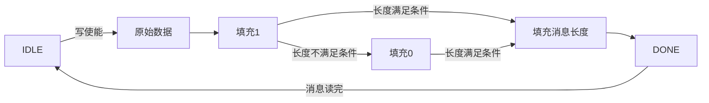

-------

## 1 前言

&#160; &#160; &#160; &#160; 网上讲SHA256算法的文章很多，大多数都是从算法角度或软件角度分析的。所以我们从硬件角度分析和设计一下SHA256算法。

* 哈希标准文档：
  * [Secure Hash Standard (SHS)](https://nvlpubs.nist.gov/nistpubs/FIPS/NIST.FIPS.180-4.pdf)
* [在线可视化SHA256计算](https://sha256algorithm.com/)


### 1.1 SHA概述

&#160; &#160; &#160; &#160; 由文档可知，SHA256算法分为以下几步：

* 预处理
  * 填充比特
  * 填充长度值
* 哈希计算
  * 消息块分解
  * 计算消息摘要
  * 计算哈希值

### 1.2 常数

&#160; &#160; &#160; &#160; 由文档可知，SHA256要用到以下8个1字节（32bit）的初始哈希值$H_0^{(0)}$~$H_7^{(0)}$：

```tcl
6a09e667 bb67ae85 3c6ef372 a54ff53a
510e527f 9b05688c 1f83d9ab 5be0cd19
```

&#160; &#160; &#160; &#160; 以及64个1字节（32bit）的常量$K_0^{(256)}$~$K_{63}^{(256)}$，它们是对自然数中前64个质数的立方根的小数部分的前32bit：

```tcl
428a2f98 71374491 b5c0fbcf e9b5dba5 3956c25b 59f111f1 923f82a4 ab1c5ed5
d807aa98 12835b01 243185be 550c7dc3 72be5d74 80deb1fe 9bdc06a7 c19bf174
e49b69c1 efbe4786 0fc19dc6 240ca1cc 2de92c6f 4a7484aa 5cb0a9dc 76f988da
983e5152 a831c66d b00327c8 bf597fc7 c6e00bf3 d5a79147 06ca6351 14292967
27b70a85 2e1b2138 4d2c6dfc 53380d13 650a7354 766a0abb 81c2c92e 92722c85
a2bfe8a1 a81a664b c24b8b70 c76c51a3 d192e819 d6990624 f40e3585 106aa070
19a4c116 1e376c08 2748774c 34b0bcb5 391c0cb3 4ed8aa4a 5b9cca4f 682e6ff3
748f82ee 78a5636f 84c87814 8cc70208 90befffa a4506ceb bef9a3f7 c67178f2
```

### 1.3 函数

&#160; &#160; &#160; &#160; 由文档可知，SHA256要用到以下6个函数

$Ch(x,y,z) = (x \land y) \oplus (\lnot x \land z)$

$Maj(x,y,z)= (x \land y) \oplus (x \land z) \oplus (y \land z) $

$\sum_0(x) = ROTR^2(x) \oplus ROTR^{13}(x) \oplus ROTR^{22}(x)$

$\sum_1(x) = ROTR^6(x) \oplus ROTR^{11}(x) \oplus ROTR^{25}(x)$

$\sigma_0(x) = ROTR^7(x) \oplus ROTR^{18}(x) \oplus SHR^3(x)$

$\sigma_1(x) = ROTR^{17}(x) \oplus ROTR^{19}(x) \oplus SHR^{10}(x)$


&#160; &#160; &#160; &#160; 其中：

| 逻辑运算 | 含义 |
| --- | --- |
| $\land$ | 按位与 |
| $\lnot$ | 按位补 |
| $\oplus$ | 异或 |
| $ROTR^n$ | 循环右移n位 |
| $SHR^n$ | 逻辑右移n位 |


&#160; &#160; &#160; &#160; 因此，转换成HDL伪代码：
```verilog
Ch(x,y,z) = (x & y) ^ (~x & z);
Ma(x,y,z) = (x & y) ^ (x  & z) ^ (y & z);
sum_0(x)  = {x[1:0],x[31:2]}   ^ {x[12:0],x[31:13]} ^ {x[21:0],x[31:22]};
sum_1(x)  = {x[5:0],x[31:6]}   ^ {x[10:0],x[31:11]} ^ {x[24:0],x[31:25]};
sigma_0(x)= {x[6:0],x[31:7]}   ^ {x[17:0],x[31:18]} ^ x>>3;
sigma_1(x)= {x[16:0],x[31:17]} ^ {x[18:0],x[31:19]} ^ x>>10;
```


----

## 2 预处理

### 2.1 算法分析

&#160; &#160; &#160; &#160; 需要对原始消息进行填充，假如原始消息长度为$l （l<2^{64}）$，填充分为三步：

* 填充1：在原始消息末尾填充1，此时消息长度为$l+1$；
* 填充0：如果此时的消息长度再加64可以被512整除，则不填充；否则在当前消息末尾填充n个0，直到$l+1+n+64$可以被512整除；
* 填充消息长度：把消息长度（位数）转换成64bit的数，填充到末尾，这样就得到了长度可以被512整除的预处理之后的消息。


&#160; &#160; &#160; &#160; 简单说就是原始消息长度为$l$，预处理之后的消息长度$m=l+1+n+64$，原始消息后面填充1，再填充n个0，再填充64bit的消息长度，n的大小要使得m能够被512整除，n为非负自然数。

### 2.2 硬件设计

&#160; &#160; &#160; &#160; 原始消息长度在输入时宽度是不固定的，但处理后的消息长度是512的倍数，这是因为在后续的哈希计算是要将预处理的消息分解为n个大小为512bit的块。

&#160; &#160; &#160; &#160; 考虑到上述输入输出位宽的情况，使用输入输出位宽不等的FIFO来对原始消息进行预处理。输入的消息长度以及输入消息的位宽能够通过parameter设定，但有以下要求：

* 输入的位宽必须为1/2/4/8/16/32/64，目前不支持大于64是因为考虑到最后填充的消息长度是64bit，降低设计难度，之后可能会添加支持；
* 输入的消息长度必须为所设定的输入位宽的倍数，方便计数并填充。


&#160; &#160; &#160; &#160; 输入信号就是写使能和写入的消息，以及读取预处理之后数据的使能，其中写入信号为Big-endian模式。

&#160; &#160; &#160; &#160; 输出信号是预处理之后的数据，也为Big-endian模式，另外就是写入完成和读取有效信号。

&#160; &#160; &#160; &#160; 根据上一小节的预处理步骤，可以设计如下状态机来实现：




&#160; &#160; &#160; &#160; 以消息宽度为8，消息长度为800举例，时序图如下：

```wavedrom
{ signal: [
  { name: "clk",      wave: "p....|..................." },
  ['Interface',
  { name: "wr_en",       wave: "01...|.0.................", node:".a......" },
  { name: "din",      wave: "x34x.|5==.|.67x.|89x.....", data:"D0 D1 D99 128 00 A0 A1 A6 A7"},
  { name: "rd_en", wave: "0...................1010.", node:"....................c.e."},
  { name: "dout",      wave: "x....................3x4x", data:"M0 M1"},
  { name: "ready",     wave: "0...................1...0" },
  { name: "valid",     wave: "0....................1010", node:".....................d.f." }, ],
  {},['Internal signal',
  { name: "msg_wr", wave: "0.1..|..............0....",node:"..b" },
  { name: "msg_din",  wave: "xx34x|.5==|..67x|.89x....", data:"D0 D1 D99 128 00 A0 A1 A6 A7" },
  { name: "cnt_bit",  wave: "=..=x|.==x|.===x|.====...", data:"0 8 792 800 952 960 968 1008 1016 1024 0" },
  { name: "cnt_rd",  wave: "=....................=.==", data:"0 1 2 0" },],
  {},['Stats',
  { name: "curr_stat", wave: "8.3..|..45|..6..|...7...8", data:"IDLE 原始消息 填1 填0 填消息长度 DONE IDLE" },

  { name: "next_stat", wave: "83...|.45.|.6...|..7...8.", data:"IDLE 原始消息 填1 填0 填消息长度 DONE IDLE" },],
  {},
],
edge: [
  'a-~>b','c-~>d','e-~>f'

]

}
```


&#160; &#160; &#160; &#160; 写入使能置1后启动写入流程。消息宽度是8，消息长度为800，因此使用8bit写宽度的FIFO需要写入原始消息100个cycle，既计数器从0，计数到799，每次加8。紧接着写入0x128到FIFO，既写入了1个1bit和7个0bit，然后补8bit的0，直到总长度还差64bit就能被512整除，最后把长度分为8个8bit的数据以大端模式写入FIFO，这样就完成了消息的Preprocess。

&#160; &#160; &#160; &#160; 需要取出处理完的消息，只需要给读出使能上升沿，就能以512bit从FIFO中读出消息，读完之后状态机恢复IDEL状态，准备好下一次预处理。


---

## 3 哈希计算

### 3.1 分解与设定初始哈希值

&#160; &#160; &#160; &#160; 在上一章里因为使用了512bit输出的FIFO，所以直接把预处理后的消息分解为n个512bit的块了。


&#160; &#160; &#160; &#160; SH256的初始哈希值是固定的，在文中1.2出可以找到，它们用于下一步计算。


### 3.2 计算消息摘要

### 3.2.1 算法分析

&#160; &#160; &#160; &#160; 消息摘要的计算需要用到上一步产生的512bit的块，每一个512bit（拆成16个32bit的字）计算一次，产生64个32bit的字作为一组消息摘要。有几个512bit的块，就有几组消息摘要。

&#160; &#160; &#160; &#160; 计算过程以一个512bit的块为例。把这个块拆分为16个32bit的字，标记为$M_0$~$M_{15}$，最终要产生64个32bit的字，标记为$W_t$，它们通过以下公式计算：

$$W_t=
  \begin{cases}
  M_t, 0\le t \le 15\\
  \sigma_1(W_{t-2})+W_{t-7}+\sigma_0(W_{t-15})+W_{t-16}, 16\le t \le 63\\
  \end{cases}$$

&#160; &#160; &#160; &#160; 其中的$\sigma_0$和$\sigma_1$函数的含义和伪代码在1.3中介绍过了。

&#160; &#160; &#160; &#160; 这样就完成了当前512bit块的消息摘要计算，其它块同理。**每个块的消息摘要计算相互独立。**


### 3.2.2 硬件设计


&#160; &#160; &#160; &#160; 构造函数。通过可综合的function来构造$\sigma_0$和$\sigma_1$函数，代码片段如下：

```verilog
function [31:0] Sigma_1;
input [31:0]	x;
begin
	Sigma_1 = {x[16:0],x[31:17]} ^ {x[18:0],x[31:19]} ^ {10'h0,x[31:10]};
end
endfunction

function [31:0] Sigma_0;
input [31:0]	x;
begin
	Sigma_0	= {x[6:0],x[31:7]} ^ {x[17:0],x[31:18]} ^ {3'h0,x[31:3]};
end
endfunction
```

&#160; &#160; &#160; &#160; 由上一小节的公式可知，$W_{15}$之后的字都需要它前面的某4个字来决定，所以需要这4个字计算出来才能得到，因此64个字全部计算完是需要一些cycle的。
```wavedrom
{ signal: [
  { name: "clk",      wave: "p.........................." },
  { name: "en",       wave: "01x......................", node:".a......" },
  { name: "en_edge",       wave: "0.10......................", node:".a......" },
  { name: "m0~m15",      wave: "x3x......................", data:"M"},
  { name: "w0~w15",      wave: "x.3........", data:"W0~W15"},
  { name: "w16~w31",      wave: "x..3.......", data:"W16~w31"},
  { name: "w32~w47",      wave: "x...3......", data:"W32~W47"},
  { name: "w48~w63",      wave: "x....3.....", data:"W48~W63"},


],
edge: [
  'a-~>b','c-~>d','e-~>f'

]

}
```


### 3.3 计算哈希值

----

[img1]: