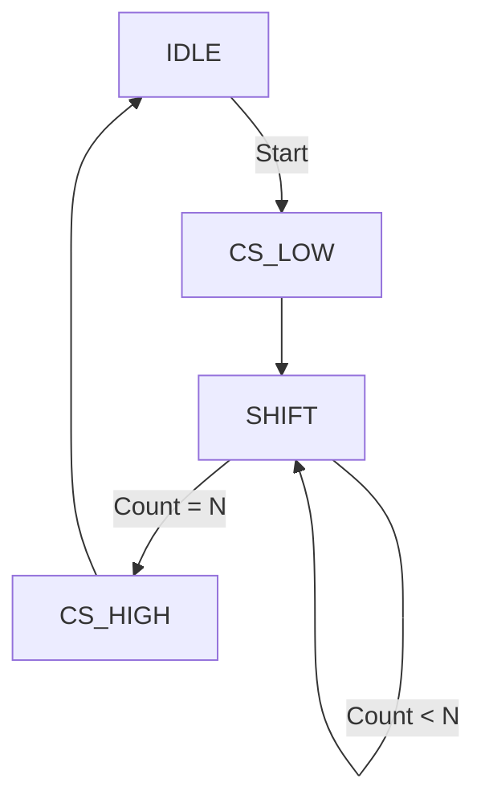

![SPI_Intro][SPI_Intro]

-------

## 1 前言

&#160; &#160; &#160; &#160; SPI (Serial Peripheral Interface) 是一种同步、全双工、主从式 (Master-Slave) 的串行通信接口，最初由 **Motorola** 公司（现在的 NXP）在 1980 年代中期提出。

&#160; &#160; &#160; &#160; 相比于 I2C，SPI 的传输速率更高（通常可达几十 MHz），协议逻辑更简单（没有复杂的起始/停止信号和应答机制），常用于 ADC/DAC、Flash 存储器、传感器等对速率有一定要求的外设连接。

-------

## 2 接口信号 (Interface Signals)

标准的 SPI 接口通常由 4 根线组成：

| 信号名 | 别名 | 方向 (Master视角) | 描述 |
| :--- | :--- | :--- | :--- |
| **SCLK** | SCK, CLK | Output | **串行时钟**，由主机产生，决定传输速率。 |
| **MOSI** | SIMO, SDO, DO | Output | **主机输出/从机输入** (Master Out Slave In)，数据从主机发送给从机。 |
| **MISO** | SOMI, SDI, DI | Input | **主机输入/从机输出** (Master In Slave Out)，数据从从机返回给主机。 |
| **SS / CS** | nCS, CSB, STE | Output | **片选信号** (Slave Select / Chip Select)，通常低电平有效，用于激活特定的从机。 |

*注：为了去除了 "Master/Slave" 的术语，部分新标准（如 OSHWA）提倡使用 **COPI** (Controller Out Peripheral In) 和 **CIPO** (Controller In Peripheral Out) 代替 MOSI/MISO。*

-------

## 3 工作原理

&#160; &#160; &#160; &#160; SPI 的核心原理是 **移位寄存器 (Shift Register)** 的数据交换。

1.  主机和从机各有一个 N-bit（通常是 8-bit）的移位寄存器。
2.  当传输开始时，主机产生时钟 SCLK。
3.  在 SCLK 的驱动下，主机的最高位 (MSB) 移出到 MOSI 线，进入从机的最低位 (LSB)（或反之）。
4.  同时，从机的最高位 (MSB) 移出到 MISO 线，进入主机的最低位 (LSB)。
5.  经过 N 个时钟周期后，主机和从机的数据完成了**互换**。

![SPI_Shift_Register][SPI_Shift_Register]

-------

## 4 时钟极性与相位 (Clock Polarity & Phase)

SPI 定义了 4 种工作模式，由两个参数决定：

*   **CPOL (Clock Polarity)**：决定时钟空闲时的电平。
    *   `CPOL=0`: 空闲时 SCLK 为低电平。
    *   `CPOL=1`: 空闲时 SCLK 为高电平。
*   **CPHA (Clock Phase)**：决定数据采样和改变的边沿。
    *   `CPHA=0`: 在第一个边沿采样数据，第二个边沿改变数据。
    *   `CPHA=1`: 在第一个边沿改变数据，第二个边沿采样数据。

### 4.1 四种模式汇总表

| Mode | CPOL | CPHA | 空闲时钟 | 采样时刻 |
| :---: | :---: | :---: | :---: | :---: |
| **Mode 0** | 0 | 0 | Low | Rising Edge (第1个边沿) |
| **Mode 1** | 0 | 1 | Low | Falling Edge (第2个边沿) |
| **Mode 2** | 1 | 0 | High | Falling Edge (第1个边沿) |
| **Mode 3** | 1 | 1 | High | Rising Edge (第2个边沿) |

### 4.2 时序图 (WaveDrom)

下面的波形图详细展示了 4 种模式下的时钟与数据采样关系。

<script type="WaveDrom">
{ signal: [
  { name: "CS (SS)", wave: "10........1"},
  {},
  { name: "SCLK (Mode 0: CPOL=0, CPHA=0)", wave: "0.P.......0", node: "..abcd" },
  { name: "MOSI/MISO (Sample @ Rise)",     wave: "x.3.4.5.6.x", data: ["D0", "D1", "D2", "D3"] },
  {},
  { name: "SCLK (Mode 1: CPOL=0, CPHA=1)", wave: "0.n.......0", node: "..efgh" },
  { name: "MOSI/MISO (Sample @ Fall)",     wave: "x..3.4.5.6x", data: ["D0", "D1", "D2", "D3"] },
  {},
  { name: "SCLK (Mode 2: CPOL=1, CPHA=0)", wave: "1.N.......1", node: "..ijkl" },
  { name: "MOSI/MISO (Sample @ Fall)",     wave: "x.3.4.5.6.x", data: ["D0", "D1", "D2", "D3"] },
  {},
  { name: "SCLK (Mode 3: CPOL=1, CPHA=1)", wave: "1.p.......1", node: "..mnop" },
  { name: "MOSI/MISO (Sample @ Rise)",     wave: "x..3.4.5.6x", data: ["D0", "D1", "D2", "D3"] },
],
  edge: [
    "a~>b Sample", "c~>d Sample",
    "f~>g Sample", "h~>i",
    "i~>j Sample", "k~>l Sample",
    "n~>o Sample"
  ],
  head: {
    text: 'SPI Modes 0, 1, 2, 3 Timing Diagram',
    tick: 0,
  }
}
</script>

*   **Mode 0** 是最常用的模式。
*   注意：CPHA=0 时，CS 拉低的同时数据必须已经准备好（因为第一个边沿就开始采样）。

-------

## 5 多从机连接 (Multi-Slave Configuration)

SPI 主机可以连接多个从机，主要有两种连接方式：

### 5.1 独立片选 (Independent Slave Configuration)

这是最常见的方式。主机为每个从机提供一根独立的 **CS** 线。
*   **优点**：逻辑简单，从机之间互不干扰，吞吐率高。
*   **缺点**：主机需要大量的 CS 引脚（或者使用译码器），PCB 走线随从机数量增加。

### 5.2 菊花链 (Daisy Chain Configuration)

所有从机串联起来，主机的 MOSI 接 Slave1 的 MOSI，Slave1 的 MISO 接 Slave2 的 MOSI，以此类推，最后一个 Slave 的 MISO 接回主机的 MISO。所有从机共用一个 **CS** 和 **SCLK**。
*   **工作方式**：整个链条构成一个巨大的移位寄存器。主机若要给 Slave2 发送数据，需要发送两组数据，将数据“推”过 Slave1。
*   **优点**：节省主机的 I/O 引脚（只需要 1 个 CS）。
*   **缺点**：
    *   并非所有 SPI 设备都支持（必须支持 No-Op 操作以便传递数据）。
    *   传输延迟大，任何一个设备故障可能导致整条链断裂。

-------

## 6 优缺点总结

### 优点
1.  **全双工通信**：可以同时发送和接收。
2.  **高吞吐量**：没有协议开销（如地址位、ACK位），速率仅受限于物理链路。
3.  **硬件简单**：无需上拉电阻（推挽输出），无需唯一的设备地址（通过 CS 区分）。
4.  **传输灵活**：支持任意 bit 长度的数据帧（8, 16, 12, etc.）。

### 缺点
1.  **引脚多**：每个设备至少需要 4 根线（I2C 只需要 2 根）。
2.  **无流控**：没有硬件应答机制 (ACK)，主机不知道从机是否接收成功。
3.  **短距离**：通常仅限于板级通信 (PCB Trace)。
4.  **多主支持差**：标准 SPI 协议没有仲裁机制，通常通过额外的逻辑实现。

-------

## 7 Verilog 实现参考 (Mode 0, Master)

一个简单的 SPI Master 状态机设计思路：



```verilog
// 简化的代码片段
always @(posedge clk) begin
    case(state)
        IDLE: begin
            cs_n <= 1'b1;
            if(start) state <= WORK;
        end
        WORK: begin
            cs_n <= 1'b0;
            sclk <= ~sclk; // 生成时钟
            if(sclk_falling) begin
                mosi <= data_reg[7];
                data_reg <= {data_reg[6:0], 1'b0};
            end
            if(sclk_rising) begin
                rx_reg <= {rx_reg[6:0], miso};
            end
            // ... 计数器逻辑 ...
        end
    endcase
end
```

[SPI_Intro]: https://upload.wikimedia.org/wikipedia/commons/thumb/e/ed/SPI_three_slaves.svg/1200px-SPI_three_slaves.svg.png
[SPI_Shift_Register]: https://www.analog.com/-/media/analog/en/landing-pages/technical-articles/introduction-to-spi-interface/figure-1.png
