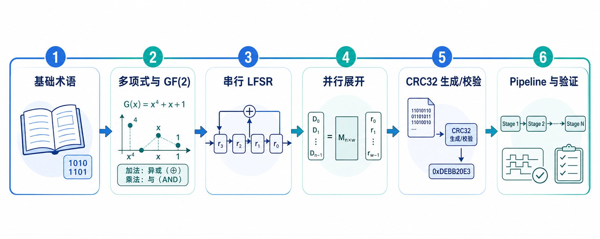
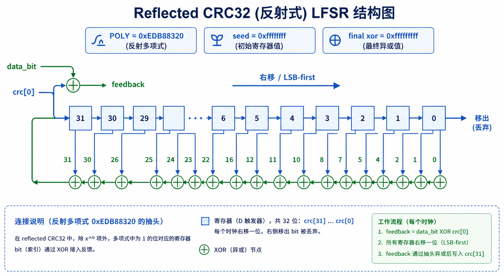
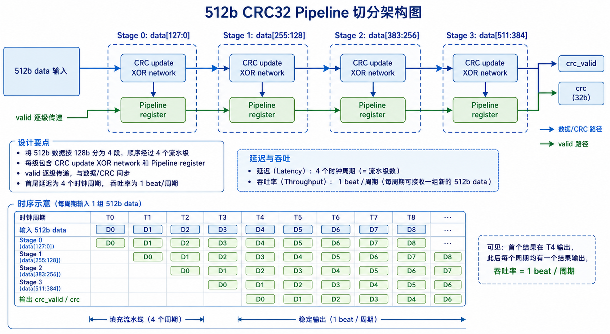

&#160; &#160; &#160; &#160; 在高速数字系统里，数据错误很少以“明显坏掉”的形式出现。一个以太网帧可能只翻转了 1 bit，一个 DMA 描述符可能只错了某个长度字段，一个片间链路可能只在拥塞或复位边界附近丢了一个 beat。系统最麻烦的错误，往往不是完全没有数据，而是数据看起来还像数据，却已经不是发送端原来想表达的内容。

&#160; &#160; &#160; &#160; CRC（Cyclic Redundancy Check，循环冗余校验）解决的就是这个问题：在一个数据块后面附加少量冗余位，让接收端可以用同一套规则重新计算并判断数据是否被破坏。它不能告诉我们错误一定在哪里，也不能替代 ECC 或重传协议，但它非常适合做 packet 级、block 级、stream 级的数据完整性检测。原因也很直接：CRC 的数学模型清晰，硬件代价低，串行和并行实现都可以统一到 LFSR 结构，适合放进 MAC、NoC、PCIe/CXL 适配层、DMA、压缩/解压缩链路、存储控制器和 FPGA 数据通路里。

&#160; &#160; &#160; &#160; 本文从 packet 级数据完整性检测讲起，重点分析 CRC32 在 RTL 中最容易踩坑的几个问题：polynomial 选择、bit 顺序、pipeline、并行/串行实现、LFSR 结构展开、freeze CRC、seed 和 invert。最后给出一个小项目：实现一个可参数化的 Ethernet CRC32 生成与校验模块，支持 64B 和 512B 两种并行宽度。



----

## 1 为什么CRC常被放在packet边界

### 1.1 数据完整性检测的对象不是“信号”，而是“语义完整的数据单元”

&#160; &#160; &#160; &#160; 在 RTL 里，我们经常看到 `valid`、`ready`、`last`、`keep`、`sop`、`eop` 这样的信号。它们说明数据流不是一条没有边界的 bit 河流，而是由一个个有语义的数据单元组成。以太网里是 frame，NoC 里可能是 flit 组成的 packet，DMA 里可能是一段 descriptor 或 payload，存储里可能是 sector 或 cache line。

&#160; &#160; &#160; &#160; CRC 最自然的作用位置，是这些边界明确的数据单元。发送端在 packet 开始时初始化 CRC 状态，随着 payload 或 header+payload 输入不断更新状态，在 packet 结束时输出 CRC 字段。接收端用同样的参数重新计算，然后比较接收到的 CRC 字段。如果不一致，就把这个 packet 标记为 corrupted，并交给上层做丢弃、重传、错误计数或链路恢复。

| 检测粒度 | 典型位置 | 优点 | 局限 |
| --- | --- | --- | --- |
| bit/beat 级 parity | SRAM、寄存器阵列、窄总线 | 代价低，定位快 | 检测能力弱，不适合长 packet |
| word/block 级 checksum | 软件协议、简单控制包 | 实现简单 | 对重排、抵消类错误较弱 |
| packet 级 CRC | MAC、SerDes 链路、DMA、存储块 | 检测能力强，硬件友好 | 不能纠错，误检概率仍非零 |
| ECC | SRAM、DRAM、片上缓存 | 可定位和纠正部分错误 | 冗余和延迟更高，适用边界不同 |

&#160; &#160; &#160; &#160; packet 级 CRC 的关键不是“算一个数”，而是定义清楚这个数覆盖了哪些 bit：是否包含 header，是否包含 padding，是否包含 sequence number，是否包含 length 字段，CRC 字段自身是否参与最终 residue 检查。这些边界如果在发送端和接收端不一致，RTL 再正确也会互相判错。

### 1.2 CRC在系统架构里的职责边界

&#160; &#160; &#160; &#160; 一个工程上可靠的 CRC 模块通常只负责三件事：

* 在指定 packet 起点装载 seed；
* 对有效数据 byte 按约定 bit 顺序更新 LFSR 状态；
* 在 packet 终点输出经过 invert/reflection 约定处理后的 CRC，或给出 compare 结果。

&#160; &#160; &#160; &#160; 它不应该隐式猜测 packet 边界，不应该自己决定丢包重传，也不应该在不知道协议语义的情况下自动跳过某些字段。协议层负责告诉 CRC 模块什么时候开始、什么时候结束、哪些 byte 有效、接收到的 FCS/CRC 字段在哪里。CRC 模块负责把这些输入转换成稳定、可验证的校验结果。

----

## 2 CRC32的参数不是细节，而是协议本身

### 2.1 同叫CRC32，不代表结果相同

&#160; &#160; &#160; &#160; 很多调试事故都来自一句话：“我们都用 CRC32。”CRC32 不是一个完整规格，它至少需要下面这些参数才能唯一确定：

| 参数 | 含义 | Ethernet CRC32 常见取值 |
| --- | --- | --- |
| width | CRC 状态位宽 | 32 |
| polynomial | 生成多项式 | normal 表示 `0x04C11DB7`，reflected 表示 `0xEDB88320` |
| init / seed | packet 起始状态 | `32'hFFFF_FFFF` |
| refin | 输入数据是否按 LSB-first 进入算法 | true |
| refout | 输出 CRC 是否反射 | true，通常与 reflected 实现的数值表达合并理解 |
| xorout / invert | 输出前最终异或 | `32'hFFFF_FFFF` |
| check | 对字符串 `123456789` 的参考结果 | 常见 CRC-32/ISO-HDLC 为 `0xCBF43926` |
| residue | 把 data+CRC 一起继续计算后的固定余数 | 用于 checker 的另一种实现方式 |

&#160; &#160; &#160; &#160; 这张表里最容易混的是 polynomial 和 bit 顺序。`0x04C11DB7` 是 normal/MSB-first 语境下的写法，`0xEDB88320` 是 reflected/LSB-first 语境下的写法。它们不是两个任意不同的多项式，而是同一类 CRC32 在不同移位方向和 bit 编号约定下的数值表达。RTL 里如果数据按每个 byte 的 bit0 先进入，那么右移 LFSR 配合 `0xEDB88320` 会更直观。

### 2.2 polynomial选择：先选协议，再谈最优

&#160; &#160; &#160; &#160; polynomial 决定 CRC 对不同错误模式的检测能力。理论上，不同多项式对 burst error、双 bit error、奇数 bit error、特定长度消息的最小汉明距离都有不同表现。工程上通常先问一个更现实的问题：这个模块是不是必须兼容既有协议？

| 场景 | polynomial 选择原则 |
| --- | --- |
| Ethernet FCS、ZIP、PNG 等兼容场景 | 使用协议规定的 CRC-32 参数，不自行优化 |
| iSCSI、SCTP 或部分存储/软件栈 | 常见选择 CRC-32C Castagnoli，多项式不同 |
| 私有片内 packet 或调试通道 | 根据最大 packet 长度、错误模型、硬件代价选择，可参考 Koopman 的 CRC 多项式研究 |
| 极短控制字段 | CRC-8/CRC-16 可能比 CRC32 更省面积和延迟 |

&#160; &#160; &#160; &#160; 本文小项目选择 Ethernet 常用 CRC32 参数，不是因为它在所有消息长度上都“最优”，而是因为它是最常见、最容易与软件 golden model 对齐、也最适合讲解 LFSR 展开的版本。真正做协议设计时，polynomial 是协议的一部分；真正做兼容实现时，polynomial 不是设计自由度。

### 2.3 bit顺序：RTL里最容易错的不是多项式，而是喂bit的方向

&#160; &#160; &#160; &#160; 对 CRC 来说，一个 byte `8'h83` 到底按 `1,1,0,0,0,0,0,1` 进入，还是按 `1,0,0,0,0,0,1,1` 进入，会得到完全不同的结果。软件里常见的 CRC32 API 往往把 byte 当作普通内存顺序处理，内部已经采用 reflected 算法。硬件里，数据总线的 bit 编号、lane 编号、协议线序、FCS 发送顺序却都可能不同。

&#160; &#160; &#160; &#160; 因此 RTL 设计前必须写清楚三层顺序：

| 顺序类型 | 需要回答的问题 | 本文约定 |
| --- | --- | --- |
| byte lane 顺序 | `data_i[7:0]` 是 packet 中较早的 byte，还是 `data_i[DATA_W-1 -: 8]` 更早 | `data_i[8*i +: 8]` 的 `i` 越小，byte 越早 |
| byte 内 bit 顺序 | 每个 byte 是 bit0 先参与 CRC，还是 bit7 先参与 | bit0 先参与，reflected CRC32 |
| CRC 输出顺序 | 输出总线里的 bit/byte 如何映射到协议 FCS 字段 | `crc_o = ~crc_state`，低 byte 先放到低 lane |

&#160; &#160; &#160; &#160; 这个约定看似啰嗦，但它能避免大部分“软件算得对、硬件一直差一个 bit reverse”的问题。CRC 调试时不要只比较最终十六进制数，还要比较每输入一个 byte 后的中间状态；中间状态一旦在第一个 byte 就分叉，基本就是 bit 顺序或 seed 错了。

----

## 3 从串行LFSR到并行展开

### 3.1 LFSR为什么适合硬件

&#160; &#160; &#160; &#160; CRC 的数学本质是在 GF(2) 上做多项式除法。GF(2) 里加法就是异或，乘以 `x` 可以对应移位，所以它天然适合用 LFSR（Linear Feedback Shift Register，线性反馈移位寄存器）实现。每输入 1 bit，LFSR 做一次移位，并根据反馈 bit 决定是否异或 polynomial。

&#160; &#160; &#160; &#160; 对 reflected CRC32，串行更新可以写成：

```systemverilog
function automatic logic [31:0] crc32_next_bit (
    input logic [31:0] crc_i,
    input logic        data_bit_i
);
    logic feedback;
    begin
        feedback       = crc_i[0] ^ data_bit_i;
        crc32_next_bit = {1'b0, crc_i[31:1]};
        if (feedback) begin
            crc32_next_bit ^= 32'hEDB8_8320;
        end
    end
endfunction
```

&#160; &#160; &#160; &#160; 这段逻辑表达了 reflected 实现的核心：状态向右移，输入 bit 与当前最低位形成 feedback，feedback 为 1 时异或 reflected polynomial。串行实现每拍处理 1 bit，面积很小，但吞吐很低。对 100G/200G/400G 以太网或片内宽总线来说，我们更常见的是一次处理 64 bit、256 bit、512 bit，甚至 4096 bit。



### 3.2 并行展开的本质是把多拍串行逻辑压成一拍组合逻辑

&#160; &#160; &#160; &#160; 并行 CRC 并不是另一种算法。它只是把串行 LFSR 连续执行 N 次后得到的结果，展开成一个关于旧 CRC 状态和 N 个输入 bit 的组合 XOR 网络。由于 CRC 更新是线性运算，每个输出 bit 都可以写成若干输入 bit 和旧状态 bit 的异或。

&#160; &#160; &#160; &#160; 例如 64B 并行意味着一次处理 64 byte，也就是 512 bit。512B 并行意味着一次处理 512 byte，也就是 4096 bit。直接把 4096 次 bit 更新写在一个 `for` 循环里，综合工具会把它展开成很大的组合逻辑。功能上没有问题，但时序可能很紧，尤其在 ASIC 高主频或 FPGA LUT/routing 资源紧张时。

| 实现方式 | 每拍处理量 | 优点 | 风险 |
| --- | --- | --- | --- |
| 串行 1 bit | 1 bit | 面积最小，结构直观 | 吞吐低 |
| byte 并行 | 8 bit | 适合低速总线，容易调试 | 高速链路仍不够 |
| word 并行 | 32/64/128 bit | 面积和吞吐平衡 | 需要明确 lane 顺序 |
| 64B 并行 | 512 bit | 适合宽 packet datapath | XOR 网络较深 |
| 512B 并行 | 4096 bit | 适合超宽内部 block/checksum | 通常需要 pipeline 分割 |

### 3.3 pipeline：不是为了改变CRC结果，而是为了切开XOR网络

&#160; &#160; &#160; &#160; CRC 并行展开后，最大问题通常不是寄存器数量，而是 XOR 扇入、逻辑深度和布线。对 64B 并行，很多工艺和频率目标下可以一拍完成；对 512B 并行，直接一拍完成通常会给 timing closure 留下很少余地。

&#160; &#160; &#160; &#160; pipeline 的做法是把一个大输入 beat 切成多个 chunk。例如 512B 可以切成 8 个 64B chunk：

```text
cycle N:
  stage0: CRC(seed or previous packet state, chunk0)

cycle N+1:
  stage1: CRC(stage0_crc, chunk1)

...

cycle N+7:
  stage7: CRC(stage6_crc, chunk7)
```

&#160; &#160; &#160; &#160; 这样做会增加 latency，但吞吐仍然可以做到每拍接收一个 512B beat，只要同时为不同 packet/beat 管理好 pipeline valid、packet 边界和部分 byte 有效信息。如果 packet 长度小于 512B，或者最后一个 beat 只有部分 byte 有效，就必须用 `keep` 控制真正参与 CRC 的 byte。不能把无效 lane 当作 0 自动纳入 CRC，除非协议明确要求 padding 也被覆盖。



### 3.4 freeze CRC：valid/ready停顿时，CRC状态必须像放进冰箱一样保持不变

&#160; &#160; &#160; &#160; 实际数据通路里，CRC 模块很少面对一条永不停顿的理想流。上游可能 `valid` 拉低，下游可能通过 `ready` 反压，packet 中间可能插入 bubble。所谓 freeze CRC，可以理解为：当本拍没有真正完成数据传输时，CRC 状态要“冻住”，不能因为总线上残留的旧数据或无效数据而更新。

&#160; &#160; &#160; &#160; 在 ready/valid 接口中，CRC 更新条件通常应该是：

```text
fire = valid_i && ready_o

if reset:
  crc_state <= SEED
else if fire && sop_i:
  crc_state <= crc_next(SEED, data_i, keep_i)
else if fire:
  crc_state <= crc_next(crc_state, data_i, keep_i)
else:
  crc_state <= crc_state
```

&#160; &#160; &#160; &#160; 这个规则也解释了为什么 CRC 模块不应该只看 `valid_i`。如果 `valid_i=1` 但 `ready_o=0`，这个 beat 并没有被系统接受，CRC 状态更新就会造成重复计算。反过来，如果上游在 bubble 周期没有清空 `data_i`，CRC 也不应该被残留数据污染。

----

## 4 顶层架构与接口约定

### 4.1 小项目目标

&#160; &#160; &#160; &#160; 本文的小项目实现一个参数化 CRC32 生成/校验模块，目标如下：

| 目标 | 说明 |
| --- | --- |
| CRC 类型 | Ethernet/ISO-HDLC 风格 CRC32，reflected 右移实现 |
| 并行宽度 | 支持 64B（512 bit）和 512B（4096 bit），也可参数化到其他 8 的倍数 |
| packet 边界 | `sop_i` 表示 packet 首 beat，`eop_i` 表示 packet 末 beat |
| byte 有效 | `keep_i` 每 bit 对应一个 byte lane，有效 byte 才参与 CRC |
| 生成模式 | packet 结束时输出 `crc_o` 和 `crc_valid_o` |
| 校验模式 | packet 结束时比较 `rx_crc_i`，输出 `crc_match_o` |
| stall 行为 | 只有 `valid_i && ready_o` 时更新 CRC，其他周期 freeze |
| 参数 | 支持 seed 和 final invert 配置 |

### 4.2 顶层信号表

| 信号名 | 方向 | 位宽 | 分类 | 描述 |
| --- | --- | --- | --- | --- |
| `clk_i` | input | 1 | clock-reset | 工作时钟 |
| `rst_ni` | input | 1 | clock-reset | 低有效异步复位 |
| `valid_i` | input | 1 | valid-ready | 输入 beat 有效 |
| `ready_o` | output | 1 | valid-ready | 本模块可接收输入 |
| `data_i` | input | `DATA_W` | data | 输入数据，低 byte lane 先参与 CRC |
| `keep_i` | input | `DATA_BYTES` | control | 每个 byte 是否有效 |
| `sop_i` | input | 1 | control | packet 起点 |
| `eop_i` | input | 1 | control | packet 终点 |
| `rx_crc_i` | input | 32 | data | 接收方向从 packet 中解析出的 CRC 字段 |
| `crc_o` | output | 32 | status | 生成出的 CRC32/FCS 数值 |
| `crc_valid_o` | output | 1 | status | `crc_o` 和 `crc_match_o` 有效 |
| `crc_match_o` | output | 1 | status | 校验模式下重新计算结果是否等于 `rx_crc_i` |

&#160; &#160; &#160; &#160; 这里没有单独设计 `mode_i`。生成和校验可以同时给出：发送路径使用 `crc_o`，接收路径使用 `crc_match_o`。如果某个系统只需要其中一种功能，可以在上层或综合约束中裁剪无用输出。

### 4.3 数据通路分块

&#160; &#160; &#160; &#160; 顶层可以拆成三个逻辑块：

| 逻辑块 | 职责 |
| --- | --- |
| byte selector | 根据 `keep_i` 决定哪些 byte 参与 CRC |
| crc32 update | 对有效 byte 执行 reflected CRC32 更新 |
| packet control | 管理 seed 装载、freeze、eop 输出、compare |

&#160; &#160; &#160; &#160; 对 64B 版本，`DATA_W=512`、`DATA_BYTES=64`。对 512B 版本，`DATA_W=4096`、`DATA_BYTES=512`。如果 512B 版本一拍组合路径过长，可以把 `crc32 update` 进一步切成 8 个 64B stage，并在每个 stage 后加寄存器。本文先给出直接参数化版本，随后解释如何生成 pipeline 版本。

----

## 5 RTL实现：参数化CRC32生成与校验

### 5.1 CRC更新函数

&#160; &#160; &#160; &#160; 下面的代码采用 reflected CRC32。输入 byte 按 lane 从低到高处理，每个 byte 内从 bit0 到 bit7 处理。`keep_i[i]=0` 的 byte 不参与计算，因此适合处理 packet 最后一个 beat 的非满宽情况。

```systemverilog
function automatic logic [31:0] crc32_next_keep (
    input logic [31:0]                 crc_i,
    input logic [DATA_BYTES*8-1:0]     data_i,
    input logic [DATA_BYTES-1:0]       keep_i
);
    logic [31:0] crc;
    logic        feedback;

    begin
        crc = crc_i;

        for (int byte_idx = 0; byte_idx < DATA_BYTES; byte_idx++) begin
            if (keep_i[byte_idx]) begin
                for (int bit_idx = 0; bit_idx < 8; bit_idx++) begin
                    feedback = crc[0] ^ data_i[byte_idx*8 + bit_idx];
                    crc      = {1'b0, crc[31:1]};
                    if (feedback) begin
                        crc ^= 32'hEDB8_8320;
                    end
                end
            end
        end

        return crc;
    end
endfunction
```

&#160; &#160; &#160; &#160; 这段函数建议放在参数化模块内部，直接使用模块参数 `DATA_BYTES`。这是最直接、最不容易写错的版本。综合工具会展开循环。对于小宽度或中等宽度，它已经足够实用；对于 512B 并行，建议用脚本生成分层 XOR 或插入 pipeline stage。

### 5.2 顶层模块

```systemverilog
module crc32_packet_gen_check #(
    parameter int unsigned DATA_BYTES = 64,
    parameter logic [31:0] SEED       = 32'hFFFF_FFFF,
    parameter logic [31:0] XOROUT     = 32'hFFFF_FFFF
) (
    input  logic                         clk_i,
    input  logic                         rst_ni,

    input  logic                         valid_i,
    output logic                         ready_o,
    input  logic [DATA_BYTES*8-1:0]      data_i,
    input  logic [DATA_BYTES-1:0]        keep_i,
    input  logic                         sop_i,
    input  logic                         eop_i,
    input  logic [31:0]                  rx_crc_i,

    output logic [31:0]                  crc_o,
    output logic                         crc_valid_o,
    output logic                         crc_match_o
);

    logic        fire;
    logic [31:0] crc_state_q;
    logic [31:0] crc_base;
    logic [31:0] crc_next;
    logic [31:0] crc_final;

    assign ready_o = 1'b1;
    assign fire    = valid_i && ready_o;
    assign crc_base = sop_i ? SEED : crc_state_q;

    assign crc_next  = crc32_next_keep(
        .crc_i (crc_base),
        .data_i(data_i),
        .keep_i(keep_i)
    );

    assign crc_final = crc_next ^ XOROUT;

    always_ff @(posedge clk_i or negedge rst_ni) begin
        if (!rst_ni) begin
            crc_state_q <= SEED;
            crc_o       <= '0;
            crc_valid_o <= 1'b0;
            crc_match_o <= 1'b0;
        end else begin
            crc_valid_o <= 1'b0;

            if (fire) begin
                crc_state_q <= eop_i ? SEED : crc_next;

                if (eop_i) begin
                    crc_o       <= crc_final;
                    crc_valid_o <= 1'b1;
                    crc_match_o <= (crc_final == rx_crc_i);
                end
            end
        end
    end

    function automatic logic [31:0] crc32_next_keep (
        input logic [31:0]                 crc_i,
        input logic [DATA_BYTES*8-1:0]     data_i,
        input logic [DATA_BYTES-1:0]       keep_i
    );
        logic [31:0] crc;
        logic        feedback;

        begin
            crc = crc_i;

            for (int byte_idx = 0; byte_idx < DATA_BYTES; byte_idx++) begin
                if (keep_i[byte_idx]) begin
                    for (int bit_idx = 0; bit_idx < 8; bit_idx++) begin
                        feedback = crc[0] ^ data_i[byte_idx*8 + bit_idx];
                        crc      = {1'b0, crc[31:1]};
                        if (feedback) begin
                            crc ^= 32'hEDB8_8320;
                        end
                    end
                end
            end

            return crc;
        end
    endfunction

endmodule
```

### 5.3 两个实例：64B与512B

```systemverilog
module crc32_64b_packet_gen_check (
    input  logic          clk_i,
    input  logic          rst_ni,
    input  logic          valid_i,
    output logic          ready_o,
    input  logic [511:0]  data_i,
    input  logic [63:0]   keep_i,
    input  logic          sop_i,
    input  logic          eop_i,
    input  logic [31:0]   rx_crc_i,
    output logic [31:0]   crc_o,
    output logic          crc_valid_o,
    output logic          crc_match_o
);

    crc32_packet_gen_check #(
        .DATA_BYTES(64)
    ) u_crc32_64b (
        .clk_i       (clk_i),
        .rst_ni      (rst_ni),
        .valid_i     (valid_i),
        .ready_o     (ready_o),
        .data_i      (data_i),
        .keep_i      (keep_i),
        .sop_i       (sop_i),
        .eop_i       (eop_i),
        .rx_crc_i    (rx_crc_i),
        .crc_o       (crc_o),
        .crc_valid_o (crc_valid_o),
        .crc_match_o (crc_match_o)
    );

endmodule
```

```systemverilog
module crc32_512b_packet_gen_check (
    input  logic           clk_i,
    input  logic           rst_ni,
    input  logic           valid_i,
    output logic           ready_o,
    input  logic [4095:0]  data_i,
    input  logic [511:0]   keep_i,
    input  logic           sop_i,
    input  logic           eop_i,
    input  logic [31:0]    rx_crc_i,
    output logic [31:0]    crc_o,
    output logic           crc_valid_o,
    output logic           crc_match_o
);

    crc32_packet_gen_check #(
        .DATA_BYTES(512)
    ) u_crc32_512b (
        .clk_i       (clk_i),
        .rst_ni      (rst_ni),
        .valid_i     (valid_i),
        .ready_o     (ready_o),
        .data_i      (data_i),
        .keep_i      (keep_i),
        .sop_i       (sop_i),
        .eop_i       (eop_i),
        .rx_crc_i    (rx_crc_i),
        .crc_o       (crc_o),
        .crc_valid_o (crc_valid_o),
        .crc_match_o (crc_match_o)
    );

endmodule
```

&#160; &#160; &#160; &#160; 这两个 wrapper 的功能完全一样，只是并行输入宽度不同。64B 版本适合一拍处理一个 cache line 或宽 MAC datapath；512B 版本更像高带宽内部 block 处理，实际落地时往往需要 pipeline。

----

## 6 512B并行时如何做pipeline

### 6.1 直接展开的问题

&#160; &#160; &#160; &#160; `DATA_BYTES=512` 时，函数内部等价于连续执行 4096 次 bit 更新。虽然每次更新只是移位和异或，但综合后的组合网络会非常大。它的时序压力来自三个方面：

* XOR 级数深，单个输出 bit 可能依赖很多输入 bit；
* 扇出和布线复杂，尤其在 FPGA 中 LUT 和 routing 可能比逻辑本身更难收敛；
* 如果 `keep_i` 支持任意 byte mask，工具还要合成大量条件选择逻辑。

&#160; &#160; &#160; &#160; 因此 512B 宽 CRC 更适合拆成多个固定 chunk。常见做法是把 512B 拆成 8 个 64B stage，每个 stage 只负责 64B 的 CRC 更新，stage 间寄存 CRC 状态和 valid。这样单级逻辑与 64B 版本相同，代价是增加 8 拍左右延迟。

### 6.2 pipeline版本的控制要点

| 控制点 | 说明 |
| --- | --- |
| stage valid | 每一级必须跟随数据 chunk 和 CRC 状态移动 |
| sop/eop | `sop` 决定第一级使用 seed，`eop` 决定最后一级输出 compare |
| keep 分段 | `keep_i[63:0]`、`keep_i[127:64]` 等分别进入对应 stage |
| backpressure | 如果 pipeline 不支持停顿，可在入口使用 skid buffer；如果支持停顿，每级都要有 valid-ready |
| 多 packet 连续输入 | 必须保证 packet 边界与 CRC 状态一一对应，不能让下一个 packet 的 seed 被上一个 packet 的 stage 状态污染 |

&#160; &#160; &#160; &#160; 如果系统要求每拍输入一个 512B beat，pipeline 不是可选优化，而是数据通路的一部分。如果系统只是在低频下偶尔处理 512B block，直接组合展开也许更简单。RTL 架构应该由吞吐、频率、面积和验证复杂度共同决定。

### 6.3 生成式RTL：用脚本展开XOR还是用for循环交给综合器

&#160; &#160; &#160; &#160; CRC 并行 RTL 有两种常见写法：

| 写法 | 优点 | 缺点 |
| --- | --- | --- |
| `for` 循环函数 | 代码短，参数化强，容易与 golden model 对齐 | 结构由综合工具决定，不容易手工优化 XOR 平衡 |
| 脚本生成显式 XOR 方程 | 逻辑完全展开，可控制分组和 pipeline | 生成代码很长，维护依赖脚本 |

&#160; &#160; &#160; &#160; 对项目早期，我更推荐先用 `for` 循环版本建立功能正确性，再用脚本生成版本替换关键路径。生成脚本的核心思路是建立 32 个 CRC 状态符号和 N 个输入 bit 符号，模拟串行 LFSR 更新，最后得到每个输出 bit 对应的 XOR 输入集合。这个过程和 RTL 函数完全等价，只是输出形式从循环变成了显式 assign。

----

## 7 seed、invert与checker设计

### 7.1 seed不是复位值那么简单

&#160; &#160; &#160; &#160; seed 是每个 packet 开始时装入 CRC 状态的初始值。Ethernet CRC32 常用 `32'hFFFF_FFFF`。从实现角度看，复位后把 `crc_state_q` 设成 seed 很合理，但更重要的是 `sop_i` 时也要重新使用 seed。否则两个连续 packet 会被串在一起计算，接收端自然无法匹配。

&#160; &#160; &#160; &#160; 有些协议允许一个 block 的 CRC 继续前一个 block 的状态，这时 seed 可能不是固定值，而是上一个 block 的 final state。这不是 CRC 模块自己能决定的行为，需要通过配置或上层控制显式表达。

### 7.2 invert决定输出前的最后一步

&#160; &#160; &#160; &#160; 常见 Ethernet CRC32 在输出前会对内部状态按位取反，也就是 `crc_final = crc_state ^ 32'hFFFF_FFFF`。如果忘记 invert，硬件输出通常会与软件结果形成固定取反关系；如果 seed 和 invert 同时错，结果可能看起来没有明显规律，更难排查。

&#160; &#160; &#160; &#160; 建议在 testbench 中至少包含 `123456789` 这个经典 check vector。对 CRC-32/ISO-HDLC 参数，结果应为 `32'hCBF4_3926`。这个向量很短，适合最早发现 seed、polynomial、bit 顺序和 invert 的组合错误。

### 7.3 checker可以比较CRC，也可以检查residue

&#160; &#160; &#160; &#160; 接收侧有两种常见校验方式：

| 方式 | 做法 | 特点 |
| --- | --- | --- |
| 重新计算并比较 | 对 data 部分计算 `crc_final`，与收到的 `rx_crc_i` 比较 | 最直观，适合数据和 FCS 已经分离的架构 |
| residue 检查 | 把 data 和收到的 CRC 字段一起送入 CRC，最后比较固定 residue | 适合流式处理，不一定需要提前剥离 FCS |

&#160; &#160; &#160; &#160; 本文 RTL 使用第一种方式，因为它更容易和 packet parser 分工：parser 负责把 FCS 字段从 packet 尾部拿出来，CRC 模块负责对真正受保护的数据部分重新计算并比较。做 Ethernet MAC 时需要额外注意：FCS 字段本身不属于要重新生成的 MAC client payload，但在线路接收方向，它会作为帧尾 4 byte 到达 MAC RX 逻辑，因此 parser 和 CRC checker 的边界必须定义清楚。

----

## 8 验证方案：不要只测一个packet

### 8.1 golden model

&#160; &#160; &#160; &#160; CRC RTL 最适合用软件 golden model 验证。Python 里的 `binascii.crc32()` 可以生成常见 reflected CRC32 结果，但要注意它的初值和最终异或语义已经封装在 API 行为中。为了避免 API 约定差异，也可以在 testbench 或 Python 中写一个逐 bit golden model，参数与 RTL 完全一致。

```python
def crc32_reflected(data: bytes, seed=0xFFFFFFFF, xorout=0xFFFFFFFF) -> int:
    crc = seed
    for byte in data:
        for bit in range(8):
            feedback = (crc ^ (byte >> bit)) & 1
            crc >>= 1
            if feedback:
                crc ^= 0xEDB88320
    return crc ^ xorout

assert crc32_reflected(b"123456789") == 0xCBF43926
```

### 8.2 directed tests

| 测试项 | 目的 |
| --- | --- |
| `123456789` 单 beat | 验证 polynomial、seed、invert、bit 顺序 |
| 空 packet 或 keep 全 0 | 明确协议是否允许，验证状态不被错误更新 |
| 1 byte packet | 验证最短有效输入 |
| 63/64/65 byte packet | 验证 64B 边界和跨 beat 行为 |
| 511/512/513 byte packet | 验证 512B 边界和跨 beat 行为 |
| 最后 beat 随机 `keep` | 验证无效 lane 不参与 CRC |
| 连续 packet back-to-back | 验证 eop 后重新 seed |
| valid bubble | 验证 freeze CRC |
| 下游反压 | 如果模块支持 `ready_i`，验证 fire 条件 |
| 单 bit 翻转 | 验证 checker 能报 mismatch |
| CRC 字段翻转 | 验证 compare 路径 |

### 8.3 SVA检查点

&#160; &#160; &#160; &#160; 除了结果比较，还可以加几条轻量级断言：

```systemverilog
property p_crc_valid_only_on_eop_fire;
    @(posedge clk_i) disable iff (!rst_ni)
        crc_valid_o |-> $past(valid_i && ready_o && eop_i);
endproperty

property p_state_freeze_without_fire;
    @(posedge clk_i) disable iff (!rst_ni)
        !fire |=> crc_state_q == $past(crc_state_q);
endproperty
```

&#160; &#160; &#160; &#160; 第一条检查 `crc_valid_o` 只由真正完成握手的 packet 末 beat 产生。第二条检查没有 fire 时 CRC 状态保持不变。实际代码里如果 `crc_state_q` 是模块内部信号，可以通过 bind 或内部 `ifdef ASSERT_ON` 暴露给断言。

----

## 9 工程取舍与常见错误

### 9.1 面积、频率和延迟的取舍

| 选择 | 适合场景 | 代价 |
| --- | --- | --- |
| 串行 LFSR | 低速控制通道、调试链路 | 多拍处理一个 packet |
| 8/32/64 bit 并行 | 中等宽度 streaming datapath | 面积适中 |
| 64B 一拍 | cache line、宽 MAC 内部接口 | XOR 网络较大 |
| 512B 多级 pipeline | 超宽 block 处理、高吞吐 ASIC | 延迟增加，控制复杂 |
| 显式 XOR 生成 | 高主频关键路径 | 代码生成和验证流程更复杂 |

&#160; &#160; &#160; &#160; 对 FPGA 来说，CRC 的瓶颈常常不是 LUT 数量，而是 routing 和长 XOR 链。对 ASIC 来说，综合器可以做 XOR tree 优化，但 4096 bit 输入仍然会带来布局布线压力。一个稳妥策略是：先用参数化函数完成可读版本，再根据综合报告决定是否脚本展开、分层 XOR、插 pipeline 或限制 `keep` 形态。

### 9.2 最常见的CRC调试错误

| 错误 | 现象 | 排查方法 |
| --- | --- | --- |
| seed 错 | 所有 packet 都不匹配，且与长度相关 | 测 `123456789` 和 1 byte packet |
| invert 错 | 输出可能是软件结果按位取反 | 比较 final 前后状态 |
| polynomial 方向错 | 第一个 byte 后中间状态就分叉 | 明确 `0x04C11DB7` 与 `0xEDB88320` 的语境 |
| byte lane 顺序错 | 多 byte packet 错，单 byte 可能对 | 测 `01 02 03 04` 与反序输入 |
| byte 内 bit 顺序错 | 几乎全部不匹配 | 打印逐 bit 中间状态 |
| keep 处理错 | 非满 beat packet 错，满 beat 对 | 随机最后 beat keep |
| freeze 错 | 有 bubble 或 backpressure 才错 | 插入随机 stall |
| eop 后未重置 | back-to-back packet 第二包错 | 连续 packet directed test |
| checker 把 FCS 也算进 data | 接收方向固定 mismatch | 明确 parser/CRC 边界 |

### 9.3 CRC能证明什么，不能证明什么

&#160; &#160; &#160; &#160; CRC 能高概率检测随机错误和 burst error，但它不是密码学完整性认证。攻击者如果知道 polynomial 和算法，可以构造不同数据使 CRC 匹配。因此 CRC 适合检测传输噪声、存储损坏、链路扰动、RTL bug 导致的偶发数据破坏；不适合防篡改、防伪造或安全认证。安全场景应该使用 MAC、数字签名或认证加密，而不是 CRC。

----

## 10 后续扩展路径

### 10.1 从本文小项目继续往下做

&#160; &#160; &#160; &#160; 如果把本文代码真正放进项目，建议按下面顺序推进：

* 先固定 64B 宽度，完成 directed test 和 random packet test；
* 加入 `ready_i`，让模块支持输出侧反压；
* 做 512B 直接展开版本，查看综合时序和面积；
* 把 512B 拆成 8 个 64B pipeline stage；
* 写 Python 或 Tcl 生成器，输出显式 XOR 方程和 stage 分割；
* 加入 residue checker 版本，对比 compare checker 的接口复杂度；
* 支持 CRC-32C，把 polynomial、seed、xorout 参数化到 package；
* 在真实 packet parser 中验证 FCS 剥离、padding、keep 和 error reporting。

### 10.2 一句话总结

&#160; &#160; &#160; &#160; CRC32 RTL 的难点不在“会不会异或”，而在协议参数和数据边界是否一致。polynomial、bit 顺序、seed、invert 决定算法语义；keep、sop/eop、valid-ready、freeze 决定数据是否被正确纳入计算；pipeline 和并行展开决定它能不能在目标频率下跑起来。把这些边界写清楚，CRC 模块就会从一个经常调半天的黑盒，变成一个可生成、可验证、可复用的数据完整性组件。

----

## 11 参考资料

* IEEE Standards Association, IEEE 802.3 Ethernet Working Group: [IEEE 802.3 Ethernet](https://standards.ieee.org/ieee/802.3/10422/)
* Ross N. Williams: [A Painless Guide to CRC Error Detection Algorithms](http://www.ross.net/crc/download/crc_v3.txt)
* Greg Cook, RevEng: [Catalogue of parametrised CRC algorithms](https://reveng.sourceforge.io/crc-catalogue/all.htm)
* Mark Adler and zlib contributors: [zlib Manual](https://zlib.net/manual.html)
* Philip Koopman, Carnegie Mellon University: [Best CRC Polynomials](https://users.ece.cmu.edu/~koopman/crc/)
* Easics: [CRC Tool: parallel CRC generator](https://www.easics.com/webtools/crctool)

----
