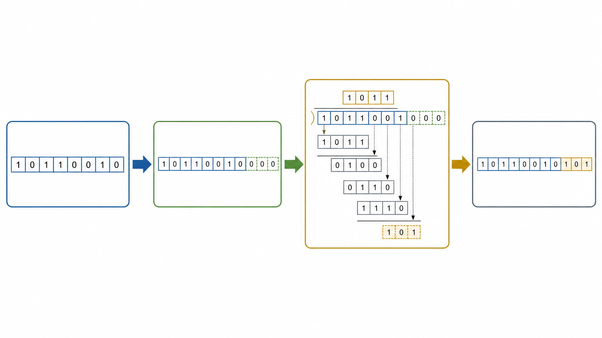
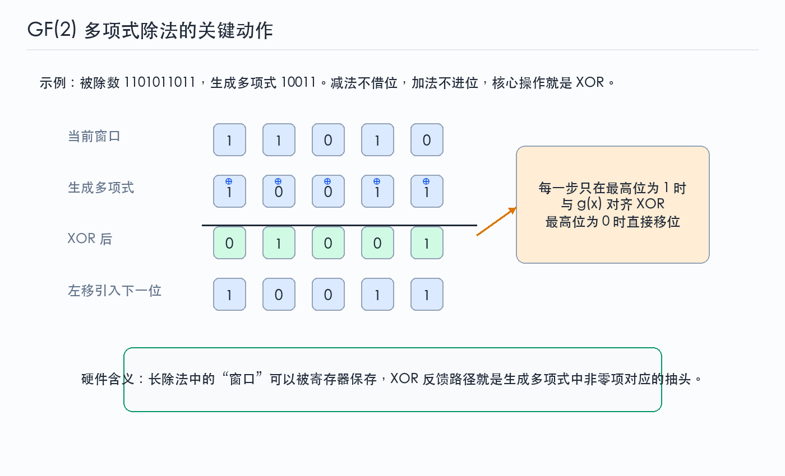
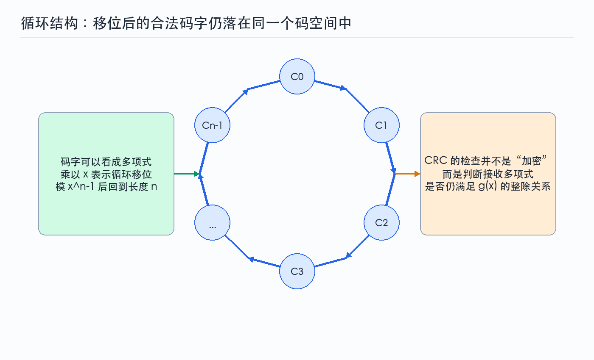

CRC 经常出现在以太网、存储控制器、片上总线和各种串行协议里。它看起来只是帧尾的一串校验位，但真正理解它，需要把三个层次连起来：数据如何被看成多项式，生成多项式如何定义可检测的错误模式，以及循环码结构为什么能被硬件实现成一个很小的移位反馈电路。

这一篇先不进入 RTL，而是把 CRC 的数学骨架搭起来。后两篇会继续把这个骨架落到串行 LFSR、并行展开和实际 SystemVerilog 模块。

----

## 1 CRC校验的工程动机

### 1.1 数据完整性检测的基本目标

数字系统里的错误通常不是“数值变大或变小”这么简单，而是某些 bit 被翻转。通信链路可能受到噪声影响，存储阵列可能出现软错误，跨芯片接口可能因为时序裕量不足产生偶发采样错误。接收端需要一种代价较低的方法判断数据是否可能被破坏。

最简单的方法是奇偶校验。它能发现奇数个 bit 翻转，但只要错误 bit 数量为偶数，奇偶校验就可能失效。求和校验比奇偶校验更强一些，但它仍然容易受数据排列、进位和特定错误模式影响。CRC 的价值在于：它不是简单统计 1 的数量，而是把整段 bit 串放进一个代数结构里检查。

CRC 的发送端通常做三件事：

- 把原始数据看成一个二进制多项式。
- 用固定生成多项式对数据进行模 2 除法。
- 把得到的余数附加到帧尾，形成带冗余的码字。

接收端对收到的完整码字再次执行同样的除法。如果没有检测到错误，余数通常应为 0，或者等于协议定义的固定残值。这里的“通常”很重要，因为不同协议可能定义初始值、输入反射、输出异或等工程参数，实际检查条件需要服从协议规范。

### 1.2 CRC不是纠错码

CRC 的定位是错误检测，不是错误纠正。它能高概率发现错误，但一般不会告诉系统哪个 bit 错了，也不会直接恢复原始数据。工程系统常见的处理方式是：

- 通信链路发现 CRC 错误后丢弃帧，并由上层协议重传。
- 存储或缓存系统用 CRC 发现数据损坏，再结合 ECC、镜像或重读机制恢复。
- 芯片内部数据通路用 CRC 作为端到端保护，定位错误范围，而不是单独完成修复。

因此，CRC 的核心指标不是“能否恢复”，而是“给定冗余位宽和数据长度时，能检测多少类错误”。

----

## 2 GF(2)多项式模型

### 2.1 bit串到多项式的映射

CRC 的第一步，是把 bit 串解释为系数只可能为 0 或 1 的多项式。例如 bit 串 `1101` 可以看成：

$$
M(x)=x^3+x^2+1
$$

其中每个 bit 是一个系数。最高位对应最高次项，最低位对应常数项。这个多项式不是为了做普通实数运算，而是在二元域 GF(2) 上运算。

GF(2) 里只有两个元素 0 和 1，加法与减法都等价于 XOR：

$$
0+0=0,\quad 0+1=1,\quad 1+0=1,\quad 1+1=0
$$

也就是说，在 CRC 除法中没有借位，也没有进位。硬件上这件事非常友好，因为加减法都可以变成 XOR 门。

### 2.2 生成多项式的形式

生成多项式通常写成：

$$
g(x)=x^r+g_{r-1}x^{r-1}+\cdots+g_1x+g_0
$$

这里 $r$ 是 CRC 宽度。例如一个 4 bit CRC 的生成多项式可以是：

$$
g(x)=x^4+x+1
$$

最高次项 $x^r$ 总是存在，所以工程里常用十六进制参数保存低 $r$ 位系数，而省略最高位的 1。这也是很多 CRC 参数表里 `poly` 看起来比直观多项式少一位的原因。

### 2.3 模2除法的动作

CRC 的除法可以理解为二进制长除法，但每一步“减去生成多项式”实际是 XOR。只要当前窗口最高位为 1，就把生成多项式对齐后 XOR；如果最高位为 0，就直接移位进入下一位。

发送端为了给余数留下位置，会先把消息左移 $r$ 位：

$$
M(x)\cdot x^r
$$

然后计算它除以 $g(x)$ 的余数：

$$
R(x)=M(x)\cdot x^r \bmod g(x)
$$

最终发送码字为：

$$
C(x)=M(x)\cdot x^r+R(x)
$$

由于 GF(2) 里的加法等价于减法，发送码字满足：

$$
C(x)\bmod g(x)=0
$$

这就是接收端能用同一个除法器检查数据的根本原因。

----

## 3 生成多项式与错误检测能力

### 3.1 错误模式的多项式表达

如果传输过程中发生 bit 翻转，可以把错误也看成一个多项式 $E(x)$。接收端收到的是：

$$
T(x)=C(x)+E(x)
$$

接收端检查：

$$
T(x)\bmod g(x)=E(x)\bmod g(x)
$$

因为 $C(x)$ 本来可以被 $g(x)$ 整除，检测结果完全取决于错误多项式 $E(x)$ 是否能被 $g(x)$ 整除。如果不能整除，CRC 就能发现错误；如果刚好能整除，CRC 就会漏检。

这个结论很朴素，也很关键：CRC 的能力不是来自余数本身“看起来随机”，而是来自生成多项式对错误模式集合的划分。

### 3.2 常见可检测错误

生成多项式选得合适时，CRC 可以稳定检测一些重要错误类型：

| 错误类型 | 多项式形式 | 检测条件直觉 |
| --- | --- | --- |
| 单 bit 错误 | $x^i$ | 只要 $g(x)$ 不是单项式，单 bit 错误不会被整除 |
| 双 bit 错误 | $x^i+x^j$ | 与 $g(x)$ 的周期性质有关 |
| 奇数个 bit 错误 | 多个单项式之和 | 若 $g(x)$ 含有因子 $x+1$，可检测所有奇数重量错误 |
| 突发错误 | 连续一段 bit 被扰动 | 宽度为 $r$ 的 CRC 可检测长度不超过 $r$ 的突发错误 |

突发错误是 CRC 在通信和存储系统中非常重要的应用场景。链路噪声、串扰、同步丢失、缓存线局部扰动都可能产生连续区域错误。CRC 对突发错误的检测能力通常比简单求和校验强得多。

### 3.3 多项式选择不是越长越随意

CRC 宽度越大，理论上漏检概率越低，但工程上不能只看位宽。真正影响检测能力的是：

- 生成多项式的因子结构。
- 保护的数据长度范围。
- 目标错误模型，例如随机错误、突发错误或固定间距错误。
- 协议是否需要兼容已有标准。

以太网使用 CRC-32，不是因为 32 bit 这个数字天然神奇，而是因为在当时的帧长、链路错误模型和硬件成本下，它提供了很好的检测能力和实现复杂度平衡。现代系统选择 CRC 多项式时，往往会参考 Koopman 等人对不同数据长度下 Hamming distance 的系统分析。

----

## 4 循环码结构

### 4.1 循环移位的代数意义

CRC 属于循环码的一类。循环码的核心特性是：如果一个长度为 $n$ 的码字是合法码字，那么对它做循环移位后，仍然是合法码字。

从多项式角度看，循环移位可以表示为乘以 $x$，再对 $x^n-1$ 取模：

$$
C'(x)=xC(x)\bmod (x^n-1)
$$

循环码通常可以由生成多项式描述，合法码字都满足某种整除关系。CRC 在工程实现中不总是显式处理固定长度循环码的全部代数细节，但“多项式整除”和“移位反馈”这两个特征正是从这里来的。

### 4.2 循环结构到硬件结构

多项式除法每一步只需要保存一个有限宽度的余数状态。新的输入 bit 进入后，最高位决定是否触发与生成多项式的 XOR。这个过程天然对应一个线性反馈移位寄存器 LFSR：

$$
s(t+1)=A\cdot s(t)+b\cdot d(t)
$$

其中 $s(t)$ 是当前 CRC 状态，$d(t)$ 是新输入 bit，矩阵 $A$ 和向量 $b$ 由生成多项式决定。这里的乘加都在 GF(2) 上完成。

这个表达有两个重要后果：

- CRC 是线性系统，可以用矩阵和递推关系描述。
- 串行 CRC 可以被代数展开成并行 CRC。

下一篇的核心就是从这个状态转移式出发，把一拍处理 1 bit 的串行电路展开成一拍处理 8 bit、32 bit 甚至更宽数据的组合逻辑。

----

## 5 工程边界与常见误区

### 5.1 CRC参数需要成组理解

实际协议里的 CRC 通常不只定义多项式，还会定义一组参数：

| 参数 | 含义 |
| --- | --- |
| `width` | CRC 状态位宽 |
| `poly` | 生成多项式低位系数 |
| `init` | 初始寄存器值 |
| `refin` | 输入 bit 是否反射 |
| `refout` | 输出 CRC 是否反射 |
| `xorout` | 最终输出前的异或值 |
| `check` | 标准测试串 `123456789` 的校验结果 |

只说“CRC-32”有时并不够。不同协议可能同样是 32 bit CRC，却有不同的 bit 顺序、初值或最终异或方式。RTL 设计和软件 golden model 必须共享同一组参数，否则很容易出现“看起来只差端序”的错误。

### 5.2 CRC不能替代安全认证

CRC 是线性校验。攻击者如果知道生成多项式和参数，可以构造数据修改并同步修改 CRC，使接收端检查通过。因此 CRC 适合发现非恶意错误，不适合承担安全认证、完整性防篡改或加密摘要职责。

### 5.3 CRC错误不等价于链路一定损坏

接收端发现 CRC 错误，只能说明收到的数据与协议定义的校验关系不一致。原因可能是链路噪声，也可能是发送端参数配置错误、字节序处理错误、截帧、补齐规则错误或 reset 时序问题。工程调试时，CRC 错误常常是系统级问题的症状，而不只是 CRC 模块本身的问题。

----

## 6 后续学习路径

第一篇需要记住三点：

- CRC 把 bit 串映射为 GF(2) 多项式，并用生成多项式取余。
- 接收端检测的是错误多项式是否能被生成多项式整除。
- 多项式除法的状态转移可以实现成 LFSR，也可以进一步展开成并行组合逻辑。

第二篇会从 LFSR 开始，讨论串行实现、输入反射、并行展开矩阵和 XOR 网络优化。第三篇会把这些内容落到一个参数化 SystemVerilog CRC 模块，并给出接口、时序、状态机和验证策略。

----

## 7 参考资料

- Ross N. Williams, “A Painless Guide to CRC Error Detection Algorithms”, 1996, [http://www.ross.net/crc/download/crc_v3.txt](http://www.ross.net/crc/download/crc_v3.txt)
- Philip Koopman, “Cyclic Redundancy Code Polynomial Selection”, Carnegie Mellon University, [https://users.ece.cmu.edu/~koopman/crc/](https://users.ece.cmu.edu/~koopman/crc/)
- RevEng CRC Catalogue, “Catalogue of parametrised CRC algorithms”, [https://reveng.sourceforge.io/crc-catalogue/](https://reveng.sourceforge.io/crc-catalogue/)
- IEEE 802.3 Working Group, “IEEE 802.3 Ethernet Working Group”, [https://www.ieee802.org/3/](https://www.ieee802.org/3/)

----
