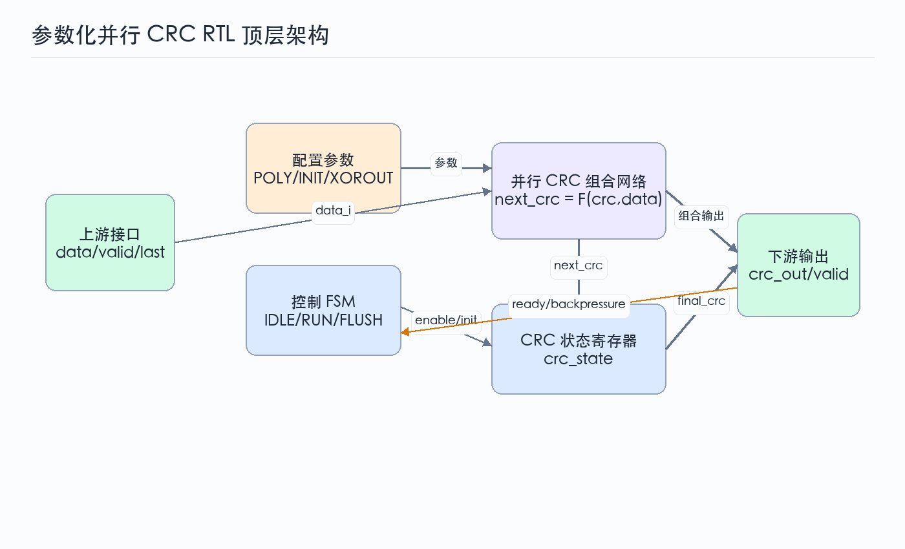
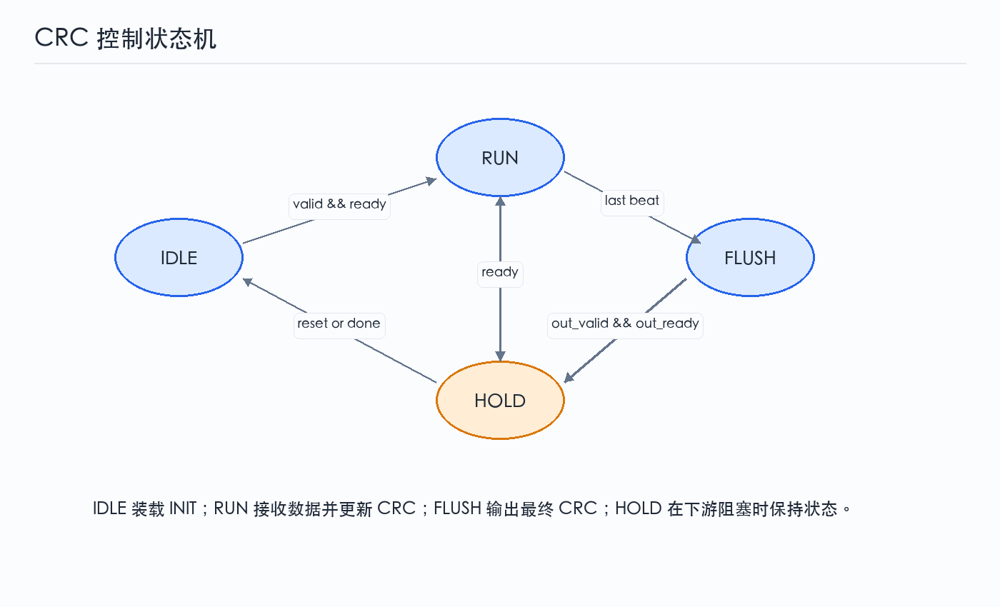
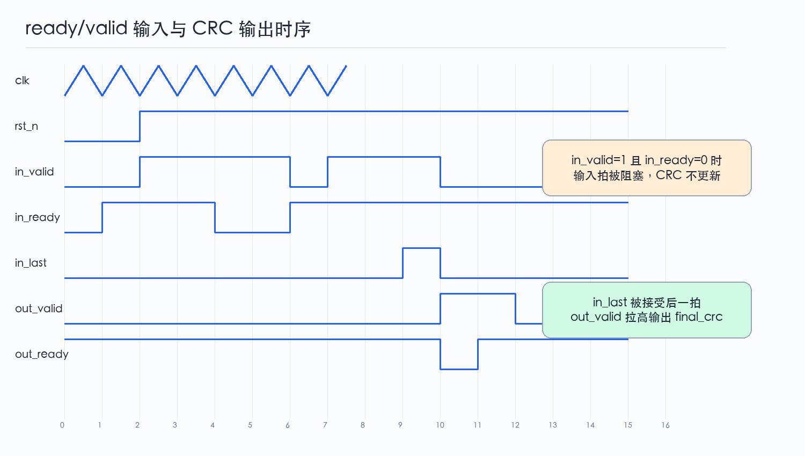
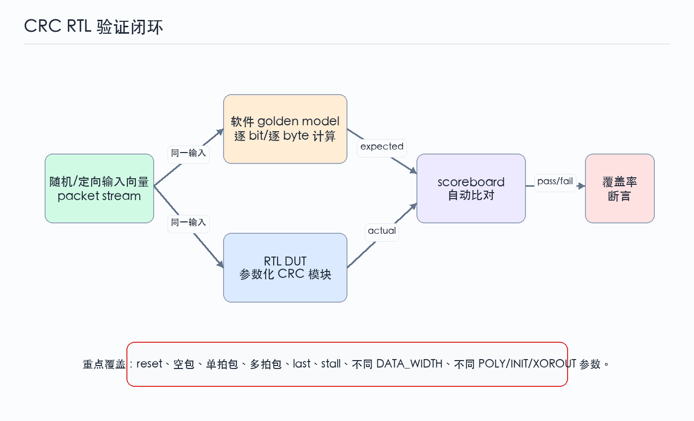

前两篇已经建立了 CRC 的数学模型和并行展开方法。第三篇把这些内容落到 RTL：设计一个可参数化的并行 CRC 模块，支持 ready/valid 输入、包尾 `last`、初值装载、最终异或输出，并给出状态机、时序波形、SystemVerilog 代码和验证思路。

本文的代码不是绑定某个协议的完整 IP，而是一个适合继续扩展的工程骨架。实际项目可以在此基础上加入字节有效掩码、反射输入、不同残值检查、寄存器配置接口和流水线切分。

----

## 1 模块概述

### 1.1 模块功能

目标模块 `crc_parallel` 完成一拍处理 `DATA_WIDTH` bit 数据的 CRC 更新。它适合放在包处理、DMA、MAC、存储控制器或片上流接口的末端，对每个 packet 生成 CRC 结果。

设计目标如下：

| 目标 | 说明 |
| --- | --- |
| 吞吐 | 正常情况下每拍接收一个数据 beat |
| 延迟 | `last` beat 被接受后，下一拍输出最终 CRC |
| 接口 | 输入侧使用 ready/valid，输出侧使用 valid/ready |
| 参数化 | 支持 `CRC_WIDTH`、`DATA_WIDTH`、`POLY`、`INIT`、`XOROUT` |
| 复位 | 异步低有效复位，状态回到 `IDLE` |
| 约束 | 示例代码采用 MSB-first，不包含字节有效掩码 |

### 1.2 设计边界

本文模块负责：

- 按固定 bit 顺序更新 CRC 状态。
- 在 packet 起始时装载初值。
- 在 packet 结束后输出最终 CRC。
- 在下游阻塞时保持输出稳定。

本文模块不负责：

- 自动识别协议帧边界。
- 根据 byte enable 处理非满宽最后一拍。
- 在运行时动态切换多项式。
- 执行安全认证或纠错。

这些边界是有意保留的。先把核心 CRC 数据通路做清楚，再扩展协议细节，设计会更容易验证。

----

## 2 顶层架构与接口

### 2.1 架构划分

顶层可以分成四个部分：输入握手、控制 FSM、并行 CRC 组合网络和 CRC 状态寄存器。



数据路径从 `data_i` 进入并行 CRC 组合网络，结合当前 `crc_state` 得到 `next_crc`。控制路径决定何时装载 `INIT`、何时更新状态、何时输出 `final_crc`。当输出侧阻塞时，模块进入保持状态，避免覆盖尚未被接收的 CRC 结果。

### 2.2 顶层信号

| 信号名 | 方向 | 位宽 | 分类 | 复位值 | 描述 |
| --- | --- | --- | --- | --- | --- |
| `clk` | input | 1 | clock-reset | 无 | 模块时钟 |
| `rst_n` | input | 1 | clock-reset | 0 | 异步低有效复位 |
| `in_valid` | input | 1 | valid-ready | 0 | 输入数据有效 |
| `in_ready` | output | 1 | valid-ready | 1 | 模块可接收输入 |
| `data_i` | input | `DATA_WIDTH` | data | 无 | 输入数据 beat |
| `last_i` | input | 1 | control | 0 | 当前 beat 是 packet 最后一拍 |
| `out_valid` | output | 1 | valid-ready | 0 | 输出 CRC 有效 |
| `out_ready` | input | 1 | valid-ready | 1 | 下游可接收 CRC |
| `crc_o` | output | `CRC_WIDTH` | data | `INIT` | 最终 CRC 输出 |

### 2.3 状态机

控制 FSM 使用四个状态：

| 状态 | 含义 |
| --- | --- |
| `IDLE` | 等待 packet 第一拍，CRC 状态保持为 `INIT` |
| `RUN` | 正在接收 packet 数据并更新 CRC |
| `FLUSH` | `last_i` 已被接受，输出最终 CRC |
| `HOLD` | 输出有效但下游未 ready，保持结果 |



状态机的核心原则是：只有在 `in_valid && in_ready` 成立时才更新 CRC；只有在 `out_valid && out_ready` 成立时才认为输出被消费。

----

## 3 并行CRC数据通路

### 3.1 组合函数边界

并行 CRC 组合网络可以封装为函数：

```systemverilog
function automatic logic [CRC_WIDTH-1:0] crc_next;
  input logic [CRC_WIDTH-1:0] state;
  input logic [DATA_WIDTH-1:0] data;
  logic [CRC_WIDTH-1:0] c;
  logic feedback;
  begin
    c = state;
    for (int i = DATA_WIDTH-1; i >= 0; i--) begin
      feedback = c[CRC_WIDTH-1] ^ data[i];
      c = {c[CRC_WIDTH-2:0], 1'b0};
      if (feedback) begin
        c = c ^ POLY;
      end
    end
    return c;
  end
endfunction
```

这个函数写成 `for` 循环，但它在综合意义上仍会展开为组合 XOR 网络。对于很宽的数据通路，建议使用脚本预生成表达式，或者在函数前后增加流水线。

### 3.2 最终输出处理

本文示例采用：

$$
crc_{final}=crc_{state}\oplus XOROUT
$$

如果协议要求 `refout=true`，还需要在输出前反射 bit 顺序。为了保持代码重点清晰，本文先不加入反射函数，实际项目可以把反射作为独立组合函数放在 `crc_o` 前。

----

## 4 时序行为

### 4.1 ready/valid握手

输入侧只在握手成功时消耗数据：

$$
accept = in\_valid \land in\_ready
$$

当 `accept` 为 1 时，`data_i` 和 `last_i` 必须在该时钟沿被采样。若 `in_valid=1` 但 `in_ready=0`，上游必须保持数据和控制信号稳定，CRC 状态不更新。



波形中可以看到两类关键事件：

- 输入阻塞期间，`in_valid` 保持，但 `in_ready` 为 0，CRC 状态不前进。
- `last_i` 所在 beat 被接受后，模块在下一拍拉高 `out_valid`。

### 4.2 reset行为

复位后模块进入 `IDLE`，`crc_state` 装载为 `INIT`，`out_valid` 清零。这样第一个 packet 不需要额外的 start 信号，只要第一拍数据握手成功，模块就从初值开始计算。

如果系统需要 packet 间插入空闲周期，本设计天然支持；如果系统要求连续 packet 背靠背输入，则需要保证 `FLUSH` 输出不会阻塞下一包的第一拍，或加入小 FIFO 解耦输入与输出。

----

## 5 SystemVerilog RTL

### 5.1 顶层模块

下面代码给出一个可综合的基础版本。它采用 MSB-first 输入顺序，`POLY` 参数使用低 `CRC_WIDTH` 位表示，最高次项隐含为 1。

```systemverilog
module crc_parallel #(
  parameter int unsigned CRC_WIDTH  = 32,
  parameter int unsigned DATA_WIDTH = 32,
  parameter logic [CRC_WIDTH-1:0] POLY   = 32'h04C11DB7,
  parameter logic [CRC_WIDTH-1:0] INIT   = '1,
  parameter logic [CRC_WIDTH-1:0] XOROUT = '1
) (
  input  logic                  clk,
  input  logic                  rst_n,

  input  logic                  in_valid,
  output logic                  in_ready,
  input  logic [DATA_WIDTH-1:0] data_i,
  input  logic                  last_i,

  output logic                  out_valid,
  input  logic                  out_ready,
  output logic [CRC_WIDTH-1:0]  crc_o
);

  typedef enum logic [1:0] {
    ST_IDLE,
    ST_RUN,
    ST_FLUSH,
    ST_HOLD
  } state_e;

  state_e state_q, state_d;

  logic [CRC_WIDTH-1:0] crc_q;
  logic [CRC_WIDTH-1:0] crc_d;
  logic [CRC_WIDTH-1:0] crc_next_data;
  logic                 accept;
  logic                 finish_beat;

  assign accept      = in_valid && in_ready;
  assign finish_beat = accept && last_i;

  function automatic logic [CRC_WIDTH-1:0] calc_next_crc;
    input logic [CRC_WIDTH-1:0]  state;
    input logic [DATA_WIDTH-1:0] data;
    logic [CRC_WIDTH-1:0] c;
    logic feedback;
    begin
      c = state;
      for (int i = DATA_WIDTH-1; i >= 0; i--) begin
        feedback = c[CRC_WIDTH-1] ^ data[i];
        c = {c[CRC_WIDTH-2:0], 1'b0};
        if (feedback) begin
          c = c ^ POLY;
        end
      end
      return c;
    end
  endfunction

  assign crc_next_data = calc_next_crc(crc_q, data_i);
  assign crc_o         = crc_q ^ XOROUT;

  always_comb begin
    state_d   = state_q;
    crc_d     = crc_q;
    in_ready  = 1'b0;
    out_valid = 1'b0;

    unique case (state_q)
      ST_IDLE: begin
        in_ready = 1'b1;
        crc_d    = INIT;
        if (accept) begin
          crc_d   = calc_next_crc(INIT, data_i);
          state_d = last_i ? ST_FLUSH : ST_RUN;
        end
      end

      ST_RUN: begin
        in_ready = 1'b1;
        if (accept) begin
          crc_d   = crc_next_data;
          state_d = last_i ? ST_FLUSH : ST_RUN;
        end
      end

      ST_FLUSH: begin
        out_valid = 1'b1;
        if (out_ready) begin
          crc_d   = INIT;
          state_d = ST_IDLE;
        end else begin
          state_d = ST_HOLD;
        end
      end

      ST_HOLD: begin
        out_valid = 1'b1;
        if (out_ready) begin
          crc_d   = INIT;
          state_d = ST_IDLE;
        end
      end

      default: begin
        crc_d   = INIT;
        state_d = ST_IDLE;
      end
    endcase
  end

  always_ff @(posedge clk or negedge rst_n) begin
    if (!rst_n) begin
      state_q <= ST_IDLE;
      crc_q   <= INIT;
    end else begin
      state_q <= state_d;
      crc_q   <= crc_d;
    end
  end

endmodule
```

### 5.2 实现注意事项

这段代码适合作为结构说明，但实际流片或高速 FPGA 设计还需要继续收敛：

- 对大 `DATA_WIDTH`，`calc_next_crc` 可能形成较深组合路径。
- 如果 `out_ready` 经常拉低，当前模块会阻塞下一包输入。
- 若需要处理非满宽最后一拍，应增加 `keep_i` 或 `byte_valid_i`。
- 若协议为 LSB-first，应修改循环方向和反馈位置，或在输入前做 bit 反射。
- 若要运行时配置 `POLY`，需要评估动态 XOR 网络对时序的影响。

----

## 6 验证方案

### 6.1 验证闭环

CRC 模块最适合用软件 golden model 做自动比对。测试平台生成 packet 输入，同时送给软件模型和 RTL DUT，最终由 scoreboard 比较结果。



### 6.2 测试用例

| 测试项 | 目的 |
| --- | --- |
| reset 后空闲 | 检查状态机回到 `IDLE`，输出无效 |
| 单拍 packet | 检查 `last_i` 与输出延迟 |
| 多拍 packet | 检查连续更新 |
| 输入 stall | 检查 `in_valid=1 && in_ready=0` 时状态保持 |
| 输出 backpressure | 检查 `out_valid=1 && out_ready=0` 时结果保持 |
| 全 0 数据 | 检查初值对前导 0 的影响 |
| 全 1 数据 | 覆盖高翻转率输入 |
| 随机 packet | 对比 golden model |
| 参数 sweep | 覆盖不同 `CRC_WIDTH`、`DATA_WIDTH`、`POLY` |

### 6.3 Testbench骨架

下面给出一个简化 testbench 骨架。完整工程中可以把 golden model 写成 SystemVerilog 函数、DPI-C 函数或 Python 参考模型生成向量。

```systemverilog
module tb_crc_parallel;

  localparam int unsigned CRC_WIDTH  = 32;
  localparam int unsigned DATA_WIDTH = 32;

  logic clk;
  logic rst_n;
  logic in_valid;
  logic in_ready;
  logic [DATA_WIDTH-1:0] data_i;
  logic last_i;
  logic out_valid;
  logic out_ready;
  logic [CRC_WIDTH-1:0] crc_o;

  crc_parallel #(
    .CRC_WIDTH (CRC_WIDTH),
    .DATA_WIDTH(DATA_WIDTH),
    .POLY      (32'h04C11DB7),
    .INIT      (32'hFFFF_FFFF),
    .XOROUT    (32'hFFFF_FFFF)
  ) dut (
    .clk       (clk),
    .rst_n     (rst_n),
    .in_valid  (in_valid),
    .in_ready  (in_ready),
    .data_i    (data_i),
    .last_i    (last_i),
    .out_valid (out_valid),
    .out_ready (out_ready),
    .crc_o     (crc_o)
  );

  initial clk = 1'b0;
  always #5 clk = ~clk;

  task automatic send_word(
    input logic [DATA_WIDTH-1:0] data,
    input logic                  last
  );
    begin
      @(posedge clk);
      in_valid <= 1'b1;
      data_i   <= data;
      last_i   <= last;
      do begin
        @(posedge clk);
      end while (!in_ready);
      in_valid <= 1'b0;
      last_i   <= 1'b0;
    end
  endtask

  initial begin
    rst_n     = 1'b0;
    in_valid  = 1'b0;
    data_i    = '0;
    last_i    = 1'b0;
    out_ready = 1'b1;

    repeat (5) @(posedge clk);
    rst_n = 1'b1;

    send_word(32'h3132_3334, 1'b0);
    send_word(32'h3536_3738, 1'b0);
    send_word(32'h3900_0000, 1'b1);

    wait (out_valid);
    $display("crc_o = %08x", crc_o);

    repeat (10) @(posedge clk);
    $finish;
  end

endmodule
```

这个骨架还没有处理最后一拍有效字节数，所以 `123456789` 示例中的最后三个填充 0 会参与计算。若要得到标准 check value，需要增加 byte enable，并让 golden model 只处理有效字节。这正是实际协议适配中最容易被忽略的地方。

### 6.4 断言建议

可以加入以下断言提高调试效率：

```systemverilog
property p_hold_output_when_blocked;
  @(posedge clk) disable iff (!rst_n)
    out_valid && !out_ready |=> out_valid && $stable(crc_o);
endproperty

property p_no_input_when_not_ready;
  @(posedge clk) disable iff (!rst_n)
    in_valid && !in_ready |=> $stable(data_i) && $stable(last_i);
endproperty

assert property (p_hold_output_when_blocked);
assert property (p_no_input_when_not_ready);
```

这些断言一个检查下游阻塞，一个检查上游握手协议。CRC 算法本身可以靠 golden model 验证，接口合法性则更适合用 SVA 持续保护。

----

## 7 设计取舍与扩展方向

### 7.1 面积与时序

并行 CRC 的主要代价是 XOR 网络。若目标频率较低，一拍展开很简单；若目标频率较高，可能需要：

- 将 `DATA_WIDTH` 拆成多个较小分段。
- 在分段之间插入 pipeline。
- 对高扇出状态位做复制或寄存。
- 使用脚本生成平衡 XOR 树。

FPGA 中还要考虑 LUT 输入数量和布线延迟。ASIC 中则更关注 XOR 树深度、负载、功耗和时钟周期约束。

### 7.2 协议适配

要把本文模块变成协议级 CRC IP，通常需要继续增加：

- `keep_i` 或 `byte_valid_i`，处理最后一拍非满宽。
- `start_i`，显式标记 packet 起点。
- `refin` 和 `refout` 选项。
- residue check 模式，用于接收端校验完整码字。
- 寄存器接口，用于配置多项式和初值。

这些扩展不应该一股脑塞进核心组合函数。更稳妥的做法是把数据重排、有效字节选择、CRC 更新和输出后处理拆成清晰边界。

### 7.3 验证优先级

CRC RTL 的验证优先级可以按风险排序：

1. 参数与软件模型一致。
2. 输入 bit 顺序一致。
3. `last`、`keep` 与输出时序一致。
4. backpressure 下状态保持正确。
5. 多 packet 连续输入时边界清晰。

只要这五类问题压住，CRC 模块通常不会难维护。真正危险的是“先写一个看似能跑的 XOR 网络”，再在协议联调阶段不断补端序和边界条件。

----

## 8 参考资料

- Ross N. Williams, “A Painless Guide to CRC Error Detection Algorithms”, 1996, [http://www.ross.net/crc/download/crc_v3.txt](http://www.ross.net/crc/download/crc_v3.txt)
- Philip Koopman, “Cyclic Redundancy Code Polynomial Selection”, Carnegie Mellon University, [https://users.ece.cmu.edu/~koopman/crc/](https://users.ece.cmu.edu/~koopman/crc/)
- RevEng CRC Catalogue, “Catalogue of parametrised CRC algorithms”, [https://reveng.sourceforge.io/crc-catalogue/](https://reveng.sourceforge.io/crc-catalogue/)
- IEEE 802.3 Working Group, “IEEE 802.3 Ethernet Working Group”, [https://www.ieee802.org/3/](https://www.ieee802.org/3/)

----
