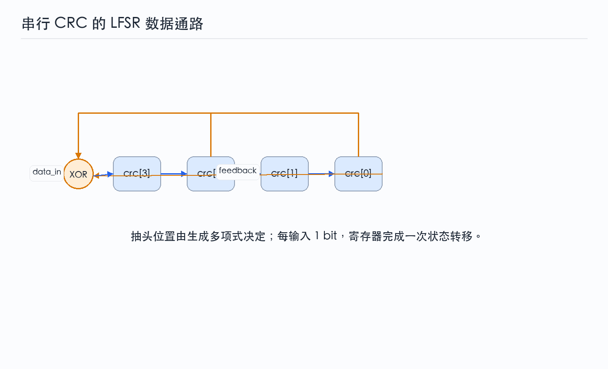
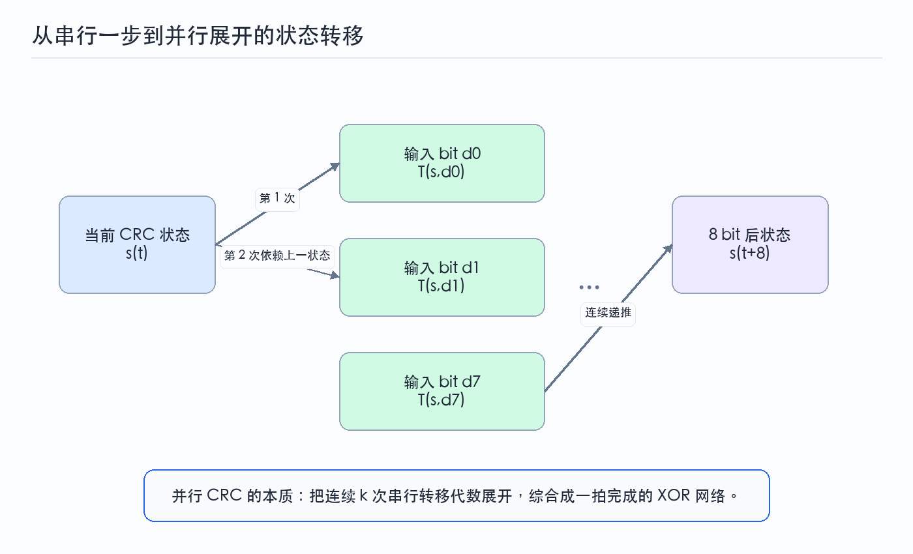
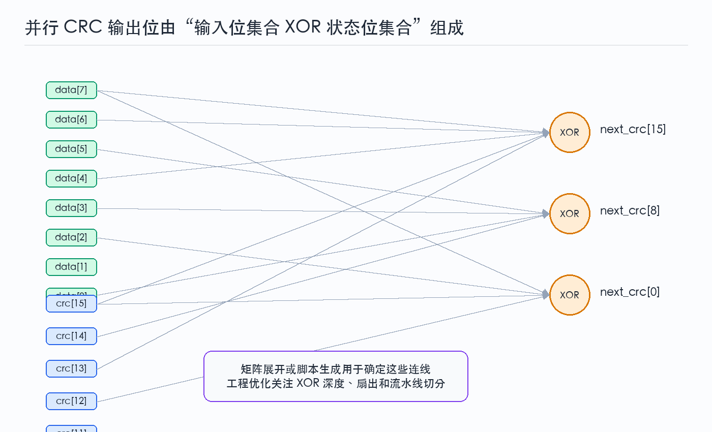

上一篇把 CRC 放在 GF(2) 多项式除法和循环码结构里理解。这一篇开始靠近硬件：先看串行 LFSR 为什么等价于多项式除法，再看如何把一拍 1 bit 的状态转移展开成一拍多个 bit 的并行 CRC。

这一步很关键。很多协议的数据通路不是 1 bit 宽，而是 8 bit、32 bit、64 bit、256 bit 甚至更宽。如果仍然逐 bit 串行计算，吞吐会跟不上接口节拍；如果直接手写并行 XOR，又容易在端序、反射和多项式抽头上出错。正确的方法是把 CRC 看成线性状态机，然后系统化展开。

----

## 1 串行CRC的硬件直觉

### 1.1 余数寄存器就是状态

CRC 除法过程中，不需要保存完整被除数，只需要保存当前余数。对于宽度为 $r$ 的 CRC，这个余数可以放在 $r$ bit 寄存器里。每输入一个 bit，寄存器完成一次移位和条件 XOR。

设当前状态为：

$$
s(t)=
\begin{bmatrix}
s_{r-1}(t) & s_{r-2}(t) & \cdots & s_0(t)
\end{bmatrix}^T
$$

输入 bit 为 $d(t)$。如果采用 MSB-first 的左移模型，反馈 bit 通常来自最高位与输入 bit 的 XOR：

$$
f(t)=s_{r-1}(t)\oplus d(t)
$$

寄存器整体左移，生成多项式中存在抽头的位置与反馈 bit 做 XOR。不同 CRC 参数的差异，最终都会反映到反馈方向、抽头位置、初值和输出处理上。

### 1.2 生成多项式决定反馈抽头

以生成多项式：

$$
g(x)=x^4+x+1
$$

为例，CRC 宽度为 4，抽头对应 $x$ 和常数项。若采用左移 MSB-first 形式，反馈 bit 会进入最低位，并在抽头位置影响下一个状态。

这个结构与多项式长除法完全一致：

- 最高位决定当前除法窗口是否需要 XOR 生成多项式。
- 移位表示进入下一位被除数。
- 抽头 XOR 表示生成多项式的非零项参与余数更新。

硬件上，串行 CRC 的成本很低：$r$ 个触发器加少量 XOR 门即可。它的问题不是面积，而是吞吐。

----

## 2 输入顺序与CRC参数

### 2.1 MSB-first与LSB-first

CRC 的多项式表达天然倾向于从最高次项开始处理，也就是 MSB-first。但很多通信协议在物理线上按 LSB-first 发送字节，软件实现也常使用反射形式以适配机器字节顺序。于是工程里会看到两类实现：

| 实现形式 | 移位方向 | 输入 bit 顺序 | 多项式表示 |
| --- | --- | --- | --- |
| 正向实现 | 左移 | MSB-first | 使用正常多项式 |
| 反射实现 | 右移 | LSB-first | 常使用反射多项式 |

两者不是随便互换的。若协议定义了 `refin=true`，输入字节进入 CRC 前需要按 bit 反射；若 `refout=true`，最终 CRC 输出也要反射。RTL 里最常见的 bug，是软件模型按反射形式算，而硬件按正向形式算，最后只在某些测试向量上“差一个反转”。

### 2.2 初值与最终异或

纯数学推导通常从全 0 初值开始，最终直接输出余数。但协议往往会加入：

$$
crc_{state}(0)=INIT
$$

以及：

$$
crc_{out}=crc_{state}\oplus XOROUT
$$

这些参数不是装饰。非零初值可以让前导 0 数据也影响结果，最终异或可以避免某些残值形式过于简单。对于 RTL 和 testbench，最稳妥的方式是把参数作为一个完整配置包处理，而不是只传 `poly`。

----

## 3 状态转移表达

### 3.1 单bit转移

串行 CRC 可以写成 GF(2) 线性系统：

$$
s(t+1)=A\cdot s(t)+b\cdot d(t)
$$

其中矩阵 $A$ 描述当前状态如何移位和反馈，向量 $b$ 描述输入 bit 如何进入反馈路径。这里的加法和乘法都在 GF(2) 上进行，因此矩阵运算最终仍然是 XOR 和选择。

这条公式的意义非常大。它说明 CRC 不是“只能逐 bit 模拟”的过程，而是一个确定的线性状态转移。只要知道 $A$ 和 $b$，就能推导任意多个 bit 后的状态。

### 3.2 多bit转移

如果一拍输入 $k$ 个 bit，可以连续展开：

$$
s(t+k)=A^k s(t)+A^{k-1}b d_0+A^{k-2}b d_1+\cdots+b d_{k-1}
$$

这就是并行 CRC 的核心公式。它没有改变 CRC 算法，只是把 $k$ 次串行状态转移合并到一个组合逻辑中。

在 RTL 里，这个公式通常不会直接写成矩阵乘法，而是由脚本生成每个 `next_crc[i]` 对应的 XOR 表达式。生成过程可以通过两种方式完成：

- 逐 bit 符号仿真，把每个状态位表示成输入位和旧状态位的 XOR 集合。
- 显式构造 GF(2) 矩阵，计算 $A^k$ 和输入矩阵。

两种方式本质相同。符号仿真更容易写脚本，矩阵法更适合解释和验证。

----

## 4 并行展开的XOR网络

### 4.1 输出位的依赖集合

并行展开后，每个 `next_crc` bit 都是若干旧 `crc_state` bit 和若干输入 `data` bit 的 XOR。形式上可以写成：

$$
next\_crc_i=
\bigoplus_{j\in S_i} crc_j
\oplus
\bigoplus_{m\in D_i} data_m
$$

其中 $S_i$ 是旧状态位集合，$D_i$ 是输入位集合。

这张图体现了并行 CRC 的真实硬件形态：它不是乘法器，也不是查表 RAM，而是一张 XOR 网络。数据位宽越大，XOR 网络越宽，逻辑深度和扇出压力也越明显。

### 4.2 XOR深度与时序

在 FPGA 或 ASIC 中，直接把几十个输入串成一条长 XOR 链通常不是好选择。综合器会做一定优化，但设计者仍然需要关注：

- 单个输出位的 XOR 输入数量。
- 旧 CRC 状态位的扇出。
- 数据总线到 CRC 输出的组合路径深度。
- 是否需要插入流水线。
- 是否允许多周期 CRC 计算。

如果接口要求每拍接收一个宽数据 beat，并且时钟频率较高，可以考虑把 CRC 更新拆成两级或多级流水线。代价是输出延迟增加，控制逻辑需要保存 `last`、`valid` 和对应的状态边界。

### 4.3 面积与吞吐的取舍

串行、半并行和全并行 CRC 可以放在同一条取舍线上：

| 实现方式 | 每拍处理位数 | 面积 | 延迟 | 适用场景 |
| --- | --- | --- | --- | --- |
| 串行 LFSR | 1 bit | 最小 | 数据越长延迟越高 | 低速链路、配置通道 |
| 半并行展开 | 4/8/16 bit | 中等 | 中等 | 字节流、低中速总线 |
| 全并行展开 | 32/64/128 bit | 较高 | 通常一拍更新 | 高速包处理、MAC、DMA |
| 流水线并行 | 宽数据分级 | 较高 | 多拍 | 高速 FPGA/ASIC 数据通路 |

工程里并不存在绝对最优实现。CRC 模块应该服务于上游接口宽度、目标频率和面积预算。

----

## 5 并行展开的实现流程

### 5.1 符号展开方法

符号展开可以这样理解：不要把 `crc_state` 和 `data` 当作具体 0/1，而是把它们当作符号变量。每执行一次串行 CRC 更新，就更新每个状态位对应的符号 XOR 集合。连续执行 $k$ 次后，就得到一拍处理 $k$ bit 的逻辑表达式。

流程如下：

1. 初始化状态集合：`crc[i] = {crc_i}`。
2. 按协议 bit 顺序取输入：`data[0]` 到 `data[k-1]`。
3. 计算反馈集合：最高位集合 XOR 当前输入 bit。
4. 按生成多项式抽头更新状态集合。
5. 重复 $k$ 次。
6. 输出每个 `next_crc[i]` 的 XOR 表达式。

这种方法的好处是很直观，也容易和串行 golden model 对齐。

### 5.2 矩阵展开方法

矩阵法更适合做形式化推导。把输入向量写成：

$$
u(t)=
\begin{bmatrix}
d_0 & d_1 & \cdots & d_{k-1}
\end{bmatrix}^T
$$

则一拍并行更新可以写成：

$$
s(t+k)=P\cdot s(t)+Q\cdot u(t)
$$

其中：

$$
P=A^k
$$

而 $Q$ 由连续输入项的系数组合得到。最终 RTL 仍然是 XOR 网络，只是 `P` 和 `Q` 决定了哪些线要接入每个 XOR。

### 5.3 端序处理应在展开前确定

并行 CRC 最容易出错的地方不是 XOR 本身，而是输入 bit 顺序。展开脚本必须明确：

- `data[DATA_WIDTH-1]` 是否先进入 CRC。
- 每个字节是否需要 bit 反射。
- 多字节数据在总线上的字节序如何映射到协议发送顺序。
- 最终输出是否反射。

如果这些规则在展开后再补丁式调整，很容易得到一个“测试样例能过但协议接不上”的模块。更好的做法是在展开脚本的输入阶段就统一 bit 顺序，让生成出来的 XOR 网络直接匹配协议定义。

----

## 6 调试与验证边界

### 6.1 标准测试串

CRC 参数表常使用 ASCII 字符串 `123456789` 作为 check value。它适合快速验证参数组合是否正确，但不能作为完整验证。因为它只覆盖一组固定长度和固定内容。

更可靠的验证组合包括：

- 空数据、单字节、多字节、非对齐长度。
- 全 0、全 1、递增序列、随机序列。
- 不同初值、不同最终异或值。
- MSB-first 与 LSB-first 两种路径。
- 软件串行模型与硬件并行模型逐包对比。

### 6.2 残值检查

有些协议不仅定义 check value，还定义 residue。发送端把 CRC 附到数据后，接收端对完整码字继续计算，最终应得到协议定义的固定残值。这个检查非常适合验证接收路径，因为它覆盖了“数据加 CRC 字段”的完整处理过程。

### 6.3 并行展开不改变算法

一个重要的调试原则是：并行 CRC 的结果必须与串行 CRC 完全一致。若不一致，优先检查：

- 输入 bit 顺序是否一致。
- 多项式是否使用了反射版本。
- 初值和最终异或是否一致。
- 数据最后一拍的有效字节掩码是否正确。
- `last` 与 CRC 输出是否对齐。

这些问题比 XOR 表达式本身更常见。展开脚本一旦经过充分验证，后续 bug 往往出在接口和数据边界处理上。

----

## 7 后续学习路径

这一篇从串行 LFSR 推到了并行 CRC。需要记住的核心框架是：

$$
s(t+k)=P\cdot s(t)+Q\cdot u(t)
$$

它说明并行 CRC 不是另一个算法，而是串行 CRC 状态转移的代数合并。第三篇会在这个基础上设计一个参数化 RTL 模块，包括顶层接口、控制状态机、ready/valid 时序、并行组合网络、测试平台和验证覆盖点。

----

## 8 参考资料

- Ross N. Williams, “A Painless Guide to CRC Error Detection Algorithms”, 1996, [http://www.ross.net/crc/download/crc_v3.txt](http://www.ross.net/crc/download/crc_v3.txt)
- Philip Koopman, “Cyclic Redundancy Code Polynomial Selection”, Carnegie Mellon University, [https://users.ece.cmu.edu/~koopman/crc/](https://users.ece.cmu.edu/~koopman/crc/)
- RevEng CRC Catalogue, “Catalogue of parametrised CRC algorithms”, [https://reveng.sourceforge.io/crc-catalogue/](https://reveng.sourceforge.io/crc-catalogue/)
- M. E. Kounavis and F. L. Berry, “A Systematic Approach to Building High Performance, Software-based, CRC Generators”, ISCC 2005, [https://doi.org/10.1109/ISCC.2005.52](https://doi.org/10.1109/ISCC.2005.52)

----
