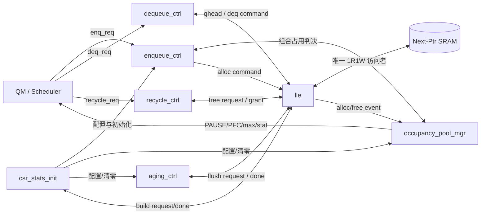
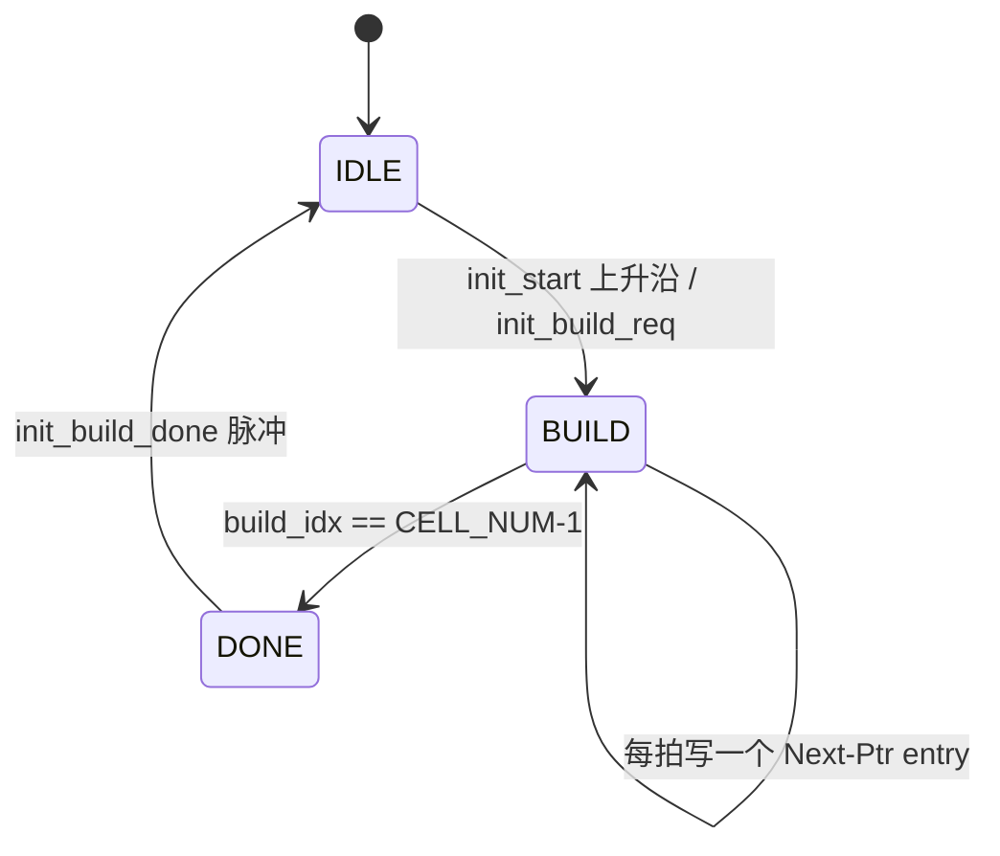
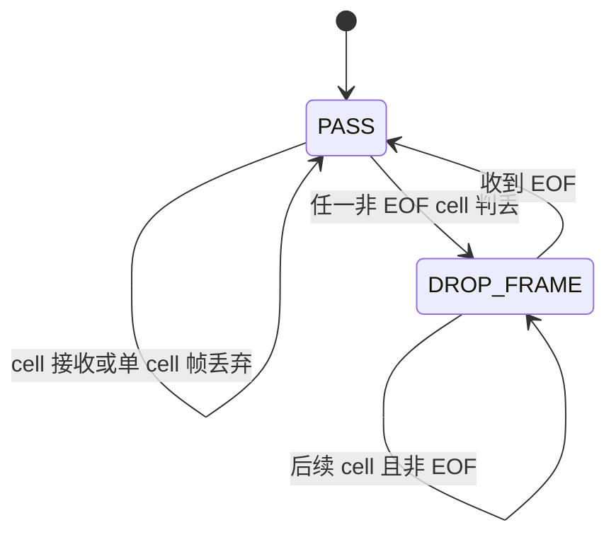
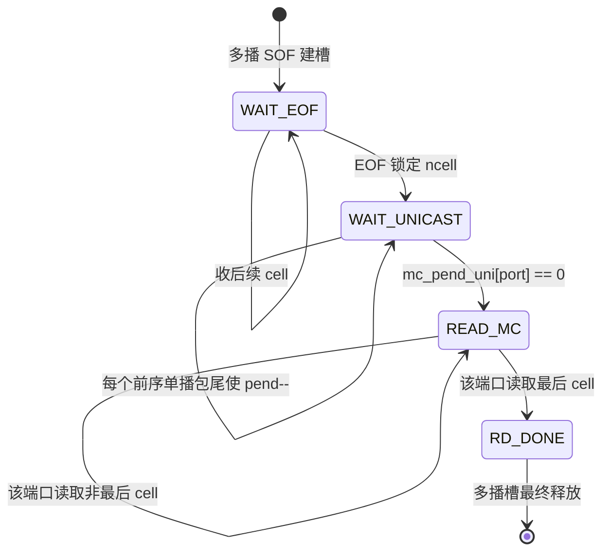
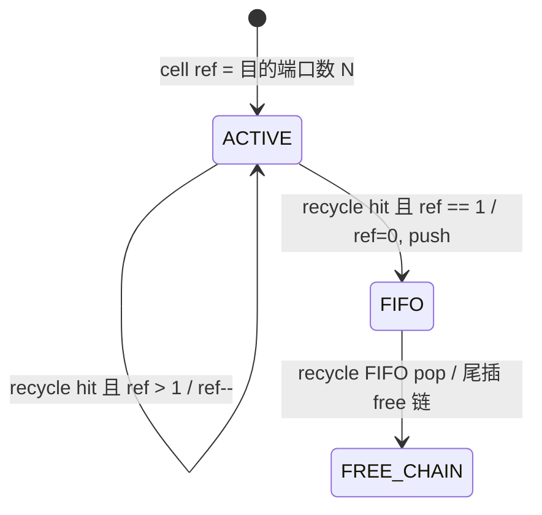
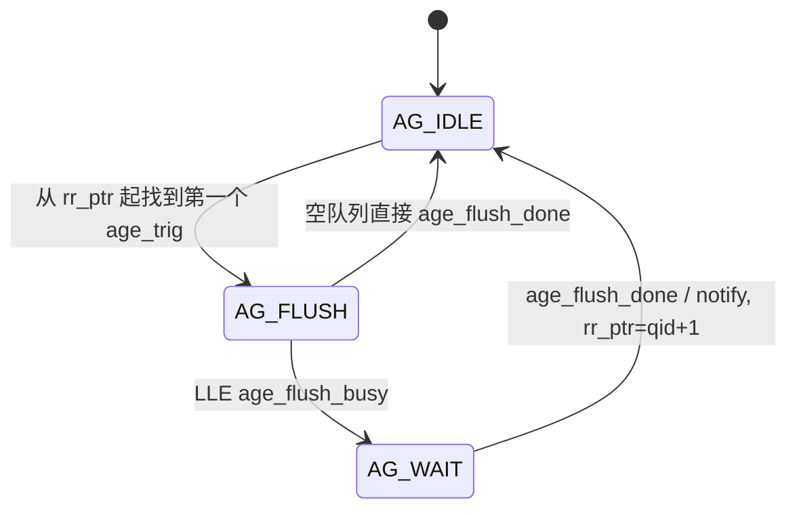
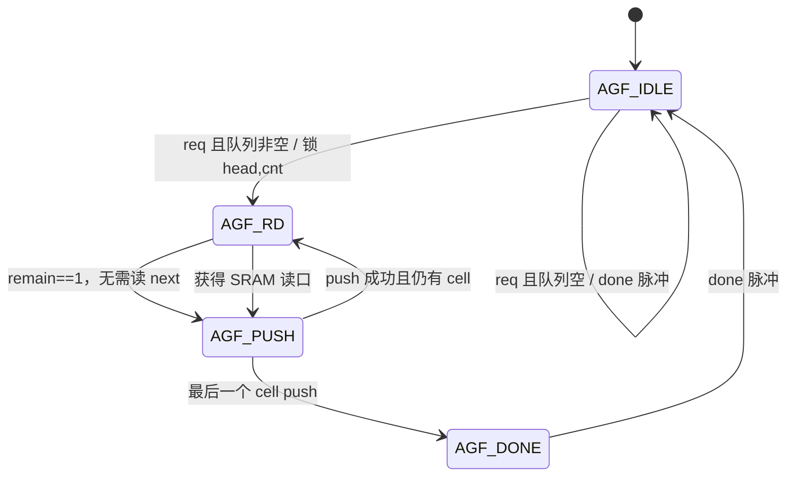

# SMMU RTL 工作原理与时序深度分析

> 分析对象：`project/cores/smmu/design/rtl/*.sv`，顶层为 `smmu.sv`。  
> 本文中的“挂链、走链、还链”均指以 256 B cell 地址为节点的链表操作。  
> 时序图采用 WaveDrom `waveform` 代码块；状态转换图采用 Mermaid（用户描述中的 `memarid` 按 Mermaid 理解）。

## 1. 结论先行

该模块名为 SMMU，但它不是进行虚实地址翻译的 IOMMU，而是交换芯片 QM 下方的共享 SRAM 地址管理器。它把 `CELL_NUM` 个 cell 地址组织成一条 free 链和 `PORT_NUM*TC_NUM+1` 条业务链，并完成以下工作：

- 入队时从 free 链头取一个地址，把该 cell 挂到目标队列尾部；外部接口 T0 接收请求，T1 返回地址或丢弃结果。
- 出队时直接读取预取到寄存器中的队头地址，并推进队头；外部接口同样是 T0 请求、T1 返回。
- 发送完成后，QM 逐 cell 请求还链；请求先进入 LLE 内部 recycle FIFO，随后由 FIFO 头部追加到 free 链尾部。
- 多播数据只分配一份 cell 链。每个目的端口以独立读索引遍历同一个 cell 镜像，并通过逐 cell 引用计数确保最后一个引用归还后才真正回到 free 链。
- Next-Ptr SRAM 是 1R1W、同步读一拍延迟。LLE 通过两级预取、同队列连续出队旁路以及 free-head 预取，维持常见情况下每拍一个 cell 的吞吐。
- SRAM 读口的实际优先级是：初始化最高，其次需要 SRAM 读的出队，再次入队，最后老化读；还链消费 recycle FIFO 主要占写口，可在部分场景与出队并行。
- 老化控制器为每个物理链维护超时计数，经轮询仲裁后请求 LLE 逐 cell 冲刷到 free 链。

默认参数下的关键规模如下：

| 项目 | 默认值 | 含义 |
|---|---:|---|
| `CELL_NUM` | 8192 | 2 MiB / 256 B 的 cell 数 |
| `ADDR_W` | 13 | cell 地址位宽 |
| `PORT_NUM` | 4 | 出端口数 |
| `TC_NUM` | 8 | 每端口 TC 数 |
| 常规调度队列 | 32 | `qid = port*8 + tc` |
| `MC_QID` | 32 | 唯一多播物理链 |
| `QUEUE_NUM` | 33 | 32 条单播链 + 1 条多播链 |
| Next-Ptr entry | 15 bit | `{next[12:0], pkt_head, pkt_tail}` |
| recycle FIFO | 8 deep | 已接收、待追加到 free-tail 的 cell |
| 多播槽 | 1 frame | 最多 `MAX_MC_CELLS=8` 个 cell |

派生位宽全部由 `CELL_NUM/PORT_NUM/TC_NUM` 推出，各子模块同源，顶层不再单独给数值：

```text
QUEUE_NUM = PORT_NUM*TC_NUM + 1          // 33
MC_QID    = QUEUE_NUM-1                   // 32
ADDR_W    = $clog2(CELL_NUM)              // 13
QID_W     = $clog2(QUEUE_NUM-1)+1         // 6
PORT_W    = $clog2(PORT_NUM-1)+1          // 2
TC_W      = $clog2(TC_NUM)                // 3
CNT_W     = ADDR_W + 1                    // 14 (可表 0~CELL_NUM)
ENTRY_W   = ADDR_W + 2                    // 15 (Next-Ptr entry)
MC_REF_W  = $clog2(PORT_NUM+1)            // 3 (多播 cell 引用数, 最大 = PORT_NUM)
```

## 2. 模块层次和职责



| 文件 | 核心职责 | 是否直接访问 Next-Ptr SRAM |
|---|---|---|
| `smmu.sv` | 顶层连接、参数派生、配置广播、告警汇总 | 否 |
| `enqueue_ctrl.sv` | 入队握手、整帧丢弃、T1 返回 | 否 |
| `dequeue_ctrl.sv` | 背压检查、T1 出队返回 | 否 |
| `recycle_ctrl.sv` | 统一还链接口的薄适配 | 否 |
| `lle.sv` | 链表权威状态、SRAM 仲裁、预取、多播、flush | 是，唯一访问者 |
| `occupancy_pool_mgr.sv` | 占用、双池、max、PAUSE/PFC、统计 | 否 |
| `aging_ctrl.sv` | 每队列计时、RR 选择、flush 握手 | 否 |
| `csr_stats_init.sv` | 配置采样、统计寄存、初始化 FSM | 否 |

### 2.1 顶层接口分组

`smmu.sv` 的端口按功能分为 6 组（注释中的 G1~G6）。讲 PPT 时按这几组切分最清晰：

| 组 | 名称 | 主要信号 | 方向 (相对 MMU) | 说明 |
|---|---|---|---|---|
| G1 | 时钟/复位/初始化 | `clk_core` `rst_core_n` `init_start` `init_done` | in / out | 单时钟域；`init_start` 上升沿触发建链 |
| G2 | 入队/地址分配 | `enq_req` `enq_queue_id(TC)` `enq_egress_port` `enq_cell_num` `enq_is_mcast` `enq_mcast_bitmap` `enq_sof/eof` → `enq_ready` `enq_predict_drop` `alloc_valid` `alloc_cell_addr` `alloc_drop_ind` `alloc_sram_flag` `alloc_pkt_head/tail` `enq_q_cell_cnt[]` `enq_free_count` | in → out | 1 拍；`enq_queue_id` 只带 TC，完整队列由 `{egress_port,tc}` 合成 |
| G3 | 出队/地址读取 | `deq_req` `deq_queue_id(TC)` `deq_egress_port` `deq_backpressure` → `deq_ready` `deq_cell_valid` `deq_cell_addr` `deq_pkt_head/tail` | in → out | 1 拍；背靠背 1 cell/cycle |
| G4 | 地址回收 | `recycle_req` `recycle_cell_addr` `recycle_queue_id(TC)` `recycle_egress_port` `recycle_is_mcast` → `recycle_ack` | in → out | 统一逐 cell 还链，单/多播同接口 |
| G5 | 流控/告警/配置/统计 | `pause_req` `pfc_req[PORT][TC]` `irq_alarm` `irq_aging` `overflow_alarm` `underflow_alarm`；`cfg_in_*`（标量广播）；`st_out_*` | out / in / out | CSR 直采无总线；配置标量在顶层 fanout 成数组 |
| G6 | 满/空反馈 | `q_empty[32]` `q_pkt_empty[32]` `q_max_reached[33]` `port_max_reached[4]` `global_max_reached` | out | 供 QM 调度与入队前置门控 |

要点：

- **配置端口是标量、片内统一阈值。** 所有队列/端口/TC 用同一套阈值，顶层用组合把标量 `cfg_in_*` 广播（fanout）成 `_arr` 数组再下发 `csr/occ/aging`。
- **`enq_predict_drop` 是纯组合、当拍返回。** QM 在 SOF 拍给 `enq_cell_num` 即可读整包能否放下，无需等 1 拍结果，用于入队前置门控。
- **告警汇聚：** 顶层 `underflow_alarm = occ_underflow_alarm | mcast_underflow`；`overflow_alarm = occ_overflow_alarm`。二者在 `csr_stats_init` 内再聚成 `irq_alarm`。
- **`q_empty` vs `q_pkt_empty`：** 前者按 cell 占用判空（承载未读完多播时也算非空），后者按“在队完整包数”判空；两者都是 32 位（仅常规队列），多播计入各目的端口承载队列。

## 3. 链表数据结构

### 3.1 权威状态

每个业务队列维护：

- `q_head_q[q]`：当前队头 cell。
- `q_tail_q[q]`：当前队尾 cell。
- `q_cell_cnt_q[q]`：链中 cell 数。
- `q_head_ph_q/q_head_pt_q`：当前队头的包头/包尾标志。
- `q_head_next_q`：下一个 cell 地址。
- `q_head_next_ph_q/q_head_next_pt_q`：下一个 cell 的头尾标志。
- `q_head_next2_q`：下下个 cell 地址，用于隐藏同步 SRAM 读延迟。
- `q_tail_ph_q/q_tail_pt_q`：旧尾节点重新写入 SRAM 时保留其头尾属性。

free 链独立维护：

- `free_head_q/free_tail_q/free_cnt_q`；
- `free_head_next_q/free_head_next2_q` 两级预取。

Next-Ptr SRAM 每个 cell 地址对应一个 entry：

```text
entry[cell_addr] = { next_cell_addr, pkt_head, pkt_tail }
```

这里有一个容易误读的点：新 cell 自身的 `{ph, pt}` 不会在分配当拍写入自身 SRAM entry；当它后来成为“旧 tail”并挂上下一 cell 时，才通过写旧 tail 的 entry 一并保存。当前 tail 的属性始终由 `q_tail_ph_q/q_tail_pt_q` 保底，因此队列尾无需依赖尚未写过的 SRAM 内容。

### 3.2 free 链初始化

初始化期间 LLE 连续写：

```text
mem[0] = {1, ph=0, pt=0}
mem[1] = {2, ph=0, pt=0}
...
mem[CELL_NUM-2] = {CELL_NUM-1, 0, 0}
mem[CELL_NUM-1] = {CELL_NUM-1, 0, 0}
```

结束后：

```text
free_head       = 0
free_head_next  = 1
free_head_next2 = 2
free_tail       = CELL_NUM-1
free_cnt        = CELL_NUM
所有业务队列 cnt = 0
```

初始化状态转换：



初始化约需 `CELL_NUM` 个 SRAM 写周期，再加请求检测和 FSM 收尾周期。在 `init_done=0` 时，入队和出队控制器均拒绝外部业务。

## 4. 入队与挂链

### 4.1 队列号与请求判决

单播完整队列号为：

```text
uni_qid = enq_egress_port * TC_NUM + enq_queue_id
```

多播不直接挂到各端口队列，而统一挂到 `MC_QID`。各目的端口上的逻辑可调度位置由多播槽另行维护。

入队可握手条件：

```text
enq_ready = init_done
          & !build_active
          & !lle_free_empty
          & !deq_need_sram
```

占用管理器对当前查询队列和端口做组合判决。若队列尚未用满 guaranteed 静态额度，则该 cell 可以绕过 q/port/global max；但 free pool 为空始终强制丢弃。

```text
occ_use_static = q_static_used[qid] < cfg_q_min_cell[qid]
max_hit = q_used      >= q_max
        | port_used   >= port_max
        | global_used >= global_max
        | shared_used >= cfg_shared_limit    // ★ 动态共享池独立上限
drop = no_free | (!occ_use_static & max_hit)
```

`max_hit_drop` 除了 q/port/global 三层 max，还包含 **动态共享池总额度** `shared_max_hit`（见 §9.2），共四项。

SOF 还会基于 `enq_cell_num` 做整包预判 (`occ_predict_drop`)。若整包不能完全落入静态剩余额度 `pred_s_rem`，则要求 free、q、port、global 以及共享池五项在加上整包 cell 数后均不越界，其中共享池只约束超出静态额度的部分 `(pred_cell_num - pred_s_rem)`。预判命中时从 SOF 开始整帧丢弃，避免产生半包残链。

### 4.2 整帧丢弃 FSM



丢弃来源包括：逐 cell max、free pool 空、LLE free 空、SOF 整包预判、多播槽忙，以及无明确 accept 的保守兜底。

### 4.3 空队列挂第一个 cell

当 `q_cell_cnt_q[q]==0`：

```text
allocated_cell = free_head_q
q_head_q[q]     = allocated_cell
q_tail_q[q]     = allocated_cell
q_head_ph/pt    = 当前 SOF/EOF
q_head_next     = free_head_next_q   // 预置值，cnt=1 时不会被当作有效链节点
q_cell_cnt      = 1
free_head       = free_head_next
free_cnt        = free_cnt - 1
```

因为没有旧 tail，所以本拍不需要写业务链 SRAM；读口用于补充 `free_head_next2` 预取。

### 4.4 非空队列尾插

当队列非空时，新 cell 仍取自 `free_head_q`，同时写旧尾节点：

```text
mem[old_tail] = {new_cell, old_tail_ph, old_tail_pt}
q_tail        = new_cell
q_tail_ph/pt  = 当前 SOF/EOF
q_cell_cnt++
```

对队列前两次扩展，还会直接补齐 `q_head_next` 和 `q_head_next2`。这使前两个后继节点不必等待 SRAM 读回。

### 4.5 入队一拍外部时序

```wavedrom
{ "signal": [
  { "name": "clk_core",       "wave": "p..." },
  { "name": "enq_req",        "wave": "010." },
  { "name": "enq_ready",      "wave": "1..." },
  { "name": "occ_accept",     "wave": "01.." },
  { "name": "lle_alloc_fire", "wave": "01.." },
  { "name": "free_head",      "wave": "x3.4", "data": ["A", "B"] },
  { "name": "alloc_valid",    "wave": "0010" },
  { "name": "alloc_addr",     "wave": "x.3x", "data": ["A"] },
  { "name": "q/free count",   "wave": "x.4.", "data": ["更新后"] }
], "head": { "text": "T0 请求与组合判决，T1 返回分配结果" } }
```

在 T0 上升沿，外部结果寄存器捕获旧 `free_head=A`；同一上升沿 LLE 将 free head 推进到 B，并更新链表及计数。T1 可见 `alloc_valid=1, alloc_addr=A`。

### 4.6 背靠背入队与 free-head 旁路

每次入队都发起一次 SRAM 读以补充 free 链预取。若上一拍入队尚有同步读结果返回、这一拍又继续入队，则 `enq_bypass=1`：

```text
本拍 free_head_next 直接取上一拍 npr_r_data.next
本拍 SRAM 新读地址也直接取上一拍 npr_r_data.next
```

该旁路形成流式预取链，支持连续每拍分配一个 cell。

```wavedrom
{ "signal": [
  { "name": "clk_core",          "wave": "p....." },
  { "name": "enq_grant (入队)",   "wave": "01110." },

  {},
  ["free 三级预取寄存器 (时钟沿更新)",
    { "name": "free_head_q",       "wave": "3.456.", "data": ["A","B","C","D"] },
    { "name": "free_head_next_q",  "wave": "4.567.", "data": ["B","C","D","E"] },
    { "name": "free_head_next2_q", "wave": "5.678.", "data": ["C","D","E","F"] }
  ],

  {},
  ["SRAM 读口 (同步读: 本拍发命令, 下一拍返回)",
    { "name": "npr_r_en (发读)",    "wave": "01110." },
    { "name": "npr_r_addr (读谁)",  "wave": "x345x.", "data": ["C","D","E"], "node": ".abc.." },
    { "name": "npr_r_data (返回)",  "wave": "xx345x", "data": ["D","E","F"], "node": "..xyz." }
  ],

  {},
  ["旁路控制",
    { "name": "enq_pend_q",        "wave": "01110." },
    { "name": "enq_bypass",        "wave": "0.110." }
  ],

  {},
  ["外部返回 (T1)",
    { "name": "alloc_valid",       "wave": "01110." },
    { "name": "alloc_addr",        "wave": "x3456.", "data": ["A","B","C","D"] }
  ]
],
"edge": [
  "a~>x 读C.next→返回D",
  "b~>y 读D.next→返回E",
  "c~>z 读E.next→返回F"
],
"config": { "hscale": 1 },
"head": { "text": "背靠背入队：free-head 流式预取 + enq_bypass" }
}

```

## 5. 出队与走链

### 5.1 外部出队条件

```text
deq_fire = deq_req & init_done & !lle_q_empty & !deq_backpressure[port]
```

T0 直接组合选择 `lle_qhead` 及其 ph/pt，T0 末沿寄存，T1 返回给 QM。因此外部看到的一拍延迟不包含 SRAM 读延迟；SRAM 读发生在后台，用于维持后续预取。

### 5.2 单播队头推进

一次单播出队完成：

```text
returned_cell = q_head
q_head        = q_head_next
q_cell_cnt--
```

队头描述符同步推进：

- 通常 `head_ph/pt <- head_next_ph/pt`；
- `head_next <- head_next2`；
- 若出队前 `cnt>=3`，后台读新的 `head_next2` 及其 ph/pt。

### 5.3 为什么 `cnt>=3` 才读 SRAM

- `cnt=1`：出队后链空，不需要后继。
- `cnt=2`：第二个 cell 已在 `q_head_next`，出队后无需再补第三个。
- `cnt>=3`：推进后还要保持两级 look-ahead，因此必须读 SRAM 获取更远节点。

### 5.4 连续同队列出队旁路

同步 SRAM 在 T+1 才返回。若连续两拍出同一队列，第二拍不能等待寄存器先回填，因此：

```text
deq_pend_same_q = 上拍读 pending & 本拍仍出同 qid
本拍读地址 = 上拍 npr_r_data.next
本拍 head/next 描述符也可直接使用上拍 npr_r_data
```

这条旁路是背靠背 `1 cell/cycle` 走链的关键。

```wavedrom
{ "signal": [
  { "name": "clk_core",      "wave": "p....." },
  { "name": "deq_req",       "wave": "01110." },
  { "name": "lle_deq_fire",  "wave": "01110." },
  { "name": "q_head",        "wave": "x345x.", "data": ["C0", "C1", "C2"] },
  { "name": "npr_r_en",      "wave": "01110." },
  { "name": "npr_r_data",    "wave": "x.345x", "data": ["C3", "C4", "C5"] },
  { "name": "deq_valid",     "wave": "001110" },
  { "name": "deq_addr",      "wave": "x.345x", "data": ["C0", "C1", "C2"] }
], "head": { "text": "同一长队列连续走链：返回路径一拍，预取读在后台流水" } }
```

### 5.5 T1 返回信号（勘误）

`dequeue_ctrl.sv` 的 T1 只寄存并返回四个信号，**没有** `deq_pkt_tail_next` 端口：

```text
deq_cell_valid <= deq_fire
deq_cell_addr  <= lle_qhead            // 队头地址, T0 当拍组合可读
deq_pkt_head   <= lle_qhead_pkt_head   // 队头描述符 (预取)
deq_pkt_tail   <= lle_qhead_pkt_tail
```

即“本次返回 cell 是否包尾”由 `deq_pkt_tail` 表达即可。LLE 内部确有 `next_pt`（`mc_cur_pt`/预取节点的 pt）用于自身流水前瞻，但它不作为顶层输出。QM 判断包边界只依赖 `deq_pkt_head/deq_pkt_tail`。

## 6. 还链

### 6.1 两阶段语义

外部请求并不直接在同一拍写 free 链尾，而分为：

1. 接收阶段：`recycle_req` 被 LLE 接收，必要时做多播 ref-count 递减；真正可释放的 cell push 到 recycle FIFO。
2. 落链阶段：FIFO 非空时获得 `rcy_grant`，把 FIFO 头 cell 写到当前 `free_tail.next`，并更新 `free_tail`。

```text
recycle_ack = recycle_req & !build_active & !rcy_fifo_full
lle_free_done = rcy_grant
```

因此 `recycle_ack` 的精确定义是“请求已接收”，不是“free-tail SRAM 写已经完成”。顶层没有把 `lle_free_done` 返回 QM。

### 6.2 单播还链

单播地址未命中活动多播槽：

```text
push_cell = recycle_cell_addr
push_qid  = port*TC_NUM + tc
recycle FIFO push
free_cnt++，occupancy 对该 qid/global/port --
```

后续 FIFO pop：

```text
mem[old_free_tail] = {returned_cell, 0, 0}
free_tail          = returned_cell
```

```wavedrom
{ "signal": [
  { "name": "clk_core",       "wave": "p...." },
  { "name": "recycle_req",    "wave": "010.." },
  { "name": "recycle_ack",    "wave": "010.." },
  { "name": "fifo_push",      "wave": "010.." },
  { "name": "lle_free_evt",   "wave": "010.." },
  { "name": "fifo_nonempty",  "wave": "0010." },
  { "name": "rcy_grant/pop",  "wave": "0010." },
  { "name": "npr_w_en",       "wave": "0010." },
  { "name": "free_tail",      "wave": "x..3x", "data": ["returned cell"] }
], "head": { "text": "单播还链：ack/push 与实际 free-tail 写入是两个阶段" } }
```

在无冲突情况下，接收后的下一拍即可 pop 并写旧 free tail。若入队占用写路径或 FIFO 中已有项目，落链会继续排队。

### 6.3 同拍 push/pop

recycle FIFO 支持同拍 push 和 pop，计数净不变。LLE 的 `free_cnt_q` 和 Occupancy 的 `free_count_q` 都在 push 时增加，而不是等 SRAM 落链时增加；这意味着计数语义是“已被回收通路接管的可用 cell 数”。

## 7. 多播挂链、走链和还链

### 7.1 单槽零复制模型

多播帧仍真实挂在 `MC_QID` SRAM 链上，同时在寄存器中建立一个最多 8 cell 的地址镜像：

```text
MC_QID chain: 权威物理链，用于挂链、占用和老化 flush
mc_cells_q[]: 逐端口 O(1) 走链的读加速镜像
```

单槽意味着 `mc_valid_q=1` 时新多播帧的 SOF 会被整帧丢弃。并不是每个多播帧、每个目的端口各建一条物理链。

### 7.2 多播挂链

多播每个 cell 与单播一样从 free head 分配并尾插到 `MC_QID`；额外执行：

- SOF：锁存目的 bitmap、各端口承载 qid、各承载队列当前完整单播包 backlog。
- 每个 cell：写入 `mc_cells_q[mc_wr_idx]`，初始化该 cell 引用数为目的端口数。
- EOF：锁定 `mc_ncell_q`，并给每个目的端口承载队列的完整包 backlog 加一。

每端口承载队列为：

```text
mc_carry_qid[p] = p*TC_NUM + multicast_tc
```

多播在物理占用上只计 `MC_QID/global` 一次，不计入任一 `per_port_used`；在调度可见性上则给 bitmap 中每个端口的承载队列增加一个逻辑包。

### 7.3 逻辑插入位置

SOF 时对每个目的端口快照：

```text
mc_pend_uni[p] = 当时承载队列内的完整单播包数
```

之后该端口每出完一个位于多播之前的单播包，`mc_pend_uni[p]--`。降到 0 后，承载队列下一次出队切到多播镜像。这样同一多播帧可以在各端口独立地插入到各自原有 backlog 之后。



注意：`mc_take_deq` 要求 `mc_ncell_q != 0`，所以多播只能 store-and-forward，必须等 EOF 入队后才对任何端口可见，不是逐 cell cut-through。

### 7.4 多播走链

当请求 qid 是该端口承载队列、该端口属于目的 bitmap、尚未读完且 `mc_pend_uni==0`：

```text
lle_qhead = mc_cells_q[mc_rd_idx[port]]
ph        = (rd_idx == 0)
pt        = (rd_idx+1 == mc_ncell)
next_pt   = (rd_idx+2 == mc_ncell)
```

每个端口只推进自己的 `mc_rd_idx_q[p]`，不推进 `MC_QID` 的物理 `q_head_q`，也不访问 Next-Ptr SRAM。这是多端口独立速率零复制读取的关键。

```wavedrom
{ "signal": [
  { "name": "clk_core",       "wave": "p......" },
  { "name": "port0 deq",      "wave": "01010.." },
  { "name": "port0 rd_idx",   "wave": "x345...", "data": ["0", "1", "2"] },
  { "name": "port1 deq",      "wave": "001010." },
  { "name": "port1 rd_idx",   "wave": "x.345..", "data": ["0", "1", "2"] },
  { "name": "npr_r_en",       "wave": "0......" },
  { "name": "shared cells",   "wave": "x3....x", "data": ["C0,C1,C2"] }
], "head": { "text": "两个目的端口以私有索引读取同一多播 cell-list，不占 SRAM 读口" } }
```

### 7.5 多播逐 cell 引用还链

每个多播 cell 初始：

```text
mc_ref_cnt[cell_index] = popcount(mcast_bitmap)
```

QM 每完成一个目的端口上的该 cell 发送，就对相同地址提交一次 recycle：

- `ref>1`：只做 `ref--`，不 push、不产生 Occupancy free 事件。
- `ref==1`：最后一次引用，`ref--` 并 push 到 recycle FIFO，`push_qid=MC_QID`。
- 所有有效 cell 的 ref 都为 0：下一拍 `mc_all_freed=1`，清槽并允许新多播 SOF。



多播回收是按地址匹配 `mc_cells_q[]` 判定，`recycle_is_mcast` 只是告警提示，不是选择路径的唯一依据。因此一个地址只要命中活动多播槽且 ref 非零，即使提示位错误也会按多播处理。

## 8. 挂链、走链、还链与老化的仲裁

### 8.1 资源拆分

Next-Ptr SRAM 是 1R1W：一个读口和一个写口可以同拍工作，但组合驱动逻辑对操作类型仍有优先级。

| 操作 | 读口 | 写口 | 说明 |
|---|---|---|---|
| 初始化 build | 否 | 是 | 独占主控制路径，业务全部禁止 |
| 长链单播 deq (`cnt>=3`) | 是 | 否 | 读新预取节点 |
| enq | 是 | 队列非空时是 | 读 free 预取；写 old tail |
| recycle FIFO pop | 否 | 是 | 写 old free tail |
| 多播镜像 deq | 否 | 否 | 全寄存器路径 |
| aging flush RD | 是 | 否 | 最低优先级读当前 cell.next |
| aging flush push | 否 | 先入 recycle FIFO | 后续由 FIFO pop 写口 |

### 8.2 实际授权逻辑

```text
deq_grant = deq_req_int & !enq_pkt_lock

enq_grant = enq_req_int & !deq_need_sram

rcy_grant = recycle_fifo_nonempty
          & !deq_need_sram
          & !enq_grant

aging_read_grant = AGF_RD
                 & !build
                 & !(deq_grant & deq_need_sram)
                 & !enq_grant
```

因此不能简单概括为所有事务严格 `deq > enq > recycle` 串行；更准确的并发矩阵为：

| 同拍组合 | 是否允许 | 原因 |
|---|---|---|
| 长链 deq + enq | 否 | 两者都需要唯一读口，deq 优先 |
| 短链 deq + enq | 是 | 短链 deq 不读 SRAM |
| 多播 deq + enq | 是 | 多播读取镜像，不读 SRAM |
| 长链 deq + recycle pop | 否 | RTL 明确用 `deq_need_sram` 阻止 `rcy_grant`，虽理论上 1R1W 可并行 |
| 短链/多播 deq + recycle pop | 是 | deq 不占 SRAM，recycle 使用写口 |
| enq + recycle pop | 否 | 两者可能竞争 SRAM 写口，enq 优先 |
| recycle pop + aging read | 是 | 一个写口、一个读口 |
| enq + aging read | 否 | enq 占读口，aging 最低优先级 |

### 8.3 包级入队锁

当某个入队 cell 获得 grant 且不是 EOF，`enq_pkt_lock_q=1`；直到某次后续 `enq_grant` 携带 EOF 才释放。锁期间：

- 外部 `lle_q_empty` 被强制为 1，暂停正常出队；
- `deq_grant` 被阻止；
- `deq_need_sram` 被屏蔽，从而入队不被出队读口打断。

但当前 RTL 并没有直接用锁位禁止 recycle pop；若入队 cell 之间存在空拍且该拍没有 `enq_grant`，recycle 仍可能推进。因此它保证的是“出队不插入正在挂链的包”，不是无条件独占 LLE 的所有操作。

## 9. Occupancy、双池与流控

### 9.1 两套计数必须同步

LLE 维护结构性链长，Occupancy 维护资源策略计数。两者通过事件同步：

```text
lle_alloc_evt = enq_grant
lle_free_evt  = recycle FIFO push
```

同拍 alloc/free 时，全局 used/free 净不变；若同 qid 或同 port，局部计数也净不变。多播 cell 的 per-port used 不增加，只增加 `MC_QID` 和 global。

### 9.2 静态 guaranteed 与共享池

每队列前 `cfg_q_min_cell[q]` 个占用计入 `q_static_used_q`。静态额度未满时允许绕过 q/port/global max，但不能绕过物理 free pool 空。超过静态额度后才受三层 max 共同限制。

当前静态回收策略是：只要该队列 `q_static_used_q!=0`，任意一次该队列 free 都先减少静态使用量；RTL 并不跟踪“具体哪个 cell 来自静态还是共享”。这是计数抽象，而非 cell 级池标签。

**动态共享池独立上限。** occupancy 用一个精确记账区分静态/共享占用：

```text
total_static_used = Σ q_static_used_q[i]         // 所有队列已用的静态预留额度
shared_used        = global_used - total_static_used  // 落到动态共享池的 cell 数
shared_max_hit     = (shared_used >= cfg_shared_limit)
```

`shared_max_hit` 作为 `max_hit_drop` 的第四项参与丢弃判决。它约束的是“超出各队列保底额度、抢占共享池的那部分 cell”，与 q/port/global 三层 max 相互独立。这样即使 global_max 还没到，共享池自身额度耗尽也能挡住抢占型流量，保护各队列的 guaranteed 预留。

### 9.3 PAUSE/PFC 迟滞

PAUSE（`pause_req[PORT_NUM]`，端口聚合 + 全局共同判决，`cfg_pause_en` 总闸）：

```text
global_xoff = (global_used >= cfg_global_pause_xoff)
global_xon  = (global_used <  cfg_global_pause_xon)
set[p] = (port_used[p] >= cfg_port_pause_xoff[p]) | global_xoff   // 端口或全局达到 xoff
clr[p] = (port_used[p] <  cfg_port_pause_xon[p])  & global_xon    // 端口且全局回落 xon
// xon~xoff 中间区保持原值 (迟滞)
```

PFC（`pfc_req[PORT_NUM][TC_NUM]`，每 `(port,tc)` 独立，`cfg_pfc_en` 总闸）：每个 `(port,tc)` 直接观察相应单播队列占用 `per_tc_used[p][tc] = q_cell_cnt_q[p*TC_NUM+tc]`，在 `xoff` 置位、`xon` 以下清除，中间区保持。

多播只计 MC_QID，因此其物理 cell 占用不会进入 per-port PAUSE/PFC 阈值，只会通过 global 水位产生影响。

### 9.4 统计与告警

occupancy 产出并经 `csr_stats_init` 寄存一拍后输出的统计（`st_out_*`，`STAT_W=32`，饱和计数）：

| 统计 | 含义 |
|---|---|
| `st_global_used` / `st_free_count` | 全局占用 / 空闲计数 |
| `st_per_queue_used[33]` / `st_per_port_used[4]` | 每队列 / 每端口占用 |
| `st_q_static_used[33]` | 每队列静态池占用 |
| `st_q_max_reached_status[33]` | 到 max 状态镜像 |
| `st_tail_drop_cnt[33]` | 命中 max/池空 丢包计数 (按 cell) |
| `st_q_max_assert_cnt[33]` | 队列 max 由 0→1 置位次数 |
| `st_pause_tx_cnt[4]` | 每端口 PAUSE 上升沿计数 |

告警：`overflow_alarm = global_used > CELL_NUM`；`underflow_alarm = 守恒破坏 | 分配时 free 空 | 回收时 global 空`。守恒式 `free_count + global_used == CELL_NUM`。顶层再并入 `mcast_underflow`，`csr_stats_init` 聚成 `irq_alarm`；`irq_aging` 来自 `aging_ctrl`。

## 10. 老化

### 10.1 计时与喂狗

每个 `QUEUE_NUM` 队列一个 24 bit timer。以下任一条件清零 timer 和内部超时触发：

- 老化未使能或初始化未完成；
- 队列为空；
- 该 qid 本拍 `deq_grant`；
- LLE 正在冲刷该 qid。

否则 timer 每拍加一；当旧值已经 `>= cfg_aging_timeout` 时，下一沿置 `age_trig_q`。从空闲计时值 0 开始计算，RTL 可见触发通常在第 `timeout+1` 个连续 eligible 时钟之后，属于需要在验证环境中明确的边界语义。

软件 `cfg_age_force[q]` 与 timer 触发做 OR；如果软件持续保持 force 位，flush 完成后仍会再次触发，软件侧应使用脉冲或及时清位。

### 10.2 老化 RR FSM



它是 round-robin 起点搜索，不是所有触发队列并行 flush。一次只锁存一个 `sel_qid_q`。

### 10.3 LLE flush FSM



除最后一个 cell 外，每个 flush cell 至少经历一个 RD 周期和一个 PUSH 周期。RD 会被正常长链 deq 和 enq 抢占；PUSH 会被外部 recycle push 抢占，也会在 recycle FIFO full 时等待。因此冲刷吞吐通常低于 1 cell/cycle。

```wavedrom
{ "signal": [
  { "name": "clk_core",       "wave": "p......." },
  { "name": "age_flush_req",  "wave": "0110...." },
  { "name": "age_flush_busy", "wave": "0011110." },
  { "name": "agf_state",      "wave": "x34563x.", "data": ["IDLE", "RD", "PUSH", "RD", "PUSH"] },
  { "name": "npr_r_en",       "wave": "000100.." },
  { "name": "agf_push",       "wave": "0000101." },
  { "name": "age_done",       "wave": "00000010" }
], "head": { "text": "示意：两 cell 队列的老化冲刷，实际等待会随仲裁拉长" } }
```

### 10.4 多播老化的特殊性

`q_occupied_vec[MC_QID]` 在多播槽有效时为 1，但多播从各端口承载 qid 出队，`deq_fire_qid` 从不会是 `MC_QID`。因此活动多播的端口读取不会直接给 MC_QID 老化 timer 喂狗。若 timeout 小于多播整个生命周期，老化可能冲刷仍在服务或等待回收的多播槽。系统应禁用 MC_QID 老化、增加专门喂狗条件，或保证 timeout 覆盖最坏多播生命周期。

## 11. 关键完整事务示例

### 11.1 三 cell 单播包

```text
初始：free = A->B->C->D...，Q5 为空

ENQ A(SOF): Q5 head=tail=A，A 暂无必要写 SRAM
ENQ B     : mem[A]={B,ph=1,pt=0}，tail=B
ENQ C(EOF): mem[B]={C,ph=0,pt=0}，tail=C，tail.pt=1

DEQ A: 返回 A/ph=1/pt=0，head=B，后台维持预取
DEQ B: 返回 B/ph=0/pt=0，head=C，next_tail=1
DEQ C: 返回 C/ph=0/pt=1，Q5 cell cnt 归 0

QM 完成发送后分别 recycle A/B/C：
每个地址先 push recycle FIFO；随后 FIFO pop，依次追加到 free-tail。
```

出队只把节点从业务队列视图中摘除，并不立即归还物理 cell；真正 free 依赖 QM 后续 recycle。这使发送流水可以继续持有已出队 cell 的数据。

### 11.2 三 cell、两目的端口多播包

```text
分配：A,B,C 只各分配一次，挂 MC_QID；每 cell ref=2
端口0：按自己的 rd_idx 返回 A,B,C
端口1：可晚若干拍，仍按自己的 rd_idx 返回 A,B,C

第一次 recycle A：ref[A] 2->1，不还 free
第二次 recycle A：ref[A] 1->0，A push recycle FIFO
B、C 同理
所有 A/B/C ref 都为0：下一拍清 mc_valid，释放单槽
```

## 12. 当前 RTL 的重要约束与风险点

以下内容不是对架构目标的否定，而是阅读和验证当前实现时必须显式建模的条件。

1. **老化与正常业务缺少同队列硬互斥。** LLE 注释假设被 flush 队列在冲刷期间 QM 已停止入队/出队，但接口没有 per-q block/ack。若同一 qid 并发 enq/deq/flush，多个 always 分支可能对同一 head/cnt 非阻塞赋值，后赋值覆盖前赋值。

2. **MC_QID 缺少服务喂狗。** 多播实际出队事件报告承载单播 qid，而 MC_QID 一直 occupied，存在活动多播被超时 flush 的风险。

3. **多播引用只计次数，不识别端口。** 同一目的端口重复 recycle、另一个端口漏 recycle，仍可能让 ref 归零并提前释放。接口中没有 recycle source-port bitmap 去做逐端口去重。

4. **非 SOF 多播 cell 的 ref 初值取当前输入 bitmap 的 popcount。** RTL 没有改用已锁存的 `mc_dst_bitmap_q` 计算。因此要求 QM 在整帧所有 cell 上保持 `enq_mcast_bitmap` 一致，否则不同 cell 的引用初值会不一致。

5. **`mcast_underflow` 覆盖不完整。** 当前表达式要求 `mc_valid_q=1`；多播槽已经清空后再提交一个 `recycle_is_mcast=1` 的地址不会置该告警。

6. **recycle FIFO 满会连多播非末次 ref 递减也一起背压。** 即使某次 recycle 只需 `ref--`、理论上不占 FIFO，`lle_free_grant` 仍要求 FIFO 非满。这是保守但会降低吞吐的实现。

7. **`free_count` 在 FIFO push 时增加，free-tail 在之后 pop 时才落链。** 正常情况下靠 FIFO 有序排空可保持一致；但应重点验证 free 链从完全空到首次回收的边界，因为当前代码没有在 `free_cnt==0` 的回收路径上显式重建 `free_head/free_head_next`。

8. **包级入队锁依赖最终看到 EOF。** 若上游在已接受非 EOF cell 后永久中断该包，`enq_pkt_lock_q` 会一直保持，所有出队被暂停。需要协议保证每个已开始且未丢弃的入队包最终提供 EOF，或增加超时恢复。

9. **多播槽容量与外部最大包长必须一致。** `MAX_MC_CELLS=8`，但 `PKT_CELL_W=4` 可表达 15；代码没有对 `mc_wr_idx` 越界做运行时保护。系统必须保证多播帧不超过 8 cells。

10. **多播每端口逻辑 backlog 与物理占用计数刻意不同。** `q_pkt_empty` 会把一个多播包同时显示在多个承载队列中，但 `q_cell_cnt/port_used/PFC` 不会给这些端口计物理多播 cell。验证 scoreboard 不能把两套语义混为一谈。

11. **`recycle_ack` 不是完成信号。** 如果 QM 需要“地址已经重新可分配”的严格确认，当前顶层接口不够；内部 `lle_free_done` 只表示 recycle FIFO pop，且未透出顶层。

12. **配置复位值全为 0。** 在有效配置采样前，`q_max/port_max/global_max=0` 会让非静态流量全部命中 max；系统必须先配置阈值再开放业务。

## 13. 建议的验证断言与覆盖点

建议围绕以下不变量建立 SVA/scoreboard：

```text
1. 地址生命周期必须满足 `FREE → QUEUED → DEQ_IN_FLIGHT → RECYCLED/FREE` 单向转移，
   任一地址同拍只能属于一个阶段。不能直接用 LLE 的
   `free_cnt + sum(q_cell_cnt) == CELL_NUM` 做断言：单播 q count 在 deq 时已减，
   free count 到 recycle push 才加，中间还必须加入 QM/EPS 持有的 in-flight 集合；
   多播物理 q count 又会保持到整帧引用全部归零。

2. Occupancy free_count + global_used == CELL_NUM。

3. accepted enq 地址不得在尚未 recycle 前再次分配。

4. q_cell_cnt==0 时 q_empty 必为1，除非该 qid 正承载未读完多播。

5. 每个多播 cell 的成功 recycle 次数恰等于目的端口数，且归零前不得再次 alloc。

6. 连续同 qid deq 时，返回地址序列必须等于 Next-Ptr 链序列，ph/pt 同步。

7. 同拍 enq+deq、deq+recycle、recycle+aging read 的允许组合全部覆盖。

8. aging flush 完成后：目标 q cnt/head/tail/backlog 清空，Occupancy 对应计数同步归零。

9. frame_drop_q 置位后直到 EOF，不得出现 lle_alloc_fire。

10. init_done 前不得产生 alloc/deq grant；初始化结束 free 链遍历必须覆盖每个地址一次。
```

重点 directed cases：

- 队列长度分别为 1、2、3、4 时连续出队，覆盖 `cnt>=3` 读口切换。
- 上一拍 deq pending、下一拍同 qid 与不同 qid，覆盖 `deq_pend_same_q`。
- free 链只剩 0/1/2 个节点时，交错 enq/recycle。
- 同拍短链 deq+enq、短链 deq+recycle、长链 deq 与两者竞争。
- 多播目的端口数 1、2、4，端口读取/回收顺序完全交错。
- 多播槽忙时新帧 SOF，确认整帧丢弃直至 EOF。
- aging flush 在 recycle FIFO full、持续 enq、持续长链 deq 下的饥饿与最终完成。
- 软件 force 位持续多拍，确认是否按期望只产生一次或重复 flush。

## 14. PPT 讲解建议大纲

面向 15~25 页幻灯片，按“是什么 → 怎么连 → 怎么走 → 边界与验证”推进：

1. **封面 + 一句话定位**：SMMU = QM 下方的共享 SRAM 地址管理器（不是 IOMMU）。放 §1 结论先行的要点与规模表。
2. **整体架构图**：§2 的 mermaid flowchart，强调 LLE 是 Next-Ptr SRAM 唯一访问者。
3. **顶层接口全景**：§2.1 的 G1~G6 分组表，一页看清 MMU 对 QM/CSR/MAC 的所有信号。
4. **为什么用链表**：对比“固定分区 vs 链表+共享池”，讲清链表的原理、使用理由与必要性——把整片 SRAM 打散成 256B cell 放进同一 free 池，用 `next` 指针把物理不连续的 cell 串成逻辑队列，按需共享、动态伸缩、回收即还池；在 4 端口×8 TC=32 队列 + 多播、流量突发不均衡的场景下，是高利用率 + 低丢包的关键。
5. **链表数据结构**：§3.1 权威状态 + entry 格式 + 两级预取的动机（隐藏 SRAM 1 拍读延迟）。
6. **上电初始化**：§3.2 建链 FSM 与结束态，说明 `init_done` 门控业务。
7. **入队与挂链**：§4 队列号合成、占用判决、整帧丢弃 FSM、空/非空挂链、T0/T1 时序图。
8. **出队与走链**：§5 队头推进、`cnt>=3` 读 SRAM 的原因、连续同队列旁路时序图。
9. **还链两阶段**：§6 recycle FIFO 接收/落链、`recycle_ack` 语义、时序图。
10. **多播（核心亮点）**：§7 单槽零复制、逻辑插入位置、逐端口私有读、逐 cell 引用还链，配 §11.2 完整事务。
11. **仲裁与并发**：§8 资源拆分表 + 并发矩阵 + 包级入队锁。
12. **占用/双池/流控（两条并行判决路径）**：§9。一张“同一份占用计数 → 两套阈值 → 两组输出”图：① 丢弃判决（→ QM）看 `q_min` 保底够不够、不够借共享池(≤`shared_limit`)、再配合 QM 请求整包 `cell_num` 做整包预判，输出 `occ_drop`/`occ_predict_drop`；② PAUSE/PFC（→ MAC）用另一套水位阈值，越 XOFF 发、回落 XON 撤销、中间迟滞，输出 `pause_req`/`pfc_req`。
13. **老化**：§10 计时喂狗、RR 仲裁、LLE flush FSM、多播老化风险。
14. **完整事务走查**：§11 单播 3-cell 全流程，作为“串起所有环节”的收束页。
15. **风险与验证**：§12 约束风险点 + §13 SVA/覆盖点，展示对实现边界的把握。
16. **收尾**：源码索引（§15）与 Q&A。


演示技巧：WaveDrom 时序图和 Mermaid 状态图可先渲染成图片贴入 PPT；每个子模块用“输入-做什么-输出”三行讲清；多播、仲裁、双池判决三块留足时间，是评审最关注的差异化设计。

## 15. 源码索引

- 顶层和互连：`rtl/smmu.sv`
- 入队判决、整帧丢弃、T1 返回：`rtl/enqueue_ctrl.sv`
- 出队背压和 T1 返回：`rtl/dequeue_ctrl.sv`
- 外部统一还链适配：`rtl/recycle_ctrl.sv`
- 链表、SRAM、仲裁、预取、多播、flush：`rtl/lle.sv`
- 占用、双池、max、PAUSE/PFC：`rtl/occupancy_pool_mgr.sv`
- 老化 timer 和 RR：`rtl/aging_ctrl.sv`
- 初始化、配置和统计寄存：`rtl/csr_stats_init.sv`
