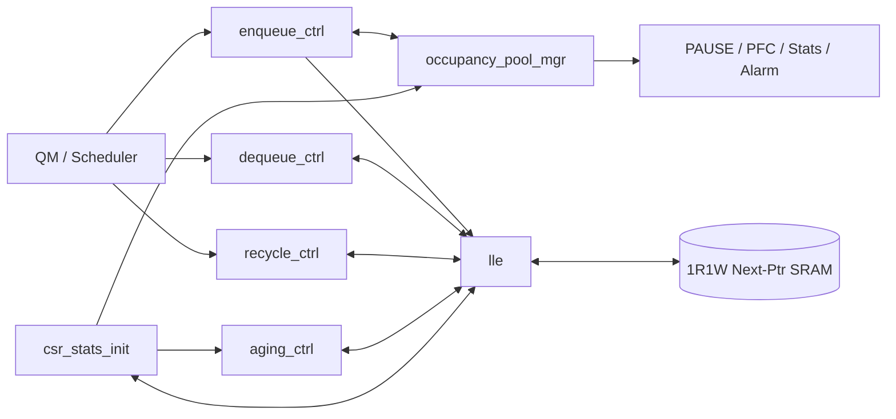
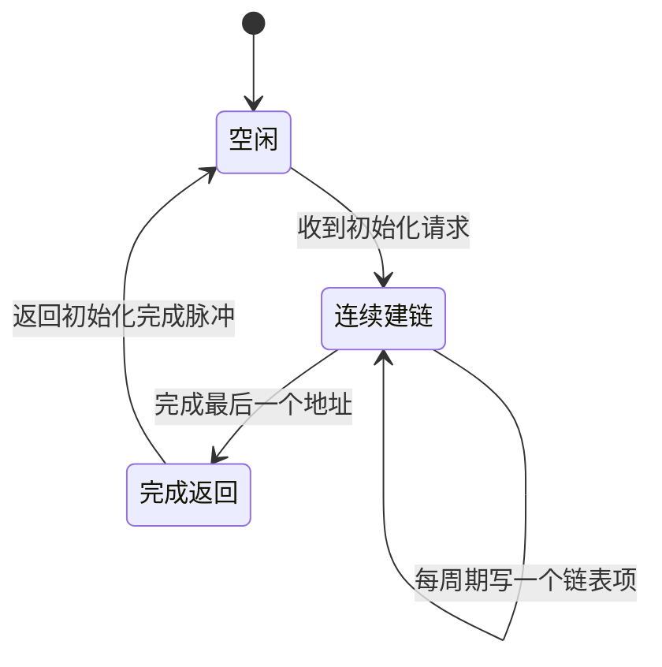
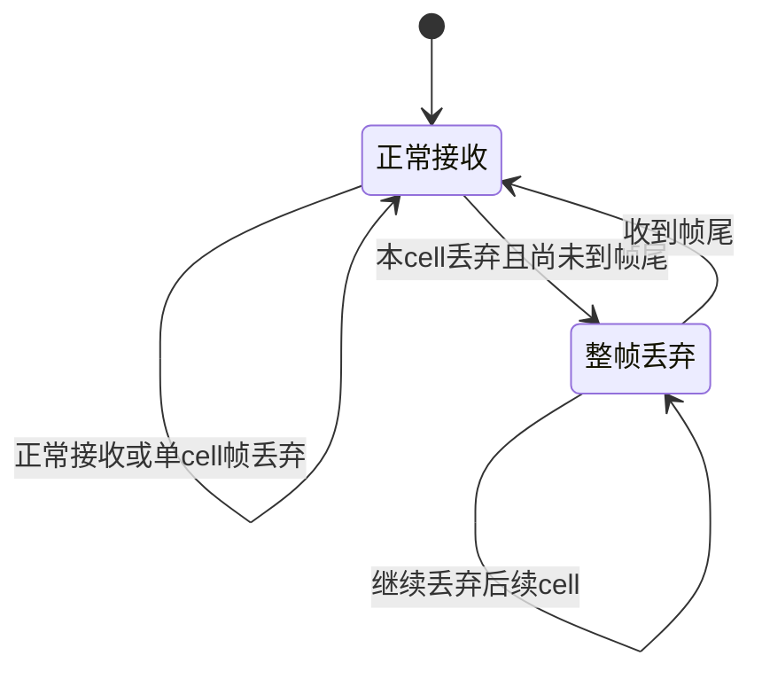
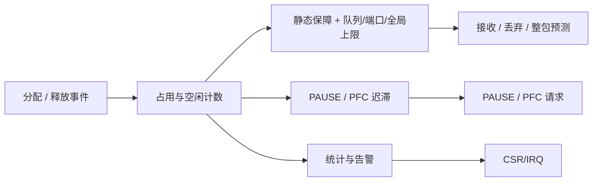
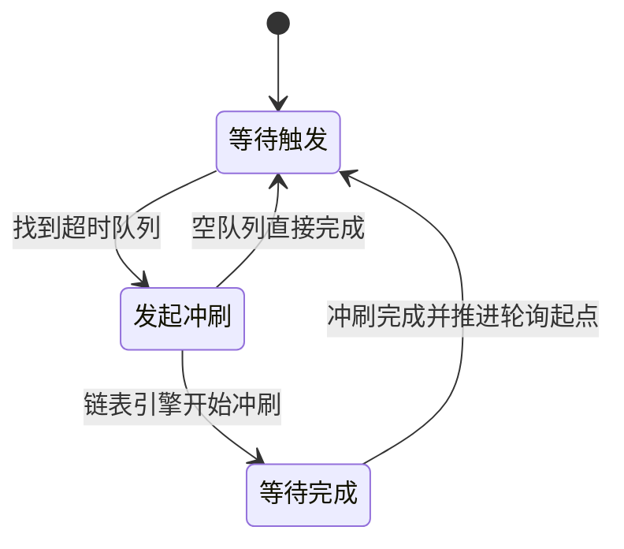
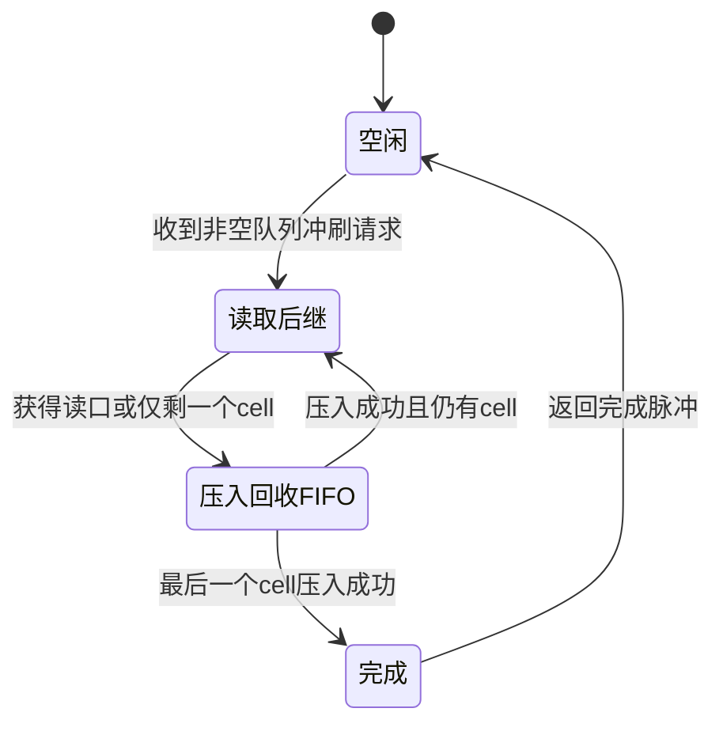

# SMMU RTL 技术汇报 PPTX 逐页制作规格

> 目标：把 `SMMU_RTL_DEEP_DIVE.md` 第 14 章的大纲扩展成一份可直接制作 PPTX 的逐页脚本。  
> 源码基线：`project/cores/smmu/design/rtl/*.sv`，核对日期 2026-07-16。  
> 建议成片：25 页正文 + 3 页附录，16:9，约 28～32 分钟，适合 RTL/架构设计评审。  
> 事实优先级：当前 RTL > 深度解析 MD > 本文中的演示性简化。示意图中的 `A/B/C` 是 cell 地址代号，不是固定数值。

## 0. 制作前必须确认的版本差异

当前 RTL 与 `SMMU_RTL_DEEP_DIVE.md` 有两处影响讲解结论的差异。制作时应按当前 RTL 表述，不要照搬旧文案。

| 项目 | 当前 RTL | PPT 中的处理 |
|---|---|---|
| `deq_pkt_tail_next` | 顶层和 `dequeue_ctrl.sv` 均存在；T1 表达式为 `deq_fire & lle_qhead_next_pkt_tail & ~lle_qhead_pkt_tail` | 第 14 页明确展示为可选前瞻信号；不要使用 MD §5.5“没有该端口”的勘误 |
| 独立共享池上限 | 当前 RTL 没有 `cfg_shared_limit/shared_max_hit`；动态区是“超过 `q_min` 后受 q/port/global max 约束”，并未另设共享总量上限 | 第 19 页只讲 guaranteed + dynamic shared 记账语义，不宣称有第四个 shared-limit 判决 |

另有两个措辞要保持精确：

- `recycle_ack` 表示 LLE 接收了回收请求，不表示 free-tail 的 SRAM 写已经结束。
- 包级入队锁直接禁止的是正常出队；在入队 cell 之间的空拍，recycle FIFO 仍可能 pop。

### 0.1 PPT 术语层与源码层分离

主讲页面不直接展示 RTL 标识符。页面、图形和口头讲解统一使用下面的架构术语；真实信号名只允许出现在本制作文档的“源码证据”、演讲者备注和附录映射表中。

| PPT 统一术语 | 含义 | 避免在主讲页出现的写法 |
|---|---|---|
| 分配请求 / 分配就绪 | QM 提交 cell 分配请求 / SMMU 可接收 | 具体入队握手信号名 |
| 分配结果有效 / 分配地址 / 丢弃指示 | 下一周期返回的分配结果 | 具体分配结果信号名 |
| 出队请求 / 队头返回有效 / 队头地址 | QM 请求并取得当前队头 | 具体出队接口信号名 |
| 当前包头、当前包尾、下一包尾前瞻 | 当前 cell 的边界属性及下一 cell 的尾部前瞻 | `ph/pt` 和具体端口名 |
| 回收请求 / 回收接收确认 | 地址进入回收处理路径 | 具体 recycle 接口信号名 |
| 回收落链完成 | recycle FIFO 项目被追加到 free 链 | LLE 内部完成信号名 |
| 空闲链头 / 一级前瞻 / 二级前瞻 / 空闲链尾 | free 链的四个结构位置 | 对应寄存器变量名 |
| 队头 / 一级后继 / 二级后继 / 队尾 | 业务链的结构位置 | 对应队列寄存器变量名 |
| 队列占用、端口占用、全局占用、空闲数量 | Occupancy 的主要水位 | 具体计数器变量名 |
| 静态保障区 / 动态共享区 / 最大占用 | guaranteed、shared、maximum 三类策略概念 | 配置寄存器和比较信号名 |
| 多播地址镜像 / 端口私有读索引 / 待服务单播包数 | 多播加速与逻辑插入状态 | 多播内部数组和寄存器名 |
| 包级入队锁 / 同队连续出队旁路 | 两个关键流水控制机制 | 内部锁位和旁路信号名 |

术语使用规则：

- 主讲页允许出现行业通用缩写：QM、LLE、SRAM、FIFO、TC、PAUSE、PFC、SOF、EOF、T0/T1。
- 不把 `valid/ready/fire/grant` 当作页面主词；分别说“有效、就绪、实际接收、获得授权”。
- 不把 `cnt/idx/ptr` 当作页面主词；分别说“数量、索引、指针”。
- 只有源码答疑时，才从专业术语反查具体 RTL 名称。

## 1. 整体演示设计规范

### 1.1 叙事主线

整套演示只围绕一句话展开：

> SMMU 用一片 1R1W 后继指针 SRAM 和少量预取寄存器，把 8192 个共享 cell 动态组织成 32 条单播业务链、1 条多播物理链和 1 条空闲链，并以一拍外部接口完成分配与取址。

正文按以下四幕推进：

1. 第 1～6 页：它是什么、为什么存在、系统怎么连接。
2. 第 7～9 页：链表数据结构与初始化。
3. 第 10～17 页：挂链、走链、还链和零复制多播。
4. 第 18～21 页：仲裁、占用、流控与老化。
5. 第 22～25 页：完整事务、风险、验证与结论。

### 1.2 页面母版

- 画布：16:9，1920×1080 设计基准；PPT 页面尺寸用“宽屏”。
- 字体：中文用“思源黑体/微软雅黑”，英文与信号名用“JetBrains Mono/Consolas”。
- 标题：30～32 pt，左上；正文 18～20 pt；图中标签不低于 15 pt；脚注 10～11 pt。
- 页边距：左右 0.55 英寸，上 0.35 英寸，下 0.25 英寸。
- 每页右上固定章节标签：`定位`、`数据结构`、`数据路径`、`策略`、`验证`之一。
- 每页左下固定一句 takeaway，格式为“结论：……”，不超过 28 个汉字。
- 右下角页码；页脚可放源码定位，例如 `lle.sv:309–313`。
- 动画只使用“出现”和“擦除”，按数据流顺序逐步显现；禁止飞入、旋转、弹跳。

### 1.3 色彩语义

| 颜色 | Hex | 固定语义 |
|---|---|---|
| 深蓝 | `#16324F` | 背景、标题、控制平面 |
| 青蓝 | `#00A6A6` | enqueue / allocation / 正向数据流 |
| 橙色 | `#F59E0B` | dequeue / read / 调度 |
| 绿色 | `#22C55E` | 回收 / 空闲 / 可用资源 |
| 紫色 | `#8B5CF6` | multicast |
| 红色 | `#EF4444` | drop、告警、风险、阻塞 |
| 灰色 | `#94A3B8` | inactive、背景结构、次要说明 |

所有图中颜色必须遵循这套语义。颜色不是装饰，而是帮助观众追踪同一事务在不同页中的位置。

### 1.4 图形制作工具与交付格式

| 内容 | 首选工具 | 交付格式 | 原因 |
|---|---|---|---|
| 模块框图、状态图 | Mermaid Live Editor 或 `mmdc` | SVG | 文本可版本管理，缩放不糊 |
| 时序图 | WaveDrom Editor 或 `wavedrom-cli` | SVG | 信号/周期关系清晰，便于修改 |
| 链表、池、水位示意 | PowerPoint 原生形状 | PPT 内可编辑矢量 | 现场可快速改数字和强调色 |
| 少量 RTL 摘录 | PowerPoint 文本框 + 等宽字体 | PPT 内文本 | 不使用 IDE 截图，避免小字和主题杂色 |
| 表格 | PowerPoint 原生表格 | PPT 内可编辑 | 支持逐行动画和统一样式 |

推荐素材目录：

```text
project/cores/smmu/design/presentation_assets/
├── 01_architecture.svg
├── 02_interface_map.svg
├── 03_linked_list.svg
├── 04_init_fsm.svg
├── 05_enqueue_drop_fsm.svg
├── 06_enqueue_timing.svg
├── 07_dequeue_timing.svg
├── 08_recycle_timing.svg
├── 09_multicast_model.svg
├── 10_multicast_timing.svg
├── 11_arb_matrix.svg
├── 12_occupancy_paths.svg
├── 13_hysteresis.svg
├── 14_aging_fsm.svg
└── 15_unicast_walkthrough.svg
```

SVG 插入 PowerPoint 后保留矢量；如果 Office 版本不稳定，再转 EMF。PNG 仅作为兼容备份，至少导出 2× 分辨率。

## 2. 逐页脚本

## 第 1 页｜封面：Smart MMU RTL 深度解析

**目标 / 时间：** 建立对象边界，30 秒。

**页面文字（直接粘贴）：**

```text
Smart MMU RTL 深度解析
共享 SRAM 地址管理、链表流水与零复制多播

4 Ports × 8 TCs · 8192 Cells · 1R1W 后继指针 SRAM
RTL Design Review
```

**画面：** 深蓝底，中央放一条从左向右的 cell 链 `A → F → C → …`；链下方淡化放“统一空闲池 / 32 条单播链 / 1 条多播链”三个标签。右下角放项目路径，不放公司无关装饰图。

**制作：** PowerPoint 原生圆角矩形和箭头。cell 用 48×48 px 方块，物理地址故意不连续，暗示“逻辑连续、物理离散”。

**讲稿：**

> 今天讲的 SMMU 不是做地址翻译的 IOMMU。它是 QM 下方的共享 SRAM 地址管理器，核心工作是把固定大小的 cell 地址动态挂成业务队列，并负责分配、取址、回收、多播引用和老化。

**结论：** SMMU 是共享 cell 的地址与链表管理器。

---

## 第 2 页｜一句话结论：它解决什么问题

**目标 / 时间：** 让观众先拿到全局结论，1 分钟。

**页面文字：**

```text
输入：QM 的入队、出队、回收请求
状态：8192 个 256 B cell + 33 条业务链 + 1 条空闲链
输出：一拍分配地址 / 一拍队头地址 / 流控与告警

关键能力
• 动态共享：突发流量按需占用整片 SRAM
• 满吞吐：常见路径支持 1 cell/cycle
• 零复制多播：一份数据、多个端口独立读取
• 完整生命周期：空闲 → 分配 → 入队 → 出队 → 回收 → 重新空闲
```

**画面：** 左中右三栏，分别为“请求”“SMMU”“结果”。中间 SMMU 用芯片形状，内部只放四个词：“链表引擎 / 占用管理 / 多播 / 老化”。

**讲稿：** 强调外部一拍不等于内部没有 SRAM 延迟；一拍是靠队头和两级前瞻寄存器把同步读延迟藏到后台。

**证据：** `smmu.sv` 文件头与 G2/G3/G4 接口；`lle.sv` 的预取寄存器。

**结论：** 外部一拍，内部靠预取维持链表流水。

---

## 第 3 页｜默认规模与派生参数

**目标 / 时间：** 给后续所有宽度和队列号一个共同基准，1 分钟。

**页面文字：**

| 参数 | 默认值 | 设计含义 |
|---|---:|---|
| cell 总数 | 8192 | 2 MiB / 256 B |
| cell 地址宽度 | 13 bit | 覆盖全部 cell 地址 |
| 端口数 × TC 数 | 4 × 8 | 32 条常规调度队列 |
| 多播物理队列 / 业务队列总数 | 1 / 33 | 1 条多播物理链 |
| 后继指针链表项 | 15 bit | 13 bit 后继地址 + 包头/包尾标志 |
| 回收 FIFO | 8 项 | 已接收、待追加到空闲链尾 |
| 多播单槽 | 1 帧 / 8 cells | 单槽地址镜像 |

页右侧公式：

```text
业务队列总数 = 端口数 × TC数 + 1
单播队列号   = 出端口 × TC数 + TC
占用计数宽度 = cell地址宽度 + 1
多播引用宽度 = clog2(端口数 + 1)
```

**画面：** 左 65% 表格，右 35% 参数卡。突出 `32 + 1`、`1R1W`、`1 cell/cycle` 三个大数字。

**制作：** 原生表格；数字 32 pt。不要放源码截图。

**讲稿：** 队列号使用 6 bit，实际有效编号为 0～32，需要覆盖全部 33 条业务队列。

**证据：** `smmu.sv:35–50`，`lle.sv:36–59`。

**结论：** 32 条调度队列共享 8192 个物理 cell。

---

## 第 4 页｜系统边界：不是 IOMMU

**目标 / 时间：** 消除命名歧义，45 秒。

**页面文字：**

```text
它做：cell 地址分配、队列链表、回收、占用、流控、多播、老化
它不做：VA→PA 翻译、页表遍历、TLB、权限检查、DMA 映射
```

**画面：** 左侧红色打叉的传统 IOMMU 路径 `Device → IOVA → TLB/Page Table → PA`；右侧绿色 SMMU 路径 `QM → Cell Address Manager → Shared Data SRAM`。中间用竖线分割。

**制作：** PowerPoint 原生形状。不要找互联网芯片图片，避免不必要的视觉噪声和版权问题。

**讲稿：**

> 名称容易误导。这里的地址是 data SRAM 的 cell index，核心不是地址翻译，而是 buffer ownership 和链表次序。

**结论：** 管的是 cell 生命周期，不是虚拟地址。

---

## 第 5 页｜模块架构：LLE 是唯一 SRAM 访问者

**目标 / 时间：** 建立模块职责和数据流，1.5 分钟。

**页面文字：** 图中只显示模块名，旁边用一句短注释：

```text
enqueue_ctrl      接收/丢弃/T1返回
dequeue_ctrl      背压/T1返回
recycle_ctrl      统一回收薄适配
lle               链表权威状态与SRAM仲裁
occupancy_pool_mgr 占用/阈值/PAUSE/PFC
aging_ctrl        timer/RR/flush请求
csr_stats_init    配置采样/统计/初始化
```

**主图 Mermaid：**



**制作：** Mermaid 导出 `01_architecture.svg`。在 PPT 中给 LLE 加青色外描边，给 SRAM 加浅灰网格底纹；动画按“控制器 → LLE → SRAM → 策略模块”四步出现。

**讲稿：** 强调只有 LLE 直接碰 Next-Ptr SRAM，控制器只是命令与结果流水；这让仲裁和链表权威状态集中在一处。

**证据：** `smmu.sv:322–626` 的例化连接。

**结论：** LLE 集中掌握链表和唯一 SRAM 端口。

---

## 第 6 页｜顶层接口全景：G1～G6

**目标 / 时间：** 让接口评审者快速定位信号，1.5 分钟。

**页面文字：**

| 组 | 方向 | 代表信号 | 时序/语义 |
|---|---|---|---|
| G1 初始化 | CSR→MMU | 初始化触发、初始化完成 | 建完空闲链才开放业务 |
| G2 入队 | QM↔MMU | 分配请求、分配结果 | T0 请求，T1 结果 |
| G3 出队 | QM↔MMU | 出队请求、队头返回 | T0 请求，T1 结果 |
| G4 回收 | QM↔MMU | 回收请求、接收确认 | 确认=已接收，不是已落链 |
| G5 策略 | CSR/MAC/CPU | 配置、PAUSE/PFC、统计/中断 | 配置同一时钟域采样一拍 |
| G6 调度反馈 | MMU→QM | cell 判空、完整包判空、最大占用 | 两种判空服务不同调度语义 |

**画面：** 中间放 `smmu`，六组接口像六个扇区环绕；表格放右侧或下一动画层。重点将 G2/G3 标为“一拍”，G4 标为“两阶段内部语义”。

**制作：** 原生形状；每组箭头使用对应事务颜色。接口类别用黑体，协议术语用等宽字体。

**讲稿：** 配置值在顶层广播到所有队列、端口和 TC，因此当前实现采用全片统一阈值，不是逐队列独立编程。

**证据：** `smmu.sv:53–178`、`smmu.sv:255–277`。

**结论：** 接口按请求、策略、反馈三类即可读懂。

---

## 第 7 页｜为什么选择链表 + 共享池

**目标 / 时间：** 解释架构取舍，1.5 分钟。

**页面文字：**

```text
固定分区
• 每队列容量确定、控制简单
• 空闲空间不能被其他突发队列利用

链表 + 共享池
• cell 物理位置可离散，队列按需伸缩
• 回收后重新进入统一空闲池
• 代价是后继指针 SRAM、仲裁和预取复杂度
```

**画面：** 左侧固定分区：Q0 很满且溢出、Q1/Q2 大片空白；右侧共享池：同一组灰色 cell 被青/橙/紫三条逻辑链串起。底部用一条平衡尺写“利用率 ↑ / 控制复杂度 ↑”。

**制作：** 原生形状，右图物理 cell 顺序故意打乱，例如 `2 → 17 → 5`。

**讲稿：** 对 32 条队列而言，流量通常不均匀。链表让缓冲容量跟着实际流量走；guaranteed 额度再为每条队列保留最低保障。

**结论：** 链表换来高利用率和突发吸收能力。

---

## 第 8 页｜链表权威状态与 Next-Ptr entry

**目标 / 时间：** 建立所有操作共用的数据模型，2 分钟。

**页面文字：**

```text
链表项 = { 后继地址[12:0], 包头标志, 包尾标志 }

每队列：队头 / 队尾 / cell 数量
队头预取：一级后继 / 二级后继 + 包边界属性
队尾属性：当前队尾的包头 / 包尾标志
free链：空闲链头 / 一级前瞻 / 二级前瞻 / 空闲链尾 / 空闲数量
```

**画面：**

- 上半部分：15 bit 链表项横向字段图，“后继地址”占 13/15 宽度，“包头/包尾”各 1 bit。
- 下半部分：`队头(A) → B → C → 队尾(D)`；在 A、B、C 上方分别标“当前队头”“一级后继”“二级后继”。
- 右下角放一个小注：“当前队尾的包边界属性保存在寄存器；成为旧队尾时才随后继地址一起写 SRAM”。

**制作：** 原生形状最合适，便于严格控制字段比例。箭头由左向右，SRAM entry 用灰底，寄存器镜像用蓝底。

**讲稿：** 两级预取的目的不是增加队列深度，而是让同步 SRAM 的一拍读延迟不出现在 T0→T1 返回路径上。

**证据：** `lle.sv:121–150`、`lle.sv:1099–1121`。

**结论：** 队头与两级前瞻隐藏同步读延迟。

---

## 第 9 页｜上电初始化：把所有 cell 串成空闲链

**目标 / 时间：** 讲清业务开放前的状态，1 分钟。

**页面文字：**

```text
链表项[i] = { i+1, 包头=0, 包尾=0 }
最后一项 = { 8191, 0, 0 }

完成态
空闲链头=0，一级前瞻=1，二级前瞻=2
空闲链尾=8191，空闲数量=8192
所有业务队列占用=0
```

**状态图：**



**画面：** 左 40% 状态图，右 60% 展示 `0→1→2→…→8191↺` 的空闲链。底部红色门禁条：“初始化未完成 → 分配与出队关闭”。

**制作：** Mermaid 导出 `04_init_fsm.svg`；空闲链用原生形状。用一条从 0 扫到 8191 的擦除动画模拟建链。

**讲稿：** 初始化核心耗时约为“cell 总数”个写周期，外加请求检测和状态机收尾；不要写死精确总周期，除非仿真已对齐边沿定义。

**证据：** `lle.sv:227–263`、`lle.sv:699–730`。

**结论：** 先建空闲链，再开放所有业务请求。

---

## 第 10 页｜入队判决：先保证整包可落地

**目标 / 时间：** 讲清 queue id、预测丢弃和整帧丢弃，2 分钟。

**页面文字：**

```text
单播队列号 = 出端口 × 每端口优先级数 + TC
多播物理队列号 = 32

分配就绪 = 初始化完成 AND 链表引擎可接收

逐 cell 丢弃：物理空闲池耗尽，或静态额度已用完且命中队列/端口/全局上限
SOF 整包预判：空闲、队列、端口、全局容量是否容得下整包 cell 数
多播额外条件：单槽占用时，新多播帧整帧丢弃
```

**整帧丢弃 FSM：**



**画面：** 左侧为五级判决漏斗：“初始化与引擎就绪 → 物理空闲量 → 静态保障区 → 最大占用 → 多播单槽”；右侧放状态机。红色支路统一汇入“丢弃指示”。

**制作：** 漏斗用原生形状；FSM 用 Mermaid `05_enqueue_drop_fsm.svg`。动画按判决顺序出现。

**讲稿：** 整包预判在 SOF 使用“本包 cell 数”，避免前几个 cell 已挂链、后续才因水位触发而留下半包。当前 RTL 没有独立的“共享区总上限”，不要在此页加入第四级共享上限判决。

**证据：** `enqueue_ctrl.sv:102–209`；`occupancy_pool_mgr.sv:303–343`。

**结论：** SOF 先预判，失败后一直丢到 EOF。

---

## 第 11 页｜挂链：空队列与非空队列只差一次旧队尾写入

**目标 / 时间：** 解释一次分配如何同时改变空闲链和业务链，2 分钟。

**页面文字：**

```text
分配地址 = 当前空闲链头

空队列
队头 = 队尾 = 分配地址
无需写旧队尾

非空队列
旧队尾的后继 = 分配地址，并保留旧队尾的包边界属性
队尾 = 分配地址

共同动作
空闲链头前进；队列占用 +1；空闲数量 -1
```

**画面：** 上下两条“操作前/操作后”动画。

- 上：“队列5：空”，“空闲链：A→B→C”，下一层变为“队列5：A”“空闲链：B→C”。
- 下：“队列5：X→Y”，“空闲链：A→B”，下一层变为 `X→Y→A`，高亮写“旧队尾 Y 的后继=A”。

**制作：** PowerPoint 原生形状；用 Morph（平滑切换）在两张重复页状态间演示，若不增加页数则用擦除动画。SRAM 写动作使用小铅笔图标或 `W` 标记，不用真实 SRAM 图片。

**讲稿：** 新队尾自己的链表项本拍不需要写。等它未来变成旧队尾时，再把包边界属性和后继地址一起写入 SRAM；当前队尾属性由寄存器保存。

**证据：** `lle.sv:423–438`、`lle.sv:733–797`。

**结论：** 分配取空闲链头，非空队列只写旧队尾。

---

## 第 12 页｜入队 T0/T1 与连续分配旁路

**目标 / 时间：** 证明“一拍返回”和背靠背能力，1.5 分钟。

**WaveDrom：**

```wavedrom
{ "signal": [
  { "name": "时钟",           "wave": "p...." },
  { "name": "分配请求",       "wave": "0110." },
  { "name": "分配就绪",       "wave": "1...." },
  { "name": "容量判决：接收", "wave": "0110." },
  { "name": "实际分配",       "wave": "0110." },
  { "name": "空闲链头",       "wave": "x345x", "data": ["A", "B", "C"] },
  { "name": "SRAM前瞻返回",   "wave": "x.345", "data": ["前瞻", "前瞻", "前瞻"] },
  { "name": "分配结果有效",   "wave": "00110" },
  { "name": "分配地址",       "wave": "x.34x", "data": ["A", "B"] }
], "head": { "text": "T0 接收并推进空闲链头；T1 返回原链头地址" } }
```

**页面文字：**

```text
T0 末沿：结果寄存器捕获旧空闲链头
T1：分配结果有效，分配地址可见
连续入队：同拍旁路直接使用上一周期 SRAM 返回补充前瞻
```

**制作：** WaveDrom 导出 `06_enqueue_timing.svg`。在 PPT 上方再加 `T0/T1/T2` 半透明周期带；动画先显示请求与判决，再显示内部读，最后显示 T1 返回。

**讲稿：** “分配结果有效”表示请求已有结果；若同时给出“丢弃指示”，地址字段无意义。连续分配由前瞻返回旁路接上同步 SRAM 流水。

**证据：** `enqueue_ctrl.sv:217–236`；`lle.sv:411–416`、`lle.sv:799`。

**结论：** 返回原空闲链头，后台同时补充前瞻。

---

## 第 13 页｜出队：两级预取和同队列旁路

**目标 / 时间：** 解释为什么长链仍可 1 cell/cycle，2 分钟。

**页面文字：**

```text
实际出队 = 请求有效 AND 初始化完成 AND 队列非空 AND 端口无背压

返回：当前队头 + 当前包头/包尾属性
推进：队头 ← 一级后继
队长=1：出队后为空，不读 SRAM
队长=2：一级后继已预取，不读 SRAM
队长≥3：读 SRAM 补充新的二级后继
```

**WaveDrom：**

```wavedrom
{ "signal": [
  { "name": "时钟",           "wave": "p......" },
  { "name": "出队请求",       "wave": "01110.." },
  { "name": "实际出队",       "wave": "01110.." },
  { "name": "当前队头",       "wave": "x345x..", "data": ["C0", "C1", "C2"] },
  { "name": "SRAM读使能",     "wave": "01110.." },
  { "name": "SRAM前瞻返回",   "wave": "x.345x.", "data": ["C3", "C4", "C5"] },
  { "name": "同队连续旁路",   "wave": "00110.." },
  { "name": "队头返回有效",   "wave": "001110." },
  { "name": "队头地址",       "wave": "x.345x.", "data": ["C0", "C1", "C2"] }
], "head": { "text": "同步 SRAM 在后台预取；同队列连续请求使用返回数据旁路" } }
```

**画面：** 时序图占 70%；右侧用三格小图解释“队长=1 / 2 / ≥3”。

**制作：** WaveDrom 导出 `07_dequeue_timing.svg`。橙色标返回路径，灰色标后台 SRAM 路径。

**讲稿：** 下一周期继续出同一队列时，上一周期的同步读刚返回；“同队连续出队旁路”直接把这份返回用于本拍推进和下一次读地址，这就是流式走链的关键。

**证据：** `lle.sv:294–299`、`lle.sv:411–419`、`lle.sv:801–852`。

**结论：** 队长≥3 才读；同队列连续出队走旁路。

---

## 第 14 页｜T1 出队元数据：当前边界与下一包尾前瞻

**目标 / 时间：** 用协议语义说明当前 RTL 的边界信息，45 秒。

**页面文字：**

```text
T1 返回内容
• 队头返回有效
• 队头 cell 地址
• 当前 cell 是否为包头
• 当前 cell 是否为包尾
• 若下一周期继续出队，下一 cell 是否为包尾
```

右侧注释：

```text
当前包尾：描述本次返回的 cell
下一包尾前瞻：描述连续出队时的下一 cell
若当前已是包尾，下一包尾前瞻强制无效
```

**画面：** 左侧 55% 放五项返回内容，右侧 45% 画两个 cell：`C1（非包尾） → C2（包尾）`。在 C1 下标“当前包尾=否”，在指向 C2 的箭头上标“下一包尾前瞻=是”。

**制作：** 使用原生信息卡和 cell 形状，不放 RTL 代码。用橙色高亮“当前包尾”，用浅橙色高亮“下一包尾前瞻”。版本校核只写入演讲者备注，不出现在画面中。

**讲稿：** 当前实现不仅返回本次 cell 的包边界，还返回下一 cell 的包尾前瞻。它帮助下游提前规划连续读取，但不替代当前包尾信息。源码中的具体端口名仅在答疑时说明。

**证据：** `dequeue_ctrl.sv:96–109`；`smmu.sv:94`。

**结论：** 当前包尾与下一包尾前瞻各司其职。

---

## 第 15 页｜还链：接收确认与真正落到空闲链尾是两阶段

**目标 / 时间：** 避免接口语义误解，1.5 分钟。

**页面文字：**

```text
阶段 1：接收
回收请求 → 地址/引用判定 → 压入回收 FIFO
回收接收确认 = 请求已被链表引擎受理

阶段 2：落链
FIFO 队头 → 写旧空闲链尾的后继地址 → 空闲链尾前进
回收落链完成 = 回收 FIFO 弹出（仅内部可见）
```

**WaveDrom：**

```wavedrom
{ "signal": [
  { "name": "时钟",          "wave": "p....." },
  { "name": "回收请求",       "wave": "010..." },
  { "name": "接收确认",       "wave": "010..." },
  { "name": "FIFO压入",       "wave": "010..." },
  { "name": "空闲数量增加",   "wave": "0010.." },
  { "name": "FIFO非空",       "wave": "0010.." },
  { "name": "FIFO弹出",       "wave": "0010.." },
  { "name": "SRAM写使能",     "wave": "0010.." },
  { "name": "空闲链尾",       "wave": "x..3x.", "data": ["回收地址"] }
], "head": { "text": "接收确认与空闲链尾写入是不同阶段" } }
```

**画面：** 上部两阶段流水框，下部时序图。绿色表示回收，灰色 FIFO 是解耦点。

**制作：** WaveDrom 导出 `08_recycle_timing.svg`。注意“空闲数量增加”是边沿后状态，不要画成与组合接收确认同一瞬时层级。

**讲稿：** 链表引擎与占用管理器的“释放事件”在 FIFO 压入时发生，所以计数语义是“已由回收通路接管”；空闲链尾指针要等后续弹出才实际写链。

**证据：** `recycle_ctrl.sv:70–80`；`lle.sv:1052–1069`。

**结论：** 接收确认不等于 SRAM 落链完成。

---

## 第 16 页｜多播：单槽、零复制、每端口私有读指针

**目标 / 时间：** 展示设计亮点，2.5 分钟。

**页面文字：**

```text
物理存储：A/B/C 只分配一次，挂到多播物理队列
读加速：小容量寄存器镜像 cell 地址，不复制 payload
独立读取：每个目的端口维护私有读索引
逻辑插入：SOF 快照承载队列中已有的完整单播包数
释放条件：每个 cell 的引用数从目的端口数减到 0
限制：同一时刻只允许一个多播帧，最多 8 cells
```

**主图：** 中央一条紫色共享 cell-list `A → B → C`；上方端口 0 指针在 B，端口 1 指针在 A，端口 3 指针在 C；右侧写“引用余量：A=1，B=2，C=1”。底部画真实多播 SRAM 链和寄存器地址镜像的双层结构，明确镜像只存地址。

**制作：** PowerPoint 原生形状，导出 `09_multicast_model.svg` 可选。动画顺序：建物理链 → 生成镜像 → 各端口指针独立推进 → 引用归零回收。

**讲稿：** 多播镜像读取不推进多播物理链的队头，也不占 Next-Ptr SRAM 读口。必须等 EOF 锁定整帧 cell 数后才对各端口可见，因此是 store-and-forward，不是 cut-through。

**证据：** `lle.sv:153–179`、`lle.sv:274–280`、`lle.sv:1008–1019`。

**结论：** 一份物理链，多端口以私有索引独立读取。

---

## 第 17 页｜多播完整事务：两端口、三 cell

**目标 / 时间：** 把建槽、读取、引用回收串起来，2 分钟。

**页面文字：**

```text
1. 分配 A/B/C：只占用 3 个地址；每个 cell 初始引用数=2
2. EOF：锁定整帧为 3 cells，多播包进入两个承载队列的逻辑待调度包数
3. 端口0读取 A/B/C；端口1可晚若干周期读取相同地址
4. 第一次回收 A：引用数 2→1，不进入空闲链
5. 第二次回收 A：引用数 1→0，A 压入回收 FIFO
6. B/C 同理；全部引用归零后，下一周期释放多播单槽
```

**时序/泳道图：** 建议不用传统波形，而用 5 条横向泳道：“多播分配”“端口0读取”“端口1读取”“引用计数”“回收 FIFO”。每个事件用带地址的圆点，端口1故意比端口0晚两格。

**制作：** PowerPoint 原生形状或 diagrams.net，导出 `10_multicast_timing.svg`。逐步动画最有效：先分配，再显示两个端口读取，最后显示两轮回收。

**讲稿：** 引用计数按地址匹配并逐次递减，不记录是哪一个端口归还；这也是后面风险页的重要约束。

**证据：** `lle.sv:498–529`、`lle.sv:878–914`。

**结论：** 最后一个引用归还时，cell 才真正回空闲链。

---

## 第 18 页｜仲裁与并发：不是简单的全串行优先级

**目标 / 时间：** 讲清 1R1W 资源占用与允许组合，2 分钟。

**页面文字（左侧公式）：**

```text
出队授权：存在有效出队请求，且没有包级入队锁
分配授权：存在有效分配请求，且出队不需要 SRAM 读口
回收落链授权：回收 FIFO 非空，且读口无长链出队、写口无分配
老化读取授权：非初始化期，且正常出队/分配不占读口
```

**并发矩阵：**

| 同拍组合 | 允许 | 关键原因 |
|---|:---:|---|
| 长链出队 + 分配 | × | 竞争唯一读口 |
| 短链出队 + 分配 | ✓ | 短链出队不读 SRAM |
| 多播镜像读取 + 分配 | ✓ | 多播读取走寄存器镜像 |
| 长链出队 + 回收落链 | × | 当前 RTL 保守禁止该组合 |
| 短链/多播出队 + 回收落链 | ✓ | 回收只使用写口 |
| 分配 + 回收落链 | × | 可能竞争写口，分配优先 |
| 回收落链 + 老化读取 | ✓ | 分别占写口和读口 |

**画面：** 右侧画 1R1W SRAM 的 R/W 两个入口，把操作卡片拖到相应入口；允许组合用绿勾，不允许用红叉。

**制作：** 表格原生；公式用等宽字体。矩阵每行逐一出现，配合讲解资源原因。

**讲稿：** 包级入队锁保证一个已开始挂链的包不被正常出队插入；但分配空拍时回收 FIFO 仍可能弹出，所以不要说“包期间链表引擎完全独占”。

**证据：** `lle.sv:309–325`、`lle.sv:466–468`。

**结论：** 是否能并发取决于当拍实际占用读口还是写口。

---

## 第 19 页｜占用管理：同一份计数驱动丢弃与流控

**目标 / 时间：** 解释控制策略的两条独立路径，2 分钟。

**页面文字：**

```text
计数源
队列占用 / 静态保障占用 / 端口占用 / 全局占用 / 空闲数量

路径 A：是否接收（→ QM）
先使用队列 guaranteed；超出后受队列/端口/全局最大占用限制
SOF 用整包 cell 数做容量预测

路径 B：是否反压（→ MAC）
PAUSE 看端口 + 全局水位
PFC 看每个“端口 × TC”水位
XOFF 置位、低于 XON 清除、中间保持
```

**主图 Mermaid：**



**画面：** 图占 60%，右侧用水箱图表示“队列 guaranteed”以下是绿色静态保障区，以上是蓝色动态共享区，红线是最大占用。图旁明确写：“当前 RTL 未设置独立的共享区总上限”。

**制作：** Mermaid 导出 `12_occupancy_paths.svg`；水箱用原生形状并保留可编辑。

**讲稿：** “双池”在当前实现中是计数抽象：静态保障占用尚未达到 guaranteed 时，可以绕过最大占用限制；超过之后进入动态区，受队列/端口/全局上限控制。回收时只要静态保障占用非零就优先减少该计数，它不是 cell 级池标签。

**证据：** `occupancy_pool_mgr.sv:142–214`、`occupancy_pool_mgr.sv:303–343`。

**结论：** 丢弃与流控共享计数，但使用不同阈值逻辑。

---

## 第 20 页｜PAUSE/PFC 迟滞与统计告警

**目标 / 时间：** 展示为什么要 XON/XOFF 双阈值，1.5 分钟。

**页面文字：**

```text
端口级 PAUSE
置位 = 端口占用 ≥ 端口XOFF  OR 全局占用 ≥ 全局XOFF
清除 = 端口占用 < 端口XON   AND 全局占用 < 全局XON

逐端口逐TC PFC
置位 = TC占用 ≥ PFC XOFF
清除 = TC占用 < PFC XON

XON ≤ 当前占用 < XOFF：保持原状态，避免抖动
```

**画面：** 一条随时间变化的占用折线，横向画 XOFF 和 XON 两条阈值；下方画“PAUSE 请求”方波。第一次穿越 XOFF 置 1，下降穿越 XON 才清 0。右侧放三项告警：数量守恒、上溢、下溢。

**制作：** 原生折线和形状，导出 `13_hysteresis.svg` 可选。不要使用 Excel 默认图表风格。

**讲稿：** PAUSE 清除需要端口和全局都回落，置位只需任一达到；PFC 则按单独的“端口×TC”队列水位判断。多播物理占用不计入端口占用，只通过全局水位影响流控。

**证据：** `occupancy_pool_mgr.sv:362–426`、`occupancy_pool_mgr.sv:520–536`。

**结论：** 双阈值把流控从临界点抖动中解耦。

---

## 第 21 页｜老化：计时、轮询选择与逐 cell 冲刷

**目标 / 时间：** 解释异常/僵尸队列回收机制，2 分钟。

**页面文字：**

```text
计时清零：未使能 / 未初始化 / 队列空 / 本队列被服务 / 正在冲刷
触发：老化计时达到超时阈值，或软件强制老化
选择：从轮询起点寻找第一条触发队列，一次只服务一条
执行：读取后继 → 压入回收 FIFO → 重复 → 完成
```

**状态图：** 左侧为老化轮询选择，右侧为链表引擎逐 cell 冲刷。





**制作：** Mermaid 分别导出后在 PPT 中并排，文件 `14_aging_rr.svg`、`14_aging_flush.svg`。用灰色虚线表示可能因正常分配、长链出队或回收 FIFO 满而拉长的等待。

**讲稿：** 非最后一个 cell 至少需要“读取后继”和“压入回收 FIFO”两阶段，且两阶段都可能被正常业务阻塞。特别注意多播物理队列：端口服务事件更新的是承载队列，不是多播物理队列，因此活动多播可能被错误老化。

**证据：** `aging_ctrl.sv:70–116`、`aging_ctrl.sv:122–229`；`lle.sv:532–614`。

**结论：** 老化低优先级逐 cell 冲刷，必须防止误清活动多播。

---

## 第 22 页｜三 cell 单播：把完整生命周期串起来

**目标 / 时间：** 用一个例子收束所有数据路径，2 分钟。

**页面文字：**

```text
初始：空闲链 A→B→C→D…，队列5为空

分配 A（包头）：队列5的队头=队尾=A
分配 B         ：A 的后继=B，保留 A 的包头属性
分配 C（包尾）：B 的后继=C，当前队尾标记为包尾

出队 A/B/C：每周期返回当前队头；后台预取后继地址
发送期间：地址处于“已出队、外部持有”，尚未释放
回收 A/B/C：先进入回收 FIFO，再依次追加到空闲链尾
```

**画面：** 横向 5 阶段生命周期：“空闲 → 已入队 → 已出队 → 外部持有 → 回收/重新空闲”。下方三条 cell 泳道 A/B/C，展示它们在每个阶段的移动；业务链和空闲链只在关键点显示操作前/操作后。

**制作：** 原生形状，建议使用 Morph 做 4 个构建步骤，但仍保持单页页码。导出静态版本为 `15_unicast_walkthrough.svg` 供 PDF 使用。

**讲稿：** 出队只从业务链视图摘除，不等于释放；在 QM/EPS 持有期间，地址属于“外部持有”集合。验证地址生命周期时必须把这个集合算进去。

**证据：** `lle.sv` ENQ/DEQ/recycle 主状态更新段。

**结论：** 出队与释放解耦，中间存在外部持有阶段。

---

## 第 23 页｜实现约束与高风险边界

**目标 / 时间：** 展示对当前 RTL 边界的把握，2 分钟。

**页面文字：** 只放 6 项最值得评审讨论的风险，不把 12 项全部塞入正文。

| 优先级 | 风险 | 可能后果 |
|---|---|---|
| P0 | 老化冲刷与同队列正常分配/出队无硬互斥 | 多个时序分支更新同一队列状态 |
| P0 | 多播物理队列没有端口服务喂狗 | 活动多播被误冲刷 |
| P0 | 多播引用只计次数，不识别来源端口 | 重复归还可提前释放 |
| P1 | 多播后续 cell 依赖目的端口位图持续一致 | 不同 cell 的引用初值不一致 |
| P1 | 空闲池从 0 恢复时未显式重建链头前瞻 | 空池边界链表风险 |
| P1 | 入队包若永远不来 EOF，包级入队锁不释放 | 所有正常出队暂停 |

页脚小字：“多播单槽最多容纳 8 cells”，系统必须保证多播包不越界。

**画面：** 风险表左侧加 P0/P1 色条；右下放“协议保证 / RTL 防护 / 验证覆盖”三个处置标签。

**制作：** 原生表格。不要在这一页塞代码；每条风险只说“条件→后果”。

**讲稿：** 区分架构约束和实现缺陷。若系统有外部协议保证，需要把保证写入接口 spec 并转成 assertion；否则应在 RTL 增加互斥、超时或来源追踪。

**结论：** 风险集中在并发互斥、空池边界和多播生命周期。

---

## 第 24 页｜验证计划：用不变量证明地址不会丢、不会重用

**目标 / 时间：** 给出可执行验证闭环，2 分钟。

**页面文字：**

```text
核心地址生命周期模型
空闲 → 已入队 → 已出队/外部持有 → 已回收/重新空闲

关键断言
1. 空闲数量 + 全局占用 = cell 总数
2. 已分配地址在回收前不得再次分配
3. 连续同队列出队序列必须匹配后继地址链
4. 整帧丢弃状态下，直到 EOF 都不得实际分配
5. 初始化完成前不得出现分配或出队授权
6. 多播 cell 在引用归零前不得进入空闲链

关键覆盖
队长 1/2/3/4；同拍短链出队+分配；长链出队竞争；
空闲剩余 0/1/2；多播目的数 1/2/4；老化被持续阻塞后最终完成
```

**画面：** 左侧状态机式地址生命周期，右侧 assertion/coverage 两栏。生命周期中的非法回边用红色虚线并打叉。

**制作：** 原生形状。主讲页不显示 SVA 属性名或具体信号，只显示要证明的不变量；完整断言放验证文档。

**讲稿：** 不能简单把“链表引擎空闲数量”与所有队列链长相加做守恒，因为已出队未回收的单播地址处于外部持有状态；多播物理链和引用释放也有不同语义。当前 RTL 直接维护的是“空闲数量 + 全局占用 = cell 总数”。

**结论：** 以地址生命周期模型为主，局部计数断言为辅。

---

## 第 25 页｜总结与 Q&A

**目标 / 时间：** 用四句话结束，30 秒。

**页面文字：**

```text
1. 8192 个 cell 由空闲链和 33 条业务链动态组织
2. 队头 + 两级前瞻把同步 SRAM 读延迟藏在后台
3. 多播用一份物理链、每端口私有读索引和逐 cell 引用计数
4. 占用管理、仲裁与老化共同决定吞吐和安全边界

Q & A
```

**画面：** 回到第 1 页的链表主视觉，但此时把“分配 / 出队 / 回收 / 多播”四条彩色路径叠上去，形成首尾呼应。右下只放“Q&A”，源码索引移到演讲者备注和附录。

**讲稿：**

> 如果只记住一点：一拍接口不是“没有延迟”，而是设计把链表状态前移到寄存器，并通过严格的读写仲裁持续补预取。

**结论：** 一拍接口来自预取、旁路和集中仲裁的共同设计。

## 3. 附录页（按提问打开，不计主讲时间）

## 附录 A｜专业术语语义速查

| 专业术语 | 精确定义 |
|---|---|
| 分配结果有效 | 上一周期有被接收的分配请求；结果可能是成功，也可能是丢弃 |
| 实际分配 | 请求真正取得 cell 地址并完成挂链 |
| 队头返回有效 | 上一周期发生了真实出队，当前返回内容可用 |
| 下一包尾前瞻 | 下一次连续返回的 cell 是否为包尾；当前已是包尾时前瞻无效 |
| 回收接收确认 | 回收请求已被链表引擎接收，不代表已经写入空闲链尾 |
| 回收落链完成 | 回收 FIFO 队头已追加到空闲链；仅内部可见 |
| cell 级非空 | 业务链含 cell，或该调度队列存在尚未读完的多播 |
| 完整包级非空 | 调度队列中至少存在一个已经接收完 EOF 的完整包 |
| 整包丢弃预测 | 根据整包 cell 数、占用阈值和多播槽状态做组合预测 |

## 附录 B｜源码索引

| 主题 | 文件 / 关键位置 |
|---|---|
| 顶层参数、接口、例化 | `rtl/smmu.sv` |
| 整帧丢弃与入队 T1 | `rtl/enqueue_ctrl.sv:102–236` |
| 出队 T1 与 next-tail | `rtl/dequeue_ctrl.sv:83–109` |
| 仲裁、SRAM、预取、多播、flush | `rtl/lle.sv` |
| 双池、max、PAUSE/PFC、统计 | `rtl/occupancy_pool_mgr.sv` |
| 老化 timer 与 RR | `rtl/aging_ctrl.sv` |
| 初始化与配置采样 | `rtl/csr_stats_init.sv` |
| 回收接口适配 | `rtl/recycle_ctrl.sv` |

## 附录 C｜更完整的并发/边界测试表

| 场景 | 主要观察点 |
|---|---|
| 队长 1/2/3/4 连续出队 | 队长≥3 的读口切换、包边界属性对齐 |
| 同队列与不同队列连续出队 | 同队连续旁路只在队列号一致时生效 |
| 短链出队 + 分配 | 同拍允许且计数正确 |
| 长链出队 + 分配 | 出队占读口，分配侧出现反压 |
| 短链/多播出队 + 回收落链 | SRAM 读口和写口并行 |
| 空闲剩余 0/1/2 | 空池恢复、链头和两级前瞻一致性 |
| 多播目的端口数 1/2/4 | 引用初值、交错读取、交错回收 |
| 新多播帧遇到单槽占用 | 从 SOF 到 EOF 整帧丢弃 |
| 老化 + 回收 FIFO 满 | 压入等待、最终完成、计数同步 |
| 软件强制老化保持多周期 | 是否重复触发冲刷 |

## 4. 图形源代码与导出说明

### 4.1 Mermaid 统一主题

Mermaid Live Editor 中使用以下 front matter；若 CLI 不支持 front matter，在初始化参数中配置相同主题变量。

```yaml
---
config:
  theme: base
  themeVariables:
    primaryColor: '#E6F7F7'
    primaryBorderColor: '#00A6A6'
    primaryTextColor: '#16324F'
    lineColor: '#64748B'
    secondaryColor: '#FFF7E6'
    tertiaryColor: '#F3E8FF'
    fontFamily: 'Microsoft YaHei, Arial'
---
```

导出时要求：透明背景、SVG、文本不转路径；插入 PPT 后检查中文字体回退。

### 4.2 WaveDrom 统一规则

- 只显示与结论相关的 8～10 根信号，不复制完整仿真波形。
- 用 `T0/T1/T2` 周期带解释外部协议；内部 SRAM 返回单独标注 `T+1`。
- 地址数据用 `A/B/C` 或 `C0/C1/C2`，不要展示随机十六进制值。
- 所有波形标题必须写“示意”，除非来自已通过 testbench 的真实 trace。
- 导出 SVG 后，在 PPT 上额外叠加彩色半透明框；不要直接修改 SVG 内部颜色，便于重新生成。

### 4.3 推荐制作顺序

1. 先建立母版、颜色和页脚，再制作第 5、8、13、16、19 页五张核心图。
2. 用核心图派生封面、总结和完整事务页，保证视觉语言一致。
3. 渲染所有 Mermaid/WaveDrom 为 SVG，并保留源代码在本 MD 或独立 `.mmd/.json` 文件。
4. 将所有逐页文字粘入 PPT，再删减而不是临场扩写；单页正文控制在 60～90 个中文字。
5. 最后添加逐步动画和 speaker notes；先保证 PDF 静态版也能独立读懂。

## 5. 最终检查清单

### 技术事实

- [ ] 全文明确 SMMU 不是 IOMMU。
- [ ] 参数统一为 8192 cells、32 常规队列、1 个 MC_QID、15 bit entry。
- [ ] `deq_pkt_tail_next` 按当前 RTL 存在处理。
- [ ] 不宣称当前 RTL 有 `cfg_shared_limit`。
- [ ] `recycle_ack` 与 `lle_free_done` 语义没有混淆。
- [ ] 多播描述为“物理链 + 地址镜像”，没有说 payload 被复制。
- [ ] aging 对活动多播的风险被明确指出。
- [ ] 所有“1 cell/cycle”均限定在无冲突、预取可持续的常见路径。

### 视觉与可读性

- [ ] 25 页主讲画面不出现 RTL 信号名；接口只使用本文件 §0.1 的专业术语。
- [ ] 真实信号名仅存在于制作校核、源码证据或演讲者备注，不进入主画面。
- [ ] 分配/出队/回收/多播全程使用固定颜色。
- [ ] 图中文字不小于 15 pt，代码不小于 18 pt。
- [ ] 每页只有一个主结论，左下 takeaway 不超过一行。
- [ ] SVG 在 200% 缩放下仍清晰，PDF 导出无字体丢失。
- [ ] 时序图标出 T0/T1，示意波形明确标“示意”。
- [ ] 没有 IDE 截图、终端截图或无关网络图片。

### 演讲节奏

- [ ] 第 1～6 页不超过 7 分钟。
- [ ] 入队/出队/还链/多播至少保留 10 分钟。
- [ ] 仲裁/Occupancy/老化至少保留 7 分钟。
- [ ] 风险与验证至少保留 4 分钟。
- [ ] 预留 5～10 分钟 Q&A，并能快速跳到三个附录页。
