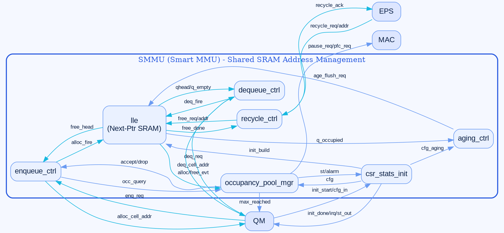

# SMMU 模块连接图 — 作图 Prompt（严格约束版）

> 用途：把下面「一、」的整段 prompt 复制给作图 AI（GPT-Image / Nano Banana 等），或用「四、」的 Graphviz DOT 直接渲染，生成一张 **SMMU（Smart MMU）模块连接框图**。
> 说明文字用中文写给你看，但**图片内部所有文字一律英文**。
>
> ⚠️ 本版针对之前的问题做了强约束：
> 1. **每条箭头两端都必须锚定到一个具体模块的边框上，不允许有任何一端悬空。**
> 2. **每个信号只出现一次，禁止重复**（尤其 `init` / `cfg_in`）。
> 3. **明确规定每个模块的位置、相对大小、以及每条连线的起点模块→终点模块和唯一方向。**

---

## 一、给作图 AI 的完整 Prompt（可直接整段复制）

```
Draw a clean, professional hardware block-connection diagram, 16:9 landscape, high resolution.
Title at top: "SMMU (Smart MMU) — Shared SRAM Address Management".
ALL TEXT MUST BE IN ENGLISH. Do NOT use any Chinese characters anywhere.

========================================================================
HARD RULES (must strictly follow):
1. EVERY arrow MUST start exactly on the border of one module box and END exactly on
   the border of another module box. NO arrow may have a dangling/free end that
   touches empty space. If you cannot connect both ends to boxes, do NOT draw it.
2. EACH signal label appears EXACTLY ONCE in the whole figure. Never duplicate a signal.
   In particular "init_start", "cfg_in_*", "init_done", "st_out_*" must appear only once.
3. Every arrow has ONE single direction (one arrowhead). Do not draw double-headed arrows.
4. Follow the exact placement grid and box sizes below. Do not move boxes elsewhere.
========================================================================

MODULES (boxes). Use a 4-column x 3-row grid. Sizes are relative:
  Grid columns from left to right: COL-A (external), COL-B, COL-C (center), COL-D (right).
  External actor boxes (medium, plain grey outline, blue text):
    - "QM"   at COL-A row-1 (top-left)
    - "EPS"  at COL-A row-2 (mid-left)
    - "MAC"  at COL-A row-3 (bottom-left)
  SMMU boundary: one big rounded rectangle covering COL-B..COL-D (all 3 rows),
    titled "SMMU". All 7 sub-modules are INSIDE this boundary.
  Sub-modules inside SMMU (rounded rectangles, blue fill):
    - "enqueue_ctrl"       COL-B row-1  (medium)
    - "dequeue_ctrl"       COL-B row-2  (medium)
    - "recycle_ctrl"       COL-B row-3  (medium)
    - "lle"                COL-C row-2  (LARGEST box, central hub; put a small inner
                                         icon labeled "Next-Ptr SRAM")
    - "occupancy_pool_mgr" COL-D row-1  (medium-large)
    - "aging_ctrl"         COL-D row-3  (medium)
    - "csr_stats_init"     COL-C row-3  (medium, sits below lle)

CONNECTIONS. Format is  FROM_BOX --> TO_BOX  : "label".
Draw EACH line as a single arrow, orthogonal (right-angle) routing, from the FROM box
border to the TO box border. The label sits on the middle of the line.

--- External <-> SMMU sub-modules ---
QM                 --> enqueue_ctrl       : "enq_req"
enqueue_ctrl       --> QM                 : "alloc_cell_addr"
QM                 --> dequeue_ctrl       : "deq_req"
dequeue_ctrl       --> QM                 : "deq_cell_addr"
occupancy_pool_mgr --> QM                 : "max_reached"
EPS                --> recycle_ctrl       : "recycle_req/addr"
recycle_ctrl       --> EPS                : "recycle_ack"
occupancy_pool_mgr --> MAC                : "pause_req/pfc_req"

--- CSR / init / stats: connect ALL of them to csr_stats_init box only (single occurrence) ---
QM                 --> csr_stats_init     : "init_start/cfg_in"
csr_stats_init     --> QM                 : "init_done/irq/st_out"
   (Route these two lines from the QM box to the csr_stats_init box border. These are the
    ONLY init/cfg/stat lines in the figure. Do NOT repeat init_start or cfg_in anywhere else.)

--- Internal sub-module <-> sub-module ---
enqueue_ctrl       --> occupancy_pool_mgr : "occ_query"
occupancy_pool_mgr --> enqueue_ctrl       : "accept/drop"
enqueue_ctrl       --> lle                : "alloc_fire"
lle                --> enqueue_ctrl       : "free_head"
dequeue_ctrl       --> lle                : "deq_fire"
lle                --> dequeue_ctrl       : "qhead/q_empty"
recycle_ctrl       --> lle                : "free_req/addr"
lle                --> recycle_ctrl       : "free_done"
lle                --> occupancy_pool_mgr : "alloc/free_evt"
aging_ctrl         --> lle                : "age_flush_req"
lle                --> aging_ctrl         : "q_occupied"
csr_stats_init     --> occupancy_pool_mgr : "cfg"
occupancy_pool_mgr --> csr_stats_init     : "st/alarm"
csr_stats_init     --> aging_ctrl         : "cfg_aging"
csr_stats_init     --> lle                : "init_build"

COUNT CHECK: there are exactly 25 arrows total (8 external + 2 csr-external + 15 internal).
Draw exactly these 25 arrows, no more, no fewer, and every arrow connects two named boxes.

========================================================================
COLOR SCHEME (modern blue palette, matching reference swatches):
- Deep blue  #2A5BE0 : SMMU boundary title bar + each module header strip
- Cyan-blue  #17B8E0 : DATAPATH arrows (enq_req, alloc_cell_addr, deq_req, deq_cell_addr,
                       recycle_req/addr, recycle_ack, alloc_fire, free_head, deq_fire,
                       qhead/q_empty, free_req/addr, free_done, alloc/free_evt)
- Light blue #6B9BF2 : CONTROL/CONFIG arrows (occ_query, accept/drop, max_reached,
                       pause_req/pfc_req, init_start/cfg_in, init_done/irq/st_out,
                       age_flush_req, q_occupied, cfg, st/alarm, cfg_aging, init_build)
- Sub-module fill: very light blue #EAF1FF with #6B9BF2 border
- Background: #F5F8FF ; Text: dark navy #0A1F44
========================================================================
STYLE:
Flat datasheet architecture style. Rounded rectangles. Orthogonal right-angle connectors.
Clear single arrowheads. Labels small but legible, one label per arrow.
Legend at bottom-right (inside its own small box):
  cyan-blue line  = "Datapath (address / cell)"
  light-blue line = "Control / Config / Stats"
```

---

## 二、25 条连线清单（供你逐条核对，防止悬空 / 重复）

| # | 起点模块 | 方向 | 终点模块 | 信号(唯一) | 类别 |
|---|----------|------|----------|-----------|------|
| 1 | QM | → | enqueue_ctrl | enq_req | 数据 |
| 2 | enqueue_ctrl | → | QM | alloc_cell_addr | 数据 |
| 3 | QM | → | dequeue_ctrl | deq_req | 数据 |
| 4 | dequeue_ctrl | → | QM | deq_cell_addr | 数据 |
| 5 | occupancy_pool_mgr | → | QM | max_reached | 控制 |
| 6 | EPS | → | recycle_ctrl | recycle_req/addr | 数据 |
| 7 | recycle_ctrl | → | EPS | recycle_ack | 数据 |
| 8 | occupancy_pool_mgr | → | MAC | pause_req/pfc_req | 控制 |
| 9 | QM | → | csr_stats_init | init_start/cfg_in | 控制 |
| 10 | csr_stats_init | → | QM | init_done/irq/st_out | 控制 |
| 11 | enqueue_ctrl | → | occupancy_pool_mgr | occ_query | 控制 |
| 12 | occupancy_pool_mgr | → | enqueue_ctrl | accept/drop | 控制 |
| 13 | enqueue_ctrl | → | lle | alloc_fire | 数据 |
| 14 | lle | → | enqueue_ctrl | free_head | 数据 |
| 15 | dequeue_ctrl | → | lle | deq_fire | 数据 |
| 16 | lle | → | dequeue_ctrl | qhead/q_empty | 数据 |
| 17 | recycle_ctrl | → | lle | free_req/addr | 数据 |
| 18 | lle | → | recycle_ctrl | free_done | 数据 |
| 19 | lle | → | occupancy_pool_mgr | alloc/free_evt | 数据 |
| 20 | aging_ctrl | → | lle | age_flush_req | 控制 |
| 21 | lle | → | aging_ctrl | q_occupied | 控制 |
| 22 | csr_stats_init | → | occupancy_pool_mgr | cfg | 控制 |
| 23 | occupancy_pool_mgr | → | csr_stats_init | st/alarm | 控制 |
| 24 | csr_stats_init | → | aging_ctrl | cfg_aging | 控制 |
| 25 | csr_stats_init | → | lle | init_build | 控制 |

> `init_start` / `cfg_in` 只在第 9 行出现一次；`init_done/st_out` 只在第 10 行出现一次。

---

## 三、配色速查

| 用途 | 颜色 | HEX |
|------|------|-----|
| 顶层边框标题 / 模块头 | 深蓝 | `#2A5BE0` |
| 数据通路箭头 | 青蓝 | `#17B8E0` |
| 控制/配置/统计箭头 | 浅蓝 | `#6B9BF2` |
| 子模块填充 | 极浅蓝 | `#EAF1FF` |
| 背景 | 极浅蓝灰 | `#F5F8FF` |
| 文字 | 深藏青 | `#0A1F44` |

---

## 四、Graphviz DOT（★ 最可靠：用 Graphviz/在线 dot 渲染，箭头绝不会悬空、信号不重复）

> 若图像生成 AI 效果不稳定，直接把下面 DOT 贴到 https://dreampuf.github.io/GraphvizOnline/ 或本地 `dot -Tpng smmu.dot -o smmu.png` 渲染。



---

## 五、模块关系一句话总览（帮你理解，不进图片）

- **QM**：入队 `enqueue_ctrl` 拿地址、出队 `dequeue_ctrl` 读地址；CSR 配置/初始化/统计也经 QM 侧顶层端口进出（图中只画一次）。
- **EPS**：经 `recycle_ctrl` 逐 cell 回收地址。
- **LLE**：核心枢纽，独占 Next-Ptr SRAM，处理 alloc/dequeue/free，并向 `occupancy_pool_mgr` 发占用事件。
- **occupancy_pool_mgr**：双池水位判决，回吐 accept/drop，对外产生 `max_reached` 与 `pause/pfc`。
- **aging_ctrl**：超时触发 `age_flush_req` 让 LLE 冲刷老化队列。
- **csr_stats_init**：无总线，采配置 fanout 给 occ/aging/lle，管理初始化建链与统计中断。